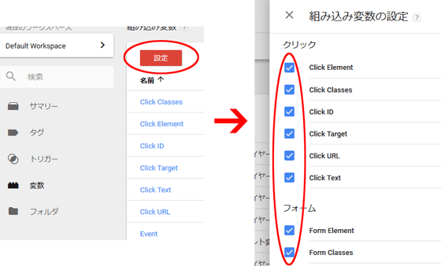
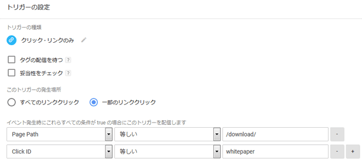
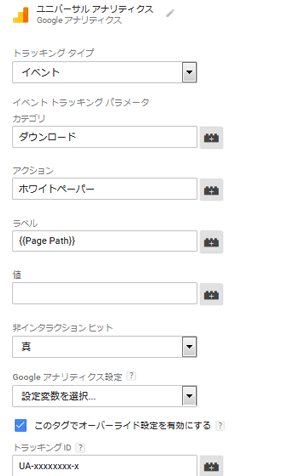
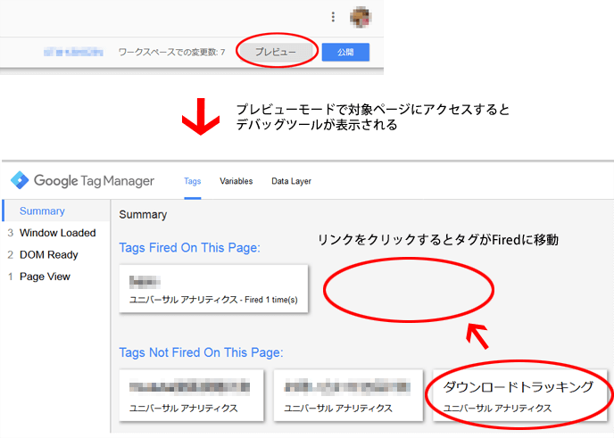
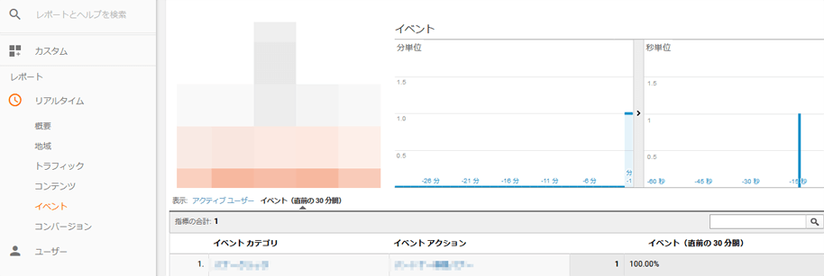
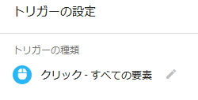

この記事はQiitaからの転載です。
https://qiita.com/prograti/items/ee339b056286b946138f

サイト内でユーザーがどのような行動をしているかを知る方法の一つとして、Googleアナリティクスのイベント トラッキングがあります。しかし、イベント トラッキングを行うには、Javascriptでイベントハンドラを実装してページに組み込んだり色々面倒な作業が発生します。

```javascript
// イベントハンドラの例
function handleOutboundLinkClicks(event) {
  ga('send', 'event', {
    eventCategory: '外部リンク',
    eventAction: 'click',
    eventLabel: event.target.href
  });
}

```

上記のような作業も、Googleタグマネージャを使えばもっと簡単にイベント トラッキングを行うことができます。ここでは、Googleタグマネージャを利用した基本的なイベント トラッキングをいくつかご紹介します。


##イベント トラッキングを始める前に
前準備としてGoogleタグマネージャの**組み込み変数**の設定を行ってください。「変数」⇒「設定」から「ページ」、「クリック」、「フォーム」、「動画」、「スクロール」の各変数にチェックを付けて有効にしてください。




##:footprints: Case1:リンクのクリックをトラッキングする
例えば下記のようなPDFダウンロードリンクがある場合、リンク クリックのトリガーを利用すればPDFのダウンロード回数を簡単に計測することができます。

```html
<a id="whitepaper" href="https://xxxxx.com/download/whitepaper.pdf">ダウンロード</a>
```

:one: メニューの「トリガー」⇒「新規」から、クリックイベントのトリガーを作成する。



■トリガーの設定例

| 項目 | 設定内容 |
|:--|:--|
| トリガーの種類 | クリック - リンクのみ |
| このトリガーの発生場所 | 一部のリンククリック |
| トリガー配信条件 | 【PagePathが"/download/"に等しい】 AND 【Click IDが"whitepaper"に等しい】 |

:two: メニューの「タグ」⇒「新規」から、タグタイプでユニバーサル アナリティクスを選択し、タグの設定および先ほど作成したトリガーの登録を行う。



■タグの設定例

| 項目 | 設定内容 |
|:--|:--|
| タグタイプ | ユニバーサルアナリティクス（Googleアナリティクス） |
| トラッキングタイプ | イベント |
| カテゴリ | ダウンロード |
| アクション | ホワイトペーパー |
| ラベル | {{Page Path}} |
| 非インタラクション ヒット | 真 [^1] |
| トラッキング ID | UA-xxxxxxxx-x |

:three: プレビューモードでサイトにアクセスし、リンククリック時にタグが動作することを確認する。



:four: Googleアナリティクスのリアルタイムレポートでイベントが計測されていることを確認する。



:five: 公開ボタンを押してワークスペースの変更を反映させる。

以上の:one:~:five:がリンクのクリックをトラッキングするための手順になります。各項目の設定内容はご自身の用途に合わせて適宜ご修正ください。

###:bulb:Tips.外部リンクのクリックをトラッキングする
アフィリエイトサイトなどを運営していてアフィリエイトリンクのクリックを計測したい場合があると思います。そのような場合はトリガーの作成とタグの作成を以下のような設定で行うことでトラッキングすることができます。

■トリガーの設定例

| 項目 | 設定内容 |
|:--|:--|
| トリガーの種類 | クリック - リンクのみ |
| このトリガーの発生場所 | 一部のリンククリック |
| トリガー配信条件 | 【PagePathが次の正規表現に一致⇒ .*】 AND 【Click URLがmydomain.com（自分のドメイン）を含まない】 |

※特定のサイトを指定したい場合はClick URLに正規表現を使ってください。　
例：(.\*)px.a8.net(.\*)|(.\*)h.accesstrade.net(.\*)

■タグの設定例

| 項目 | 設定内容 |
|:--|:--|
| タグタイプ | ユニバーサルアナリティクス（Googleアナリティクス） |
| トラッキングタイプ | イベント |
| カテゴリ | アフィリエイトリンク |
| アクション | {{Click URL}} |
| ラベル | {{Page Path}} |
| 非インタラクション ヒット | 真 |
| トラッキング ID | UA-xxxxxxxx-x |

##:footprints: Case2:ボタンのクリックをトラッキングする
次はCase1のリンクが下記のようなボタンだった場合の設定方法です。

```html
<button id="whitepaper" type="button">ダウンロード</button>
```
このケースはCase1のリンクの場合と同じ流れになりますが、:one:のトリガーの作成でトリガーの種類を「リンクのみ」ではなく「すべての要素」に設定してください。



[^1]: 非インタラクションヒットを真にした場合、イベント トラッキングが設定されたページでの 1ページのみのセッションは直帰としてカウントされます。逆に偽にした場合は直帰としてカウントされません。ユーザー インタラクションをエンゲージメントの根拠として重視する場合は偽に設定すると良いと思います。