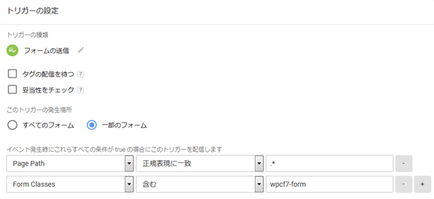
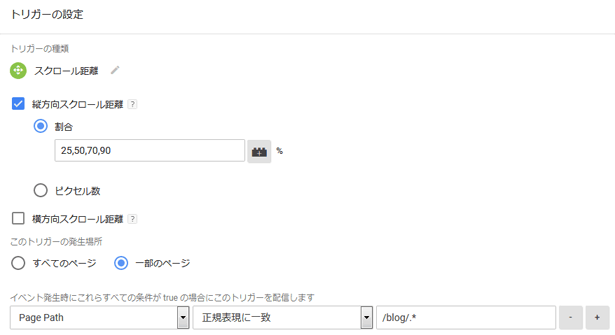
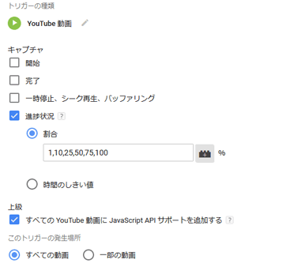
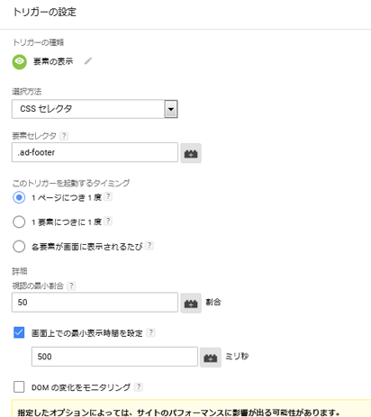

##:footprints: Case3:フォーム送信をトラッキングする
ブログサイトでサイドカラムやページの最後にメルマガ登録フォームを設置しているケースは多いと思います。例えばどのページからのお申し込みが多いかを知りたいという場合、フォームの送信（サブミット）をトラッキングすることで簡単に計測することができます。ここではWordPressで最も多く使われているContact Form 7のトラッキング例を記載します。

```html
<!-- Contact Form 7が出力するHTML -->
<form action="xxxx" method="post" class="wpcf7-form" novalidate="novalidate">
~（略）
</form>
```

:one: メニューの「トリガー」⇒「新規」から、フォームの送信イベントのトリガーを作成する。



■設定例

| 項目 | 設定内容 |
|:--|:--|
| トリガーの種類 | フォームの送信 |
| このトリガーの発生場所 | 一部のフォーム |
| トリガー配信条件 | 【PagePathが次の正規表現に一致⇒ .*】 AND 【Form Classesが次のクラスを含む⇒ wpcf7-form】 |

:two: メニューの「タグ」⇒「新規」から、タグタイプでユニバーサル アナリティクスを選択し、タグの設定および先ほど作成したトリガーの登録を行う。

■設定例

| 項目 | 設定内容 |
|:--|:--|
| タグタイプ | ユニバーサルアナリティクス（Googleアナリティクス） |
| トラッキングタイプ | イベント |
| カテゴリ | メルマガ登録 |
| アクション | {{Page Path}} |
| ラベル | （空白） |
| 非インタラクション ヒット | 偽 |
| トラッキング ID | UA-xxxxxxxx-x |

:three: プレビューモードでサイトにアクセスし、フォーム送信時にタグが動作することを確認する。

:four: Googleアナリティクスのリアルタイムレポートでイベントが計測されていることを確認する。

:five: 公開ボタンを押してワークスペースの変更を反映させる。

以上の:one:~:five:がフォームの送信をトラッキングするための手順になります。各項目の設定内容はご自身の用途に合わせて適宜ご修正ください。なお、フォーム送信時のバリデーションエラー（未入力エラーなど）が発生した場合もカウントされますのでご注意ください。

##:footprints: Case4:ページスクロールをトラッキングする
コンテンツの良し悪しを計る指標としてページビューや滞在時間の他に精読率があります。細かく計測にはヒートマップツールなどを利用する必要がありますが、ページのどの位置までスクロールされたかをトラッキングすることにより、この精読率を大まかに推測することができます。

:one: メニューの「トリガー」⇒「新規」から、スクロールイベントのトリガーを作成する。



■設定例

| 項目 | 設定内容 |
|:--|:--|
| トリガーの種類 | スクロール距離 |
| 縦方向スクロール距離（%もしくはpx） | 任意の数値をカンマ区切り（例：25,50,70,90） |
| トリガー配信条件 | PagePathが次の正規表現に一致⇒ /blog/.* |

:two: メニューの「タグ」⇒「新規」から、タグタイプでユニバーサル アナリティクスを選択し、タグの設定および先ほど作成したトリガーの登録を行う。

■設定例

| 項目 | 設定内容 |
|:--|:--|
| タグタイプ | ユニバーサルアナリティクス（Googleアナリティクス） |
| トラッキングタイプ | イベント |
| カテゴリ | 精読率 |
| アクション | {{Page Path}} |
| ラベル | {{Scroll Depth Threshold}}% |
| 非インタラクション ヒット | 真 |
| トラッキング ID | UA-xxxxxxxx-x |

:three: プレビューモードでサイトにアクセスし、縦方向スクロール距離に設定した値に到達した時にタグが動作することを確認する。

:four: Googleアナリティクスのリアルタイムレポートでイベントが計測されていることを確認する（上記設定例の場合、ページの最後までスクロールすると計4回のイベントが計測される）。

:five: 公開ボタンを押してワークスペースの変更を反映させる。

以上の:one:~:five:がページスクロールをトラッキングするための手順になります。各項目の設定内容はご自身の用途に合わせて適宜ご修正ください。

##:footprints: Case5:Youtube動画をトラッキングする
Youtubeアナリティクスを使えば動画の詳細な解析ができますが、Googleアナリティクスとの連携ができません（YoutubeチャンネルはGoogleアナリティクスで計測可能）。Googleタグマネージャを使えば、ページに埋め込んだYoutube動画の再生状況も簡単に計測することができます。例としてユーザが動画を再生してからどこまで視聴したかをトラッキングしてみます。

:one: メニューの「トリガー」⇒「新規」から、Youtube動画のトリガーを作成する。



■設定例

| 項目 | 設定内容 |
|:--|:--|
| トリガーの種類 |  YouTube 動画  |
| 進捗状況（割合もしくは時間のしきい値）| 任意の数値をカンマ区切り（例：1,10,25,50,75,100） |
| 上級 [^1] |  すべての YouTube 動画に JavaScript API サポートを追加するにチェック  |
| このトリガーの発生場所  | すべての動画を選択 |

:two: メニューの「タグ」⇒「新規」から、タグタイプでユニバーサル アナリティクスを選択し、タグの設定および先ほど作成したトリガーの登録を行う。

■設定例

| 項目 | 設定内容 |
|:--|:--|
| タグタイプ | ユニバーサルアナリティクス（Googleアナリティクス） |
| トラッキングタイプ | イベント |
| カテゴリ | Youtube動画 |
| アクション | {{Video Title}} |
| ラベル | {{Video Percent}}% |
| 非インタラクション ヒット | 偽 |
| トラッキング ID | UA-xxxxxxxx-x |

:three: プレビューモードでサイトにアクセスし、動画を再生して進捗状況に設定した値に到達した時にタグが動作することを確認する。

:four: Googleアナリティクスのリアルタイムレポートでイベントが計測されていることを確認する（上記設定例の場合、動画を最後まで再生すると計6回のイベントが計測される）。

:five: 公開ボタンを押してワークスペースの変更を反映させる。

以上の:one:~:five:がYoutube動画をトラッキングするための手順になります。各項目の設定内容はご自身の用途に合わせて適宜ご修正ください。

##:footprints: Case6:要素の表示をトラッキングする
サイトに設置したバナーのインプレッションを計測したい場合、バナーがファーストビューにあればインプレッション数≒PV数となりますが、バナーが下の方にあるとインプレッション数＜PV数となり大きな誤差が生まれます。
Case4で紹介したスクロールイベントで縦方向スクロール距離を指定して計測する方法も考えられますが、ブラウザやデバイスの違いで誤差が生まれ正確性に欠けます。そのような場合は特定要素の表示をトラッキングすることで簡単に計測することができます。

:one: メニューの「トリガー」⇒「新規」から、要素表示イベントのトリガーを作成する。



■設定例

| 項目 | 設定内容 |
|:--|:--|
| 選択方法 | CSSセレクタ |
| 要素セレクタ | class属性に指定しているセレクタを入力（例： .ad-footer） |
| このトリガーを起動するタイミング | 1 ページにつき 1 度を選択 |
| 視認の最小割合 | 50 |
| 画面上での最小表示時間 | 500ミリ秒 |
| このトリガーの発生場所  | 一部の表示イベントを選択 |
| トリガー配信条件 | PagePathが次の正規表現に一致⇒ /blog/.* |

:two: メニューの「タグ」⇒「新規」から、タグタイプでユニバーサル アナリティクスを選択し、タグの設定および先ほど作成したトリガーの登録を行う。

■設定例

| 項目 | 設定内容 |
|:--|:--|
| タグタイプ | ユニバーサルアナリティクス（Googleアナリティクス） |
| トラッキングタイプ | イベント |
| カテゴリ | 広告バナーインプレッション |
| アクション | {{Page Path}} |
| ラベル | （空白） |
| 非インタラクション ヒット | 真 |
| トラッキング ID | UA-xxxxxxxx-x |

:three: プレビューモードでサイトにアクセスし、スクロール位置がバナー設置箇所に到達した時にタグが動作することを確認する。

:four: Googleアナリティクスのリアルタイムレポートでイベントが計測されていることを確認する。

:five: 公開ボタンを押してワークスペースの変更を反映させる。

以上の:one:~:five:が要素の出現をトラッキングするための手順になります。各項目の設定内容はご自身の用途に合わせて適宜ご修正ください。

[^1]: YoutubeプレーヤーのJavaScript APIを有効にするためのenablejsapiパラメータが自動的に付加されます。大抵の場合はチェックを入れておけば問題ないと思います。