##:mortar_board: 応用編:ソーシャルイベントをトラッキングする
オフィシャルのFacebookの「いいね」ボタンやTwitterのツイートボタンを使用している場合、Case1やCase2のクリックのトラッキングは適用できません。トラッキングするには以下のような流れが必要になります。

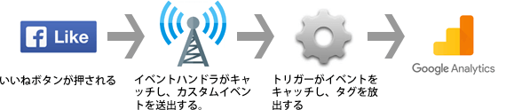

###:footprints: Facebook「いいね」のトラッキング

:one: メニューの「トリガー」⇒「新規」から、ウィンドウの読み込みイベントのトリガーを作成する。

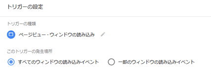

■設定例

| 項目 | 設定内容 |
|:--|:--|
| トリガーの種類 | ウィンドウの読み込み |
| このトリガーの発生場所  | すべてのウィンドウの読み込みイベント |

:two: メニューの「タグ」⇒「新規」から、カスタムHTMLを選択し、Facebookのイベントハンドラの作成および先ほど作成したトリガー（ウィンドウの読み込みイベント）の登録を行う。

HTMLには以下のJavascriptを記述します。

```javascript
<script>
FB.Event.subscribe('edge.create', function(targetUrl) {
  dataLayer.push({
    'event': 'socialActionEvent', 
    'socialNetwork': 'Facebook', 
    'socialAction': 'Like',
    'socialTarget': targetUrl
  });
});
</script>
```

FB.Event.subscribeはFacebookのイベントをキャッチし、コールバック関数を実行するFacebookグラフAPIです。第一引数の'edge.create'が「いいね」が押されたイベントを表します。コールバック関数内ではGoogleタグマネージャにデータを渡す役割を果たすデータレイヤーに値をセットしています。

データレイヤーには'event'という特別な変数が用意されており、これを利用してカスタムイベントを作成することができます。例では'socialActionEvent'というカスタムイベントを作成しています。'socialNetwork'、'socialAction'、'socialTarget'はタグに値を渡すために定義したデータレイヤー変数です。

:three: メニューの「トリガー」⇒「新規」から、先ほど作成したカスタムイベントのトリガーを作成する。

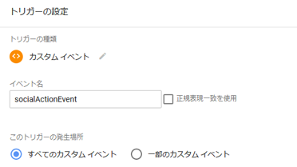

■設定例

| 項目 | 設定内容 |
|:--|:--|
| トリガーの種類 |  カスタムイベント |
| イベント名 | :two:で指定したイベント名（例：socialActionEvent） |
| このトリガーの発生場所 |  すべてのカスタム イベント |

:four: メニューの「タグ」⇒「新規」から、タグタイプでユニバーサル アナリティクスを選択し、タグの設定および先ほど作成したトリガー（カスタムイベント）の登録を行う。

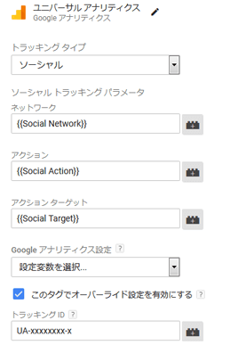

■設定例

| 項目 | 設定内容 |
|:--|:--|
| タグタイプ | ユニバーサルアナリティクス（Googleアナリティクス） |
| トラッキングタイプ | ソーシャル |
| ネットワーク | {{Social Network}} |
| アクション | {{Social Action}} |
| アクションターゲット | {{Social Target}} |
| トラッキング ID | UA-xxxxxxxx-x |

:five: プレビューモードでサイトにアクセスし、「いいね」を押した時にタグが動作することを確認する。

:six: Googleアナリティクスの「集客」⇒「ソーシャル」⇒「プラグイン」でイベントが計測されていることを確認する（反映されるまで時間が掛かる場合があります）。

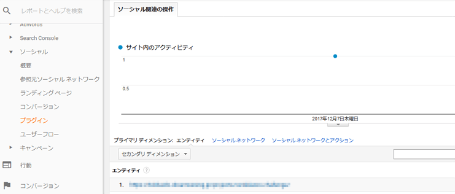

:seven: 公開ボタンを押してワークスペースの変更を反映させる。

以上の:one:~:seven:がFacebookの「いいね」をトラッキングするための手順になります。各項目の設定内容はご自身の用途に合わせて適宜ご修正ください。

###:footprints: Twitter「ツイート」のトラッキング

既に前述のFacebookの設定を行っている場合、イベントハンドラだけ作成すれば残りは共通で使いまわせます。

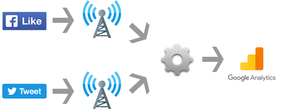

ここではイベントハンドラに設定するJavascriptだけ以下に記述します（FacebookとTwitterでイベント名を統一することがポイント）。

```javascript
<script>
if (typeof twttr !== 'undefined') {
  twttr.ready(function (twttr) {
    twttr.events.bind('tweet', function() {
      dataLayer.push({
        'event': 'socialActionEvent',
        'socialNetwork': 'Twitter',
        'socialAction': 'Tweet',
        'socialTarget': window.location.href
      });
    });
  });
}
</script>
```

##:moneybag: おまけ:JavaScriptエラーをトラッキングする
Googleタグマネージャはブラウザで発生したJavaScriptエラーもイベントとしてトラッキングすることができます（ただし、トラッキングできるのはタグマネージャが読み込まれた後に発生したエラーのみ）。

:one: 「変数」⇒「設定」から、組み込み変数「Error Message」、「Error URL」、「Error Line」、「Debug Mode」にチェックを付ける。

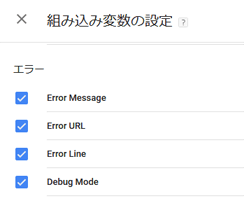

:two: メニューの「トリガー」⇒「新規」から、JavaScriptエラーイベントのトリガーを作成する。

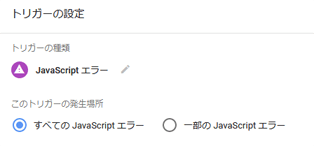

■設定例

| 項目 | 設定内容 |
|:--|:--|
| トリガーの種類 | JavaScript エラー  |
| このトリガーの発生場所  | すべての JavaScript エラー  |

:three: メニューの「タグ」⇒「新規」から、タグタイプでユニバーサル アナリティクスを選択し、タグの設定および先ほど作成したトリガーの登録を行う。

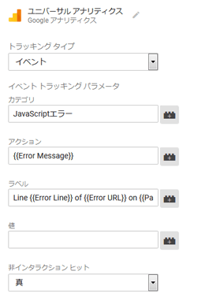

■タグの設定例

| 項目 | 設定内容 |
|:--|:--|
| タグタイプ | ユニバーサルアナリティクス（Googleアナリティクス） |
| トラッキングタイプ | イベント |
| カテゴリ | JavaScriptエラー |
| アクション | {{Error Message}} |
| ラベル | Line {{Error Line}} of {{Error URL}} on {{Page URL}} |
| 非インタラクション ヒット | 真 |
| トラッキング ID | UA-xxxxxxxx-x |

:four: プレビューモードでサイトにアクセスし、JavaScripeエラーが発生した時にタグが動作することを確認する。

:five: Googleアナリティクスのリアルタイムレポートでイベントが計測されていることを確認する。

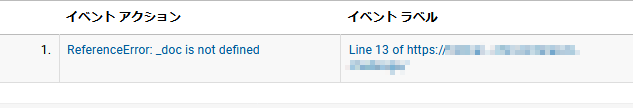

:six: 公開ボタンを押してワークスペースの変更を反映させる。

以上の:one:~:six:がJavaScriptエラーをトラッキングするための手順になります。

また、必要に応じてGoogleアナリティクスの「カスタム」⇒「カスタムアラート」から、JavaScriptエラーのアラートを作成してメールで通知するようすると良いでしょう。

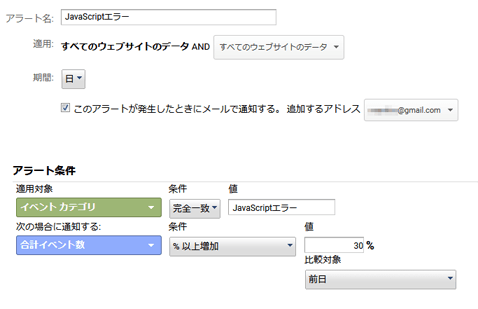

## まとめ
Googleアナリティクスではちょっと面倒だったイベントトラッキングも、Googleタグマネージャなら既存のコードに手を加えることなく簡単に設定することができます。
PVやUU、直帰率などの数値の変動を観察するだけしかやってないという方は、今後の運用にイベント トラッキングを活用した仮説・検証のプロセスを組み込んでみてはいかがでしょうか？
