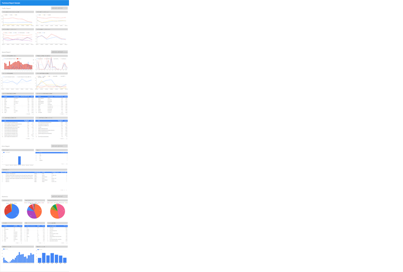
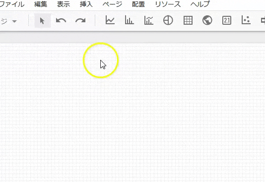
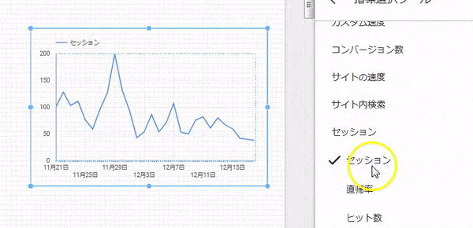
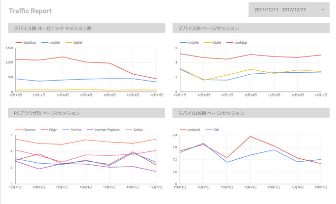
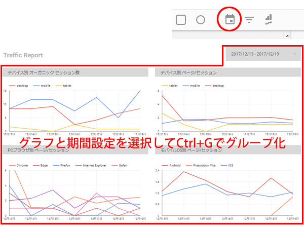
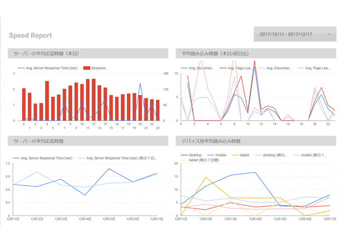
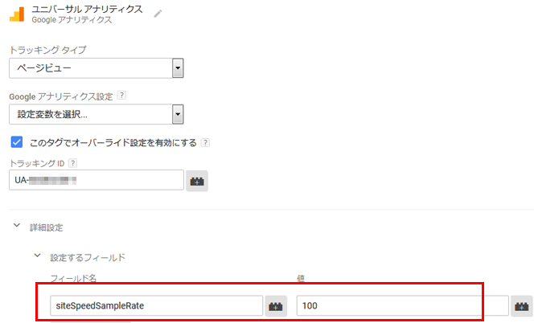

この記事はQiitaからの転載です。
https://qiita.com/prograti/items/933280f821b4c2c1190c

WebサービスやECサイトの運用にトラブルは付き物です。ケアレスミスがサイトのトラフィックやコンバージョンに大きな影響を与えることも少なくありません。数値のチェックをマーケター任せにせず、エンジニアサイドも協力しながら情報共有することがトラブルの早期発見につながり、被害を最小限に食い止めることにつながります。

[New Relic](https://newrelic.com/)のような監視ツールを導入できれば良いのですが、予算の面だったりクライアント案件だと難しいというケースも多いでしょう。そこで今回は、Googleアナリティクスのデータを**Google Data Studio**（無料）を使って、テクニカル レポート風にまとめてみたいと思います。

##:beginner: Google Data Studioとは
Google Data Studioとは、統合マーケティングツール「Google Analytics 360 suite」製品シリーズの一つ「Google Data Studio 360」の**無償版**で、Googleアカウントがあれば誰でも利用することができます。

Google アナリティクスをはじめ、Google BigQuery、Google Cloud SQL、MySQLなどのデータベースやGoogle スプレッドシート、AdWords、DoubleClick、YouTube チャンネルなど様々なデータソースと接続可能で、簡単なGUI操作でデータをグラフや表にすることができます。

■標準で接続可能なデータソース [^1]
AdWords、アトリビューション360、BigQuery、Cloud SQL、DCM、DFP、Google Cloud Storage、Googleアナリティクス、Googleスプレッドシート、MySQL、PostgreSQL、Search Console、Youtubeアナリティクス、ファイルアップロード

## :tools:テクニカル レポートを作る
今回作成するレポートは大きく4つのパートに分かれています。

1. トラフィック レポート（サイト流入やサイト内回遊などを確認）
2. スピード レポート（ページ表示速度などを確認）
3. エラー レポート（404エラーやJavaScriptエラーなどを確認）
4. 統計（ブラウザやOSのシェアなど開発の際に必要なデータを確認）



上記4パートについて設定例やポイントなどをご紹介したいと思いますが、具体的な内容に入る前にData Studioの操作方法を簡単にご紹介しますと、下のようにグラフの種類を選んでドラッグ＆ドロップで貼りつけ、指標を選択したり細かい調整を行っていく形になります。






## :family_mwgg:トラフィック レポート
トラフィック レポートは、サイト流入数やサイト回遊率をチェックするためのものです。トラフィックはGoogleのアルゴリズム変更や競合サイトの動向、季節変動、トレンドの変化など外部環境の変化に影響を受けるところが多分にあるのですが、リダイレクトやmetaタグの設定ミス、意図しない重複コンテンツの生成などケアレスミスが悪影響を与えることも少なくありません。今回のサンプルでは以下の4つのグラフを用い、トラフィックの変化を監視しています。



1. **デバイス別オーガニックセッション数** ： 改修によってPC/SPサイトの評価が下がり、検索エンジンからの流入が減っていないかどうか
2. **デバイス別ページ/セッション** ： 改修によってPC/SPサイトの閲覧に支障が出ていないかどうか
3. **PCブラウザ別ページ/セッション** ： 改修によって特定ブラウザで閲覧に支障が出ていないかどうか
4. **モバイルOS別ページ/セッション** ： 改修によって特定OSで閲覧に支障が出ていないかどうか

以下が各グラフの設定例になります。

|  | デバイス別オーガニックセッション数 | デバイス別ページ/セッション | PCブラウザ別ページ/セッション | モバイルOS別ページ/セッション |
|:--|:-:|:-:|:-:|:-:|
| グラフの種類 | 期間 | 期間 | 期間 | 期間 |
| 時間ディメンション | 日付 | 日付 | 日付 | 日付 |
| 内訳ディメンション | デバイスカテゴリ | デバイスカテゴリ | ブラウザ | オペレーティングシステム |
| 指標 | セッション | ページ/セッション | ページ/セッション | ページ/セッション |
| デフォルトの期間 | 自動 | 自動 | 自動 | 自動 |
| フィルタ | - | - | デバイスカテゴリがdesktopに等しい | - |
| セグメント | - | - | - | モバイルトラフィック  |

:bulb:ワンポイントテクニック
期間設定というカレンダー ウィジェットをレポートに追加すれば、閲覧者がレポートの期間を自由に変更できるようになります（デフォルトの期間を「自動」に設定したグラフに、期間設定で選択した期間が適用される）。
また、ウィジェットとグラフをグループ化（選択してCtrl+G）すれば、そのグラフにだけ期間を適用することもできます。



## :stopwatch:スピード レポート
ページ速度はGoogleの評価指標の一つであり、ECサイトではコンバージョンにも大きな影響を与えます。スピード レポートは、このページ速度をチェックするためのものです。今回のサンプルでは、サーバのレスポンス時間やページ表示速度など8つのグラフ・表を用い、ページ速度の変化を監視しています。



1. **サーバーの平均応答時間（本日）** ： サーバー移転やバックエンド処理の改修、トラフィック増加などによってパフォーマンスが低下していないかどうか
2. **平均読み込み時間（本日/前日比）** ： HTMLやJavaScriptの変更、広告タグや解析タグの追加、ソーシャルプラグインの追加などによってページの読み込みに時間が掛かっていないかどうか
3. **サーバーの平均応答時間** ： 応答時間が増加傾向にないかどうか
4. **デバイス別平均読み込み時間** ： 改修によってPC/SPサイトのページの読み込みに時間が掛かっていないかどうか
5. **PCブラウザ別平均読み込み時間** ： 特定のブラウザ・バージョンでページの読み込みに時間が掛かっていないかどうか
6. **モバイルブラウザ別平均読み込み時間** ： 特定のブラウザ・バージョンでページの読み込みに時間が掛かっていないかどうか
7. **ページ別平均読み込み時間（PC）** ： 特定のページでページの読み込みに時間が掛かっていないかどうか
8. **ページ別平均読み込み時間（モバイル）** ： 特定のページでページの読み込みに時間が掛かっていないかどうか

以下が各グラフ・表の設定になります。

|  | サーバーの平均応答時間（本日） | 平均読み込み時間（本日/前日比） | サーバーの平均応答時間 | デバイス別平均読み込み時間 |
|:--|:-:|:-:|:-:|:-:|
| グラフの種類 | 複合グラフ | 期間 | 期間 | 期間 |
| 時間ディメンション | 時 | 時 | 日付 | 日付 |
| 内訳ディメンション | - | - | - | デバイスカテゴリ |
| 指標 | サーバーの平均応答時間、セッション | 平均ドキュメントコンテンツ読み込み時間、平均読み込み時間 | サーバーの平均応答時間 | 平均読み込み時間 |
| デフォルトの期間 | カスタム（今日） | カスタム（今日）、前の期間と比較 | 自動、前の期間と比較 | 自動、前の期間と比較 |
| フィルタ | - | - | - | - |
| セグメント | - | - | - | - |

|  | PCブラウザ別平均読み込み時間 | モバイルブラウザ別平均読み込み時間 | ページ別平均読み込み時間（PC） | ページ別平均読み込み時間（モバイル） |
|:--|:-:|:-:|:-:|:-:|
| グラフの種類 | 表 | 表 | 表 | 表 |
| ディメンション | ブラウザ、ブラウザのバージョン | ブラウザ、ブラウザのバージョン | ページ | ページ |
| 指標 | 平均読み込み時間、セッション | 平均読み込み時間、セッション | 平均読み込み時間、セッション | 平均読み込み時間、セッション |
| デフォルトの期間 | 自動 | 自動 | 自動 | 自動 |
| フィルタ | デバイスカテゴリがdesktopに等しい | - | デバイスカテゴリがdesktopに等しい | - |
| セグメント | - | モバイルとタブレットのトラフィック | - | モバイルとタブレットのトラフィック |

:bulb:平均読み込み時間とは
Googleアナリティクスには平均読み込み時間以外にも、平均リダイレクト時間、ドメインの平均ルックアップ時間、サーバーの平均接続時間、サーバーの平均応答時間、ページの平均ダウンロード時間、平均ドキュメント インタラクティブ時間、平均ドキュメント コンテンツ読み込み時間といろいろな速度指標があります。

各指標を処理の順番に並べると以下のようになります。これ以外にもNavigation Timing APIなどを使って独自に速度を記録することができます。

|| 速度指標 | 意味 |
|:-:|:--|:--|
|||:rocket:ナビゲーションスタート（リンク、ボタンをクリック）|
|1| :stopwatch:平均リダイレクト時間  | このURLに到達するまで間のリダイレクトにかかった時間（リダイレクトが無い場合はゼロ）  |
|2| :stopwatch:ドメインの平均ルックアップ時間  | ドメインの名前解決にかかった時間  |
|3| :stopwatch:サーバーの平均接続時間  | TCPコネクションの確立にかかった時間  |
|4| :stopwatch:サーバーの平均応答時間  | サーバーにリクエストを投げて、HTMLドキュメントのファーストバイトを受信するまでにかかった時間  |
|5| :stopwatch:ページの平均ダウンロード時間  | HTMLドキュメントの受信開始から完了までにかかった時間  |
|6| :stopwatch:平均ドキュメント インタラクティブ時間  | ナビゲーションスタートからHTMLドキュメントの解析（DOM構築）を完了するまでにかかった時間  |
|7| :stopwatch:平均ドキュメント コンテンツ読み込み時間  | ナビゲーションスタートからHTMLドキュメントの解析、CSSの解析（CSSOM構築）、繰延スクリプト（defer属性のついたJavaScript）の実行までにかかった時間  |
|8| :stopwatch:平均読み込み時間  | ナビゲーションスタートからHTML、CSS、JavaScript、画像など参照している全てのリソースの読み込みが完了するまでにかかった時間 |
|||:triangular_flag_on_post:ページ読み込み完了|

:warning:サイトの速度のサンプルレート
サイト速度は全てのユーザーに対して計測されるわけではなく、デフォルトでは1%のユーザーのみが対象となります。そのためアクセス数が少ないサイトではあまり有効な数値が取れません。そのような場合には```siteSpeedSampleRate```の値を1～100の間で適宜設定してください。 [^2]

例）Googleタグマネージャを使ったsiteSpeedSampleRateの設定例



[^1]: サードパーティのコネクタを使用してソーシャルメディアなどのデータソースと接続することも可能です。また、コネクタを自分で開発することもできます。

[^2]: 計測できるサンプル数の上限は前日のページビューによって決定されるため、100に設定しても全てが計測されるわけではありません。アクセス数が多いサイトで100に設定すると1日の早い時間で上限に達して以降は計測されなくなるのでご注意ください。:link:[サンプリングに関する注意事項](https://developers.google.com/analytics/devguides/collection/analyticsjs/user-timings)
