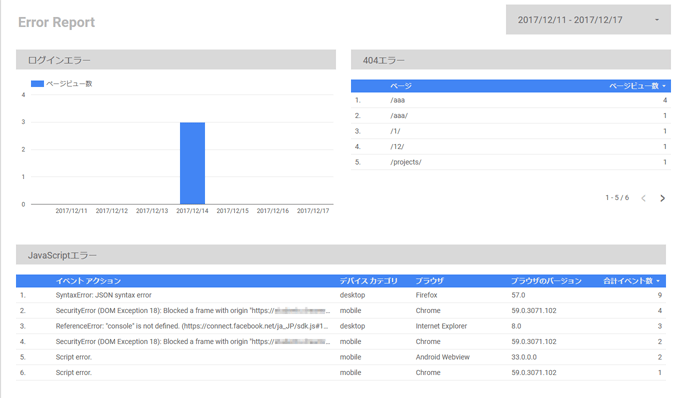
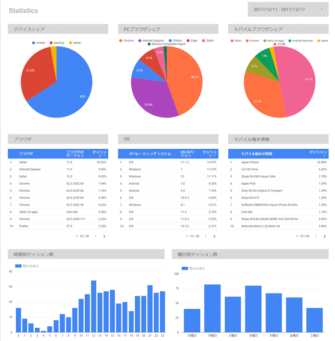

## :no_good:エラー レポート
サイトが複雑になればなるほど、事前に改修の影響範囲を把握することは難しくなり、ある改修が別の箇所で予期せぬ不具合を引き起こすことはよくあります。エラー レポートはこのような不具合を検知し、迅速な対応をとるためのものです。今回のレポートでは、ログインエラー、404エラー、JavaScriptエラーの3つを監視しています。

1. **ログインエラー** ： ECサイトのように会員登録がある場合、改修によってログインに不具合が出ていないかどうか、またボットなどによる不正なアクセスがないかどうか
2. **404エラー** ： 改修によってリンク切れなどが発生していないかどうか、またボットなどによる不審なアクセスがないかどうか
3. **JavaScriptエラー** ： 改修によってJavaScriptの実行にエラーが発生していないかどうか

以下が各グラフ・表の設定になります。

|  | ログインエラー | 404エラー | JavaScriptエラー |
|:--|:-:|:-:|:-:|
| グラフの種類 | 期間 | 表 | 表 |
| 時間ディメンション | 日付 | - | - |
| ディメンション | - | ページ | イベントアクション、デバイスカテゴリ、ブラウザ、ブラウザのバージョン |
| 指標 | ページビュー数 | ページビュー数 | 合計イベント数 |
| デフォルトの期間 | 自動 | 自動 | 自動 |
| フィルタ | 例）ページに"?err=invalid_user"を含む | 例）ページタイトルに"ページが見つかりません"を含む | 例）イベントカテゴリに"JavaScript Error"を含む |
| セグメント | - | - | - |

各フィルタはサイトに合わせて適宜変更してください。
JavaScriptエラーのトラッキングに関してはこちらをご参照ください。
:link:[とっても簡単！Googleタグマネージャ イベントトラッキング ガイド](https://qiita.com/prograti/items/ee339b056286b946138f)

## :bar_chart:統計
開発の際に知っておいた方が良い情報などは、レポートにまとめておいてサッと確認できるようにしておくと便利です。今回のレポートでは、主にデバイスやブラウザなどユーザーのアクセス環境についてまとめています。

1. **デバイスシェア** ： PC、スマホ、タブレットのシェア
2. **PCブラウザシェア** ：主要なPCブラウザのシェア
3. **モバイルブラウザシェア** ：主要なモバイルブラウザのシェア
4. **ブラウザ** ：ブラウザの種類とバージョン
5. **OS** ：OSの種類とバージョン
6. **モバイル端末情報** ：モバイルの機種情報
7. **時間別セッション数** ：時間によるセッション数の変化
8. **曜日別セッション数** ：曜日によるセッション数の変化

以下が各グラフ・表の設定になります。

|  | デバイスシェア | PCブラウザシェア | モバイルブラウザシェア | ブラウザ |
|:--|:-:|:-:|:-:|:-:|
| グラフの種類 | 円グラフ | 円グラフ | 円グラフ | 表 |
| ディメンション | デバイスカテゴリ | ブラウザ | ブラウザ | ブラウザ、ブラウザのバージョン |
| 指標 | セッション | セッション | セッション | セッション |
| デフォルトの期間 | 自動 | 自動 | 自動 | 自動 |
| フィルタ | - | デバイスカテゴリがdesktopに等しい | - | - |
| セグメント | - | - | モバイルとタブレットのトラフィック | - |

|  | OS | モバイル端末情報 | 時間別セッション数 | 曜日別セッション数 |
|:--|:-:|:-:|:-:|:-:|
| グラフの種類 | 表 | 表 | 棒グラフ | 棒グラフ |
| ディメンション | オペレーティングシステム、OSのバージョン | モバイル端末の情報 | 時 | 曜日 |
| 指標 | セッション | セッション | セッション | セッション |
| デフォルトの期間 | 自動 | 自動 | 自動 | 自動 |
| フィルタ | - | - | - | - |
| セグメント | - | - | - | - |

## まとめ
今回はGoogleアナリティクスのデータのみを使ったため実運用ではちょっと物足りない感じですが、一つテンプレートを作っておくと色々なサイトで流用できるので便利かと思います。APIで取得した値をGoogleスプレッドシートに記録し、Data Studioと連携させるといった使い方もできますので、Data Studioを使っていろんなデータを可視化してみてはいかがでしょうか？

今回作成したレポートは:point_down:　自由にコピーしてテンプレートとしてご利用ください。
https://datastudio.google.com/open/1yjii733xrzgMO0JMBWBs6JDy9X-2blFT
