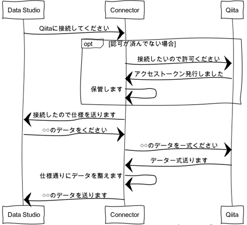
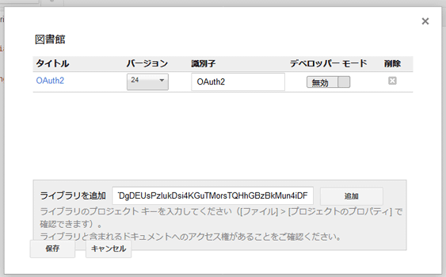
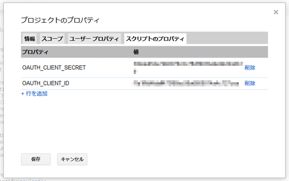

この記事はQiitaからの転載です。
https://qiita.com/prograti/items/52eea1909afd7a5869c9

過去の記事で Google Data Studio を使って Googleアナリティクスのデータをビジュアル化しました。

:link:[無料でテクニカル レポートを作ろう！Google Data Studio＋Google Analyticsガイド](https://qiita.com/prograti/items/933280f821b4c2c1190c)

この時は、標準で用意されているコネクタを使ってGoogleアナリティクスに接続しました。しかし、Data Studioが標準でサポートしていないデータソースと接続する場合には、一旦GoogleスプレッドシートやBigQueryなどのサポートされているデータソースに記録して接続する必要があり、やや汎用性に欠ける部分があります。

いろんな用途で幅広く使いたいという場合はコネクタを自作した方が何かと都合が良いでしょう。そこで今回は、基本的なコネクタの作り方としてQiitaと接続するためのコネクタを作ってみたいと思います。

※英語のリファレンスはこちら:point_down:
https://developers.google.com/datastudio/connector/overview

##:beginner: 基本的な処理フロー
はじめに基本的な処理フローを見てみましょう。簡単に図示すると以下のような感じになります。



コネクタはGoogle Apps Scriptのプロジェクトとして作成し、定義されたAPI（Data Studioからコネクタに対してコールされる関数）仕様に従って認証・認可やデータの取得、フォーマットなどの処理を実装する形になります。

##:gear: API一覧
Data Studioからコールされる関数の一覧は以下の通りです。必ずコールされる関数が4つ、OAuthを利用する場合にコールされる関数が4つの計8つの関数があります。 [^1]

###必ずコールされる関数
- **getAuthType**： Data Studioは、この関数から返される認証方式をもとに外部データソースとの接続に認可が必要かどうか判断する。認可が必要でまだ認可を取得していない場合、ユーザーはData Studioの画面上で認証・認可を行う。 [^2]
- **getConfig**： ユーザーが設定できるオプション情報を取得する。Data Studioは、この情報をもとにユーザーにオプション情報入力画面を表示し、コネクタはそこで入力された値を使って外部データソース接続などの処理を行うことができる。
- **getSchema**： コネクタが提供するデータの構造（フィールドの名前や型など）をData Studioに返す。Data Studioはこのデータ構造をもとにユーザーにフィールド情報を表示し、ユーザーがグラフを作成できるようにする。
- **getData**： Data Studioからリクエストが来た時に外部データソースなどに接続してデータを取得し、定義したデータ構造に合わせた形に整形して返す。

###OAuthを利用する場合にコールされる関数
- **isAuthValid**： 有効な資格を持っている場合はtrue、もっていない場合はfalseを返す。
- **get3PAuthorizationUrls**： 外部データソースへのアクセスを OAuthクライアントに認可するための認可エンドポイントを返す。
- **authCallback**： 認可サーバで認可を行った後にコールバックされる関数。
- **resetAuth**： 保存している資格情報を削除する。 [^3]

##   Qiitaコネクタを作ってみる
###事前準備１．OAuthライブラリを追加する
Qiitaと接続するためにOAuth認証が必要になりますが、OAuthクライアントを一から実装するのは大変です。今回は既にあるOAuthライブラリを利用します。Google Apps Scriptでプロジェクトを作成したら、メニューの「リソース」⇒「ライブラリ」からライブラリ画面を開き、以下のライブラリIDを入力してOAuthライブラリを追加してください。
ライブラリID：```1B7FSrk5Zi6L1rSxxTDgDEUsPzlukDsi4KGuTMorsTQHhGBzBkMun4iDF```
via https://github.com/googlesamples/apps-script-oauth2



###事前準備２．マニフェスト ファイルにData Studioの情報を追記する
メニューの「表示」⇒「マニフェスト ファイルを表示」からマニフェスト ファイル（appsscript.json）を開き、Data Studioに関する情報を追記してください。

```appsscript.json
{
  "dataStudio": {
    "name": "Qiita Connector",
    "logoUrl": "https://ロゴのURL",
    "company": "コネクタの作者",
    "companyUrl": "https://コネクタの作者のURL",
    "addonUrl": "https://コネクタの詳細に関するURL",
    "supportUrl": "https://コネクタのサポート窓口のURL",
    "description": "Connect to your Qiita account"
  }
}
```
マニフェスト ファイルに記載した内容が以下のようにData Studioのコネクタの画面に反映されます。


###事前準備３．Client IDとClient Secretを発行する
OAuthを利用するためにはClient IDとClient Secretが必要です。Qiitaの「設定」⇒「アプリケーション」⇒「アプリケーションを登録する」から必要な情報を入力し、Client IDとClient Secretを発行してください。なお、「リダイレクト先のURL」は以下のようになります。
リダイレクト先のURL：```https://script.google.com/macros/d/（スクリプト ID）/usercallback```
※スクリプトIDはプロジェクトのプロパティから参照できます。

プログラムの中にClient IDとClient Secretをハードコーディングしても良いのですが、ここではスクリプトのプロパティに設定して、プログラムからはプロパティ名で参照するようにしたいので、プロジェクトのプロパティからスクリプトのプロパティを選んで適当な名前で登録してください。




[^1]: 8つ以外に任意実装の関数が1つあります。詳しくは[APIリファレンス](https://developers.google.com/datastudio/connector/reference)をご確認ください。
[^2]: 2018年1月時点ではOAuthのみですが、今後他の方式も追加する予定とのことです。
[^3]: 今後Data Studioの画面上からリセットを実行可能にする予定とのことです。