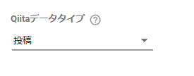
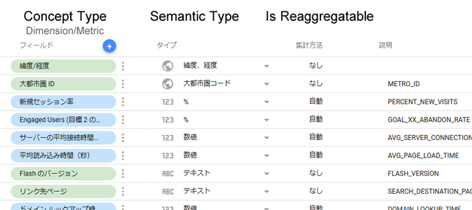
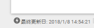
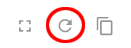

###サンプルコード
では、実際にAPI一覧でご紹介した関数8つを実装してみたいと思います。

:one: **getAuthType**

```javascript
function getAuthType() {
  var response = {'type': 'OAUTH2'}; // 認可不要の場合は'NONE'を設定
  return response;
}
```

:two: **getConfig**

```javascript
function getConfig(request) {
  var config = {
    configParams: [
      {
        name: 'qiitaDataType',
        type: 'SELECT_SINGLE',
        displayName: 'Qiitaデータタイプ',
        helpText: '取得したいデータのタイプを選択してください。',
        options: [
          {
            label: '投稿',
            value: 'posts'
          },
          {
            label: 'いいね',
            value: 'likes'
          }
        ]
      }
    ]
  };
  return config;
}
```
サンプルでは投稿データと いいね データを分けて取得するため、ユーザーにどちらのデータを取得するのか選択させるようにオプション情報を設定しています。こうすると、Data Studioのコネクタの画面で下図のような画面を表示させることができます。



選択リスト以外にもテキスト入力欄やチェックボックスなどが利用可能です。

:three: **getSchema**

```javascript
var connector = connector || {}; // namespace
connector.schema = {
  posts: [
    {
      name: 'title',
      label: 'タイトル',
      description: '投稿のタイトル',
      dataType: 'STRING',
      semantics: {
        semanticType: 'TEXT',
        conceptType: 'DIMENSION'
      }
    },
    {
      name: 'likes_count',
      label: 'いいね数',
      description: '投稿に対する いいね の総数',
      dataType: 'NUMBER',
      semantics: {
        semanticType: 'NUMBER',
        semanticGroup: 'NUMERIC',
        conceptType: 'METRIC'
      }
    },
    {
      name: 'comments_count',
      label: 'コメント数',
      description: '投稿に対するコメントの総数',
      dataType: 'NUMBER',
      semantics: {
        semanticType: 'NUMBER',
        semanticGroup: 'NUMERIC',
        conceptType: 'METRIC'
      }
    },
    {
      name: 'created_at',
      label: '投稿日',
      description: '投稿した日',
      dataType: 'STRING',
      semantics: {
        semanticType: 'YEAR_MONTH_DAY',
        semanticGroup: 'DATE_TIME',
        conceptType: 'DIMENSION'
      }
    }
  ],
  likes: [
    {
      name: 'id',
      label: 'ID',
      description: '投稿のID',
      dataType: 'STRING',
      semantics: {
        semanticType: 'TEXT',
        conceptType: 'DIMENSION'
      }
    },
    {
      name: 'title',
      label: 'タイトル',
      description: '投稿のタイトル',
      dataType: 'STRING',
      semantics: {
        semanticType: 'TEXT',
        conceptType: 'DIMENSION'
      }
    },
    {
      name: 'created_at',
      label: 'いいね作成日',
      description: 'ユーザーが いいね した日',
      dataType: 'STRING',
      semantics: {
        semanticType: 'YEAR_MONTH_DAY',
        semanticGroup: 'DATE_TIME',
        conceptType: 'DIMENSION'
      }
    },
    {
      name: 'likes_count',
      label: 'いいね数',
      description: 'いいね数',
      dataType: 'NUMBER',
      defaultAggregationType: 'COUNT',
      semantics: {
        semanticType: 'NUMBER',
        semanticGroup: 'NUMERIC',
        conceptType: 'METRIC'
      }
    }
  ]
};

function getSchema(request) {
  return {schema: connector.schema[request.configParams.qiitaDataType || 'posts']};
}
```

投稿データと いいね データを分けているためスキーマも2つ用意し、ユーザーが選択したQiitaデータタイプに合わせてスキーマを返すようにしています。スキーマには各フィールドの名前やラベル、説明、データ型、セマンティック情報などを定義します。セマンティック情報とは文字通りフィールドに意味的な情報を付加するもので、Data Studioのフィールドエディタで確認出来ますのでGoogleアナリティクスなどのフィールドを参考にしてみてください。



:four: **getData**

```javascript
function getData() {
  var dataType = request.configParams.qiitaDataType || 'posts';
  var dataFunc = connector.dataFuncs[dataType];
  return dataFunc(request);
}

connector.dataFuncs = {};

connector.dataFuncs.posts = function(request) {
  // リクエストされたフィールドに対応するスキーマを作成
  var dataSchema = request.fields.map(function(field) {
    for (var i = 0; i < connector.schema.posts.length; i++) {
      if (connector.schema.posts[i].name == field.name) {
        return connector.schema.posts[i];
      }
    }
  });

  var posts = [];
  var access_token = connector.getOAuthService().getToken().token;
  // Qiitaに投稿データの1ページ目をリクエスト
  var response = UrlFetchApp.fetch(
      'https://qiita.com/api/v2/authenticated_user/items?page=1&per_page=100', 
      {headers: {'Authorization': 'Bearer ' + access_token}}
    );
  
  // レスポンスヘッダーから総ページ数を取得
  var headers = response.getAllHeaders();
  if ('Link' in headers) {
    var link = headers['Link'];
    var lastPageRegEx = /\?page=([0-9]+)&per_page=[0-9]+>; rel="last"/;
    var matches = link.match(lastPageRegEx);
    var lastPageStr = matches[1];
    var totalPages = parseInt(lastPageStr, 10);
  } else {
    var totalPages = 1;
  }
  
  // 全ページのデータを取得してマージ
  for (var i = 1; i <= totalPages; i++) {
    if (i > 1) {
      response = UrlFetchApp.fetch(
          'https://qiita.com/api/v2/authenticated_user/items?page=' + i + '&per_page=100', 
          {headers: {'Authorization': 'Bearer ' + access_token}}
        );
    }
    try {
      var currentPostData = JSON.parse(response);
    } catch (e) {
      throw new Error('取得したデータの解析に失敗しました。');
    }
    posts = posts.concat(currentPostData);
  }

  // スキーマに合わせて行データを作成
  var data = posts.map(function(post) {
    var values = [];
    dataSchema.forEach(function(field) {
      switch (field.name) {
        case 'title':
          values.push(post.title);
          break;
        case 'likes_count':
          values.push(post.likes_count);
          break;
        case 'comments_count':
          values.push(post.comments_count);
          break;
        case 'created_at':
          values.push(post.created_at.slice(0, 10).replace(/-/g, ''));
          break;
        default:
          values.push('');
      }
    });
    return { values: values };
  });

  return {
    schema: dataSchema,
    rows: data
  };
}
```

基本的にはこの関数でコネクタの大部分の処理を行うことになります。今回は投稿データと いいね データを分けて取得するため、便宜上関数を分けています（いいね に関する関数はページが長くなるので割愛させていただきます）。

Data Studioはデフォルトでキャッシュする仕組みを持っており、レポートを表示するたびに毎回```getData```を呼び出すわけではなく、極力キャッシュからデータを取得しようと動作します（レポートの左下にある稲妻アイコンがキャッシュから取得していることを表す）。



キャッシュには以下の2種類があり、キャッシュにヒットしない場合に```getData```が呼び出されます（キャッシュは定期的に自動更新される）。

- **クエリ キャッシュ**：レポートのコンポーネントによって発行されたクエリ（データのリクエスト）を記憶し、レポートを表示するユーザーが過去のクエリと同一のクエリをリクエストした場合、キャッシュからデータを取得する。 [^1]
- **プリフェッチ キャッシュ**：レポートのディメンション、指標、フィルタ、期間のプロパティなどを分析することで、コンポーネントがリクエストするデータを予測し、使用できるデータを可能な限り保存する。クエリ キャッシュにヒットしない場合に、さらにこのキャッシュを使ってデータの取得を試みる。

レポート編集権限者は、ページ上部の「データを更新」ボタンを使っていつでもキャッシュを更新できます。また、キャッシュを無効にしたい場合はメニューの「ファイル」⇒「レポート設定」から「キャッシュを有効化」のチェックを外してください。



[^1]: 試した感じだと、表の列の昇順・降順を変更したり、結果をフィルタリングした場合は、既に取得したデータセットに対して処理を行うのではなく、新たなクエリを発行しているようです。