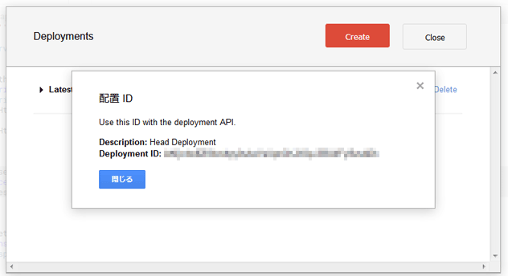
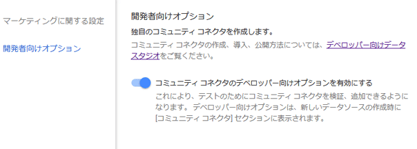
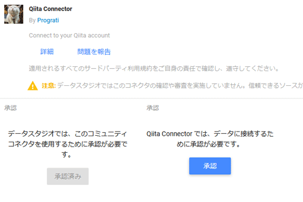
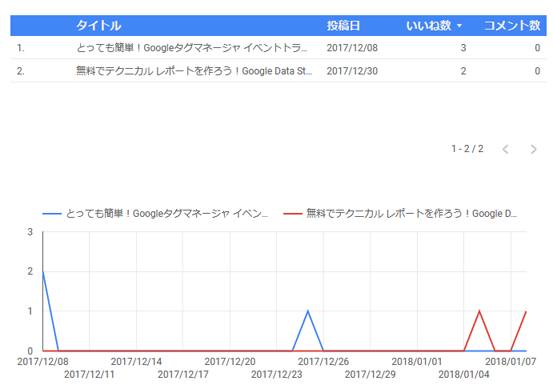

:closed_lock_with_key: OAuthクライアントを実装する

OAuth関連の関数を実装する前にOAuthクライアントの実装が必要ですが、OAuthライブラリが必要な処理を全て行ってくれるためパラメータを設定するだけで大丈夫です。

```javascript
connector.getOAuthService = function() {
  // スクリプトのプロパティに設定したClient IDとClient Secretを取得
  var scriptProps = PropertiesService.getScriptProperties();
  var clientId = scriptProps.getProperty('OAUTH_CLIENT_ID');
  var clientSecret = scriptProps.getProperty('OAUTH_CLIENT_SECRET');
  
  return OAuth2.createService('qiita')
    .setAuthorizationBaseUrl('https://qiita.com/api/v2/oauth/authorize')
    .setTokenUrl('https://qiita.com/api/v2/access_tokens')
    .setClientId(clientId)
    .setClientSecret(clientSecret)
    .setTokenHeaders({
      'Content-Type': 'application/json'
    })
    .setPropertyStore(PropertiesService.getUserProperties()) // アクセストークンの保存先
    .setScope('read_qiita')
    .setCallbackFunction('authCallback')
    .setTokenPayloadHandler(connector.tokenHandler);
}

// アクセストークンを要求する際のペイロードをJSON文字列に変換
connector.tokenHandler = function(payload) {
  return JSON.stringify(payload);
}
```

Qiita APIはデータの送受信にJSONしか受け付けないため```setTokenHeaders```と```setTokenPayloadHandler```でJSONに関する処理を施しています（ライブラリのデフォルトが```application/x-www-form-urlencoded```のため）。

:five: **isAuthValid**

```javascript
function isAuthValid() {
  var service = connector.getOAuthService();
  if (service == null) {
    return false;
  }
  return service.hasAccess();
}
```

:six: **get3PAuthorizationUrls**

```javascript
function get3PAuthorizationUrls() {
  var service = connector.getOAuthService();
  if (service == null) {
    return '';
  }
  return service.getAuthorizationUrl();
}
```

:seven: **authCallback**

```javascript
function authCallback(request) {
  var authorized = connector.getOAuthService().handleCallback(request);
  if (authorized) {
    return HtmlService.createHtmlOutput('認証に成功しました。');
  } else {
    return HtmlService.createHtmlOutput('認証が拒否されました。');
  }
}
```

:eight: **resetAuth**

```javascript
function resetAuth() {
  var service = connector.getOAuthService();
  service.reset();
} 
```

以上で実装は終了です。

###コネクタのテスト
では、実際に作ったコネクタを使ってみたいと思います。コネクタを利用するためにはDeployment IDが必要になります。Google Apps Scriptのメニューの「公開」⇒「マニフェストから配置」⇒「Get ID」でDeployment IDを取得してください。



Deployment IDを取得したら、Data Studioの画面で左メニューの「ユーザー設定」⇒「開発者向けオプション」から、コネクタのオプションを有効にしてください。



これでコネクタを追加できるようになります。左メニューの「データソース」からデータソースの新規作成を行い（画面右下の:heavy_plus_sign:ボタン）、コネクタの一覧が表示されているエリアの一番下の:wrench:デベロッパーをクリックしてください。そうするとコネクタを追加する画面が開きますので先ほど取得したDeployment IDを入力して検証ボタンをクリックしてください。

マニフェストが有効な場合、コネクタが表示されますので「コネクタを追加」をクリックしてください。


コミュニティ コネクタを利用するためにはGoogleアカウントでの承認が必要になりますので、承認ボタンをクリックしてください。承認が完了すると今度はQiitaと接続するための承認ボタンが表示されますので、承認ボタンをクリックしてOAuth認証を行ってください。



以上で準備は完了です。あとは投稿データか いいね データのどちらかを選択して接続すればレポートを作成できます。もし両方のデータを使いたい場合は、投稿データ用のデータソースと いいね データ用のデータソースの2つを作って、レポート内でそれぞれのデータソースを使えばOKです。

実際に表やグラフを表示してみると下のような感じになります。データがしょぼくてお恥ずかしいのですが。。。



##まとめ
最近だと[Metabase](https://www.metabase.com/)に関する記事がトレンドに入ったりデータ可視化ツールが注目を集めているようです。Google Data Studioは痒い所に手が届かなかったり、まだまだこれからのツールかなという感じですが、継続的に改良が加えられて使い勝手も良くなっています。なにより、手軽に始められ配布しやすいという点は大きなメリットかなと思います。

既にいろいろなコネクタが公開されていますが、有料だったりするので欲しいものがなければ自作してみては如何でしょうか？
https://developers.google.com/datastudio/connector/gallery/
https://developers.google.com/datastudio/connector/data-sources

今回作ったQiitaコネクタのソースは下記リンクからご参照いただけます。
https://github.com/prograti/datastudio-community-connectors/tree/master/qiita
