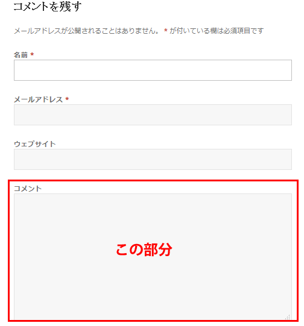
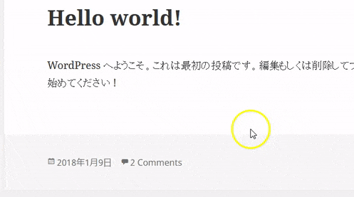

この記事はQiitaからの転載です。
https://qiita.com/prograti/items/951949e407fe8a40043b

CMSの世界で圧倒的なシェアを誇る「WordPress」。個人ブログから企業サイトまで幅広い用途で利用され、そのシェアは約60%にまで達すると言われています。最近では米国のホワイトハウスのサイトがDrupalからWordPressに移行したことでも話題になりました。

それだけ多くのサイトで使われている故にハッカーの標的になりやすく、セキュリティリリースもたびたび行われています。普段はあまり気にせずに管理画面の更新ボタンを押すだけかもしれませんが、どのような脆弱性があり、どのような対応が行われたのかを詳しく知ることは、Webアプリケーションのセキュリティを学ぶ上で有意義なことだと思います。

そこで、この記事ではWordPressの脆弱性のケーススタディを5つ取り上げてみたいと思います。なお、ここで取り上げるケースは世にある脆弱性事例の極々一部ですので、IPAの資料をまだ読んだことがないという方は一読されることをお勧めいたします。

「安全なウェブサイトの作り方：IPA 独立行政法人 情報処理推進機構」
https://www.ipa.go.jp/security/vuln/websecurity.html

徳丸先生のブログも大変参考になりますので定期的にチェックしてみてください。

「徳丸浩の日記」
https://blog.tokumaru.org/

## :spy: Stored XSS（Cross Site Scripting）
[CWE-79](https://cwe.mitre.org/data/definitions/79.html)によると、Stored XSSは以下のように記載されています。

>The application stores dangerous data in a database, message forum, visitor log, or other trusted data store. At a later time, the dangerous data is subsequently read back into the application and included in dynamic content. From an attacker's perspective, the optimal place to inject malicious content is in an area that is displayed to either many users or particularly interesting users. Interesting users typically have elevated privileges in the application or interact with sensitive data that is valuable to the attacker. If one of these users executes malicious content, the attacker may be able to perform privileged operations on behalf of the user or gain access to sensitive data belonging to the user. For example, the attacker might inject XSS into a log message, which might not be handled properly when an administrator views the logs. 

要約すると、攻撃者からのリクエストに含まれる危険なコード（スクリプト文字列など）が、適切な処理が施されずにデータベースやログなどに保存されてしまい、アプリケーションでデータを出力した時に危険なコードが実行され、ユーザーに被害を与えてしまう脆弱性です。

今回ご紹介するStored XSSは2015年に発見されたもので、投稿にコメントを残す機能に脆弱性がありました。



なお、コメント入力欄は次のHTML タグと属性のみが使え、それ以外のタグや属性は全て除去されるようになっています。

```
<a href="" title=""> <abbr title=""> <acronym title=""> <b> 
<blockquote cite=""> <cite> <code> <del datetime=""> <em> <i> 
<q cite=""> <s> <strike> <strong>
```

\<a\>タグのhref属性には```http / https /ftp / mailto / tel```などの特定のプロトコルしか記述することを許可されておらず、```javascript:```は除去されスクリプトは実行できないようになっています。一見するとスクリプトを混入させる余地がないようにも見えますが、一体どこに脆弱性があったのでしょう:thinking:

この脆弱性に対する修正は以下のURLから確認できます。
https://github.com/WordPress/WordPress/commit/5c2b420b294082c055327aa49243c1da137c694d

これを見ると```process_fields```という関数に```process_field_lengths```という処理が追加されています。これはフィールドのデータ型の最大長より入力された値が大きい場合はエラーにするという処理を行っているのですが、なぜこの処理が必要だったかお分かりでしょうか？

これはWordPressのある仕様が関係しています。WordPressではデフォルトで以下のSQLモードが非対応モードとなっており、例えSTRICTモードがセットされていたとしても、アンセットされるようになっています。

（参考） [MySQL :: MySQL 5.6 リファレンスマニュアル :: 5.1.7 サーバー SQL モード](https://dev.mysql.com/doc/refman/5.6/ja/sql-mode.html)

```php
/**
 * A list of incompatible SQL modes.
 *
 * @since 3.9.0
 * @var array
 */
protected $incompatible_modes = array(
  'NO_ZERO_DATE',
  'ONLY_FULL_GROUP_BY',
  'STRICT_TRANS_TABLES',
  'STRICT_ALL_TABLES',
  'TRADITIONAL',
);
```

この仕様により、TEXT型のフィールドに64KB（65535byte）以上の文字をインサートしようとすると、エラーにならずに64KBに切り詰めてインサートされます。実はこの挙動が脆弱性につながります。例えば以下のような64KBを超える文字列をコメント欄に入力してみます。（AAAAの部分が64KBを超えるようにズラズラとつなげる）

```
<a title='x onmouseover=alert(unescape(/xss%20success!/.source)) style=position:absolute;left:0;top:0;width:100%;height:3000px;border:none AAAAAAAAA....A'></a>
```

\<a\>タグとtitle属性だけなので入力規則的にはOKとなりエスケープ処理されないままDBに登録しようとします。しかし、TEXT型の最大長を超える部分はカットされ、実際には以下のように後半が切れた中途半端な状態で登録されます。

```
<a title='x onmouseover=alert(unescape(/xss%20success!/.source)) style=position:absolute;left:0;top:0;width:100%;height:3000px;border:none AAAAAAAAA....
```

この登録された文字列がコメント画面に以下のように出力され、```onmouseover```に書いたJavaScriptが実行されるようになります。style属性でレイヤーが画面を覆うようにしているので、ページにカーソルを置いた時点でイベントが発火しJavaScriptが実行されます。

```
<a title=&#8217;x onmouseover=alert(unescape(/xss%20success!/.source)) style=position:absolute;left:0;top:0;width:100%;height:3000px;border:none  AAAAAAAAA....
```



詳しくは書きませんが、管理者権限を持ったユーザーがログインした状態でアクセスした時に外部JavaScriptを読み込ませてバックドアを仕込むこともでき、極めて深刻な脆弱性だったと言えます。