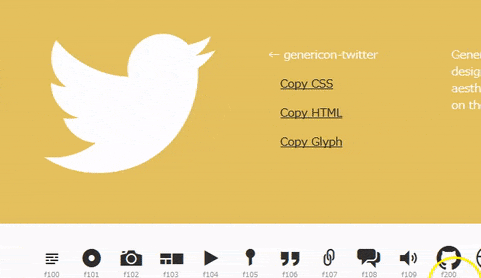
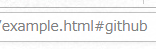
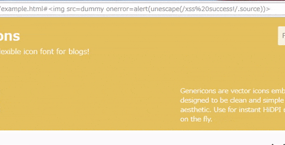
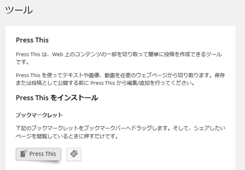
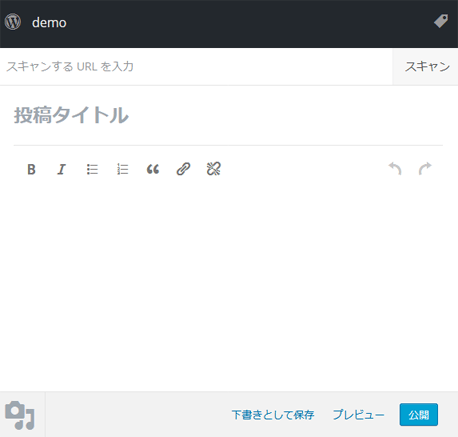

## :spy: DOM-based XSS（Cross Site Scripting）
[CWE-79](https://cwe.mitre.org/data/definitions/79.html)によると、DOM-based XSSは以下のように記載されています。

>In DOM-based XSS, the client performs the injection of XSS into the page; in the other types, the server performs the injection. DOM-based XSS generally involves server-controlled, trusted script that is sent to the client, such as Javascript that performs sanity checks on a form before the user submits it. If the server-supplied script processes user-supplied data and then injects it back into the web page (such as with dynamic HTML), then DOM-based XSS is possible.

要約すると、前述したStored XSSのようにサーバ側から不正なスクリプトを含んだレスポンスがクライアントに送信され実行されてしまうタイプとは異なり、クライアント側でのJavaScriptによる動的な処理の結果として不正なスクリプトが実行されてしまう脆弱性です。

今回ご紹介するDOM-based XSSは2015年に発見されたもので、WordPressのTwenty Fifteen テーマに含まれるGenericonsパッケージに起因するものです。

Genericonsとはフリーのアイコン フォント セットで、テーマ配下のgenericonsフォルダの中にTTFなどのフォントファイルが格納されているのですが、アイコンの一覧が確認できるようにexample.htmlという見本ページがあり、このページに脆弱性がありました（現在はexample.htmlは削除されています）。

このページは、使いたいアイコンをページに挿入するためのCSSコードやHTMLコードをコピーできるようにする機能をもっており、その部分がJavaScriptで実装されています。




アイコンをクリックすると下のようにURLのフラグメント識別子が切り替わります。




そして、実際に問題になったソースコードを抜粋したものが以下になります。

```javascript
jQuery(document).ready(function() {

  // pick random icon if no permalink, otherwise go to permalink
  if ( window.location.hash ) {
    permalink = "genericon-" + window.location.hash.split('#')[1];
    attr = jQuery( '.' + permalink ).attr( 'alt' );
    cssclass = jQuery( '.' + permalink ).attr('class');
    displayGlyph( attr, cssclass );
  } else {
    pickRandomIcon();
  }
----（省略）----
```

これを見ると、ページ読み込み時にフラグメント識別子があった場合は該当のアイコンを表示するようになっています。（example.html#hogeでアクセスされたらgenericon-hogeクラスを持つ要素からフォントコードなどを取得）

では、このページに以下のようなフラグメント識別子をつけてアクセスしてみます。

```
http://（略）/example.html#
```



プログラムを見ると```permalink = "genericon-" && selector.length >= 3 ) {
      // Assume that strings that start and end with <> are HTML and skip the regex check
      match = [ null, selector, null ];
    } else {
      match = quickExpr.exec( selector );
    }

    // Verify a match, and that no context was specified for #id
    if ( match && (match[1] || !context) ) {

      // HANDLE: $(html) -> $(array)
      if ( match[1] ) {
        context = context instanceof jQuery ? context[0] : context;
        doc = ( context ? context.ownerDocument || context : document );

        // If a single string is passed in and it's a single tag
        // just do a createElement and skip the rest
        ret = rsingleTag.exec( selector );

        if ( ret ) {
          if ( jQuery.isPlainObject( context ) ) {
            selector = [ document.createElement( ret[1] ) ];
            jQuery.fn.attr.call( selector, context, true );
          } else {
            selector = [ doc.createElement( ret[1] ) ];
          }
        } else {
          ret = jQuery.buildFragment( [ match[1] ], [ doc ] );
          selector = ( ret.cacheable ? jQuery.clone(ret.fragment) : ret.fragment ).childNodes;
        }

        return jQuery.merge( this, selector );

      // HANDLE: $("#id")
      } else {
 ----（省略）----     
    // HANDLE: $(expr, $(...))
    } else if ( !context || context.jquery ) {
      return ( context || rootjQuery ).find( selector );

    // HANDLE: $(expr, context)
    // (which is just equivalent to: $(context).find(expr)
    } else {
      return this.constructor( context ).find( selector );
    }
----（省略）----
```

上記の処理を簡単に説明すると```$('セレクタ')```のセレクタの部分にhtmlタグが指定されたのか、IDが指定されたのか、それともクラスセレクタなど他のセレクタが指定されたのかで処理を分けているのですが、今回のケースでいうと```jQuery('.genericon-)[^>]*$|#([\w\-]*)$)/
match = quickExpr.exec( selector );
```

正規表現を見ると分かるようにhtmlタグもしくは#idに一致するか、いずれにも一致しないかで処理を振り分けています。しかし、このhtmlタグ判定の部分を見るとタグの前後に文字が入ることを許可した仕様になっています。つまり、本来クラスセレクタの方にいくはずの処理がhtmlタグとして認識され、タグの方の処理に行ってしまいます。

そして、この後に以下の処理が実行されます。

```javascript
ret = jQuery.buildFragment( [ match[1] ], [ doc ] );
```

このbuildFragmentの中で[DocumentFragment](https://developer.mozilla.org/ja/docs/Web/API/DocumentFragment)(親ノードの無い最小限度の文書オブジェクト)が作成され、そこにフラグメント識別子に仕込んだ以下のimgタグが```innerHTML```で追加されることによりonerrorイベントが発火してjavascriptが実行されることになります。

```

```

jQueryの仕様によるものなので発見は難しいかもしれませんが、prettyPhotoなどの人気ライブラリでも同様の脆弱性が過去に発見されており、サードパーティ製のライブラリを利用する際は注意が必要です。

## :spy: SSRF（Server-Side Request Forgery）
[CWE-918](https://cwe.mitre.org/data/definitions/918.html)によるとSSRFは以下のように記載されています。

>By providing URLs to unexpected hosts or ports, attackers can make it appear that the server is sending the request, possibly bypassing access controls such as firewalls that prevent the attackers from accessing the URLs directly. The server can be used as a proxy to conduct port scanning of hosts in internal networks, use other URLs such as that can access documents on the system (using file://), or use other protocols such as gopher:// or tftp://, which may provide greater control over the contents of requests. 

要約すると、ファイアウォールなどで外部からの攻撃をプロテクトしているサーバに対して、別のサーバを経由することで攻撃できてしまう脆弱性です。

今回ご紹介するSSRFは2016年に発見されたもので、「Press This」という機能に脆弱性がありました。



「Press This」は引用したいサイトのコンテンツを記事に取り込み簡単に投稿できるようにするためのブックマークレットなのですが、指定したURLをスキャンして取り込む機能も持っています。



WordPressではnonceを使ったCSRF対策を行っているのですが、このスキャンの実行に関してはCSRF対策がされておらず、URL直叩きで実行できる状態になっていました。

```
http://xxxx/wp-admin/press-this.php?u=（スクレイピングしたいURL）&url-scan-submit=スキャン
```

外部からのアクセスをプロテクトしていたとしても、WordPressサーバからアクセスできる状態であれば、この脆弱性を突いて情報を窃取することができてしまいます。

攻撃者 ---:heavy_multiplication_x:---> プロテクトされたサイト
攻撃者 ---:o:---> WordPress ---:o:---> プロテクトされたサイト

加えて、この脆弱性にはもう一つ別の問題が発見されています。該当箇所のソースコードを抜粋したものが以下になります。

```php
function wp_http_validate_url( $url ) {
  ----（省略）----
  if ( $ip ) {
    $parts = array_map( 'intval', explode( '.', $ip ) );
    if ( 127 === $parts[0] || 10 === $parts[0]
      || ( 172 === $parts[0] && 16 <= $parts[1] && 31 >= $parts[1] )
      || ( 192 === $parts[0] && 168 === $parts[1] )
    ) {
      if ( ! apply_filters( 'http_request_host_is_external', false, $host, $url ) )
        return false;
    }
  }
  ----（省略）----
}
```

これはWordPressのHTTPクライアント（WordPress本体やサードパーティ・プラグインなどが利用するユーティリティクラス）がリクエストを送信する際に、それがローカルアドレス宛だったら安全でないリクエストとしてリクエストをキャンセルする処理になります。

[IANA IPv4 Special-Purpose Address Registry](https://www.iana.org/assignments/iana-ipv4-special-registry/iana-ipv4-special-registry.xhtml)を見ると

| Address Block | Name |
|:--|:--|
| 10.0.0.0/8  | Private-Use  |
| 127.0.0.0/8  | Loopback  |
| 172.16.0.0/12  |  Private-Use |
| 192.168.0.0/16  | Private-Use  |

となってますのでルールに従って実装しているように見えるのですが、一つ見落としがあります。既にお気付きかもしれませんが、Linuxサーバ上で```ping 0.0.0.0```を叩くと```127.0.0.1```から結果が返ってくることから分かるように、0.0.0.0でlocalhostにアクセスできてしまいます。

```
http://xxxx/wp-admin/press-this.php?u=http://0.0.0.0:8080/&url-scan-submit=スキャン
```

レアケースかもしれませんが、仮にWordPressと同じサーバ内に開発サイトや社内ポータルなどをlocalhostで動かしていた場合にアクセスされる危険性がありました。