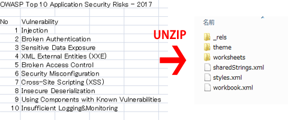
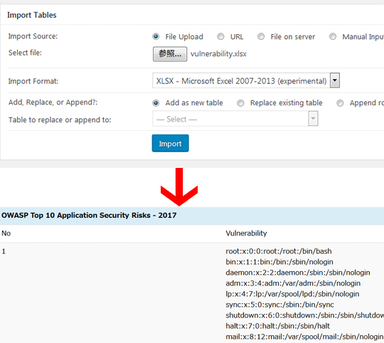

この記事はQiitaからの転載です。
https://qiita.com/prograti/items/82409213bb875540a52e

以前WordPressの脆弱性ケーススタディをご紹介しました。

[Webアプリケーションの脆弱性ケーススタディ（WordPress編）](https://qiita.com/prograti/items/951949e407fe8a40043b)

今回もWebアプリケーションのセキュリティを学ぶために、WordPressで実際にあった脆弱性をいくつかご紹介したいと思います。

## :spy: XML External Entity (XXE) Processing

[CWE-611](https://cwe.mitre.org/data/definitions/611.html)によると、XML External Entity (XXE) は以下のように記載されています。

>XML documents optionally contain a Document Type Definition (DTD), which, among other features, enables the definition of XML entities. It is possible to define an entity by providing a substitution string in the form of a URI. The XML parser can access the contents of this URI and embed these contents back into the XML document for further processing.By submitting an XML file that defines an external entity with a file:// URI, an attacker can cause the processing application to read the contents of a local file. For example, a URI such as "file:///c:/winnt/win.ini" designates (in Windows) the file C:\Winnt\win.ini, or file:///etc/passwd designates the password file in Unix-based systems. Using URIs with other schemes such as http://, the attacker can force the application to make outgoing requests to servers that the attacker cannot reach directly, which can be used to bypass firewall restrictions or hide the source of attacks such as port scanning.Once the content of the URI is read, it is fed back into the application that is processing the XML. This application may echo back the data (e.g. in an error message), thereby exposing the file contents. 

要約すると、XMLの仕様に実体参照（[Entity Reference](https://www.w3.org/TR/xml/#sec-references)）というものがあり、XXEとはその実体参照によって引き起こされる脆弱性になります。例えば、XMLは以下のような形で外部ファイルを参照することができるのですが、これを悪用すればパスワードファイルを窃取したり、内部サーバに対してポートスキャニングを行ったりすることが可能になります。

```mybook.xml
<?xml version="1.0" ?>
<!DOCTYPE mybook [
<!ENTITY toc SYSTEM "toc.xml">
<!ENTITY introduction SYSTEM "introduction.xml">
<!ENTITY body SYSTEM "body.xml">
<!ENTITY afterword SYSTEM "afterword.xml">
]>
<mybook>
&toc;
&introduction;
&body;
&afterword;
</mybook>
```

今回ご紹介するXXEは、投稿内に表組みを簡単に作成できる「TablePress」というプラグインで見つかったものです。このプラグインはCSVやHTML、Excelなどのファイルをインポートすることができ、Excelファイルをインポートする機能に脆弱性がありました。

まず、本題に入る前に補足説明しておくと、ExcelはOffice 2003までは独自のバイナリ形式でしたが、2007以降では「[Office Open XML](https://ja.wikipedia.org/wiki/Office_Open_XML)」というXMLをベースとしたファイルフォーマットを採用しています。



TablePressでは、このXMLを解析して表データを取り込んでいます。では、問題のあった箇所を見てみましょう。

```php
protected function getEntryXML( $name ) {
  if ( ( $entry_xml = $this->getEntryData( $name ) ) && ( $entry_xmlobj = simplexml_load_string( $entry_xml ) ) ) {
    return $entry_xmlobj;
  }

  $this->error( 'Entry not found: ' . $name );
  return false;
}
```

上記関数は読み込んだXMLデータをオブジェクトとして返すシンプルなもので、SimpleXML拡張モジュール（libxmlに依存）の```simplexml_load_string```を使用しています。この関数に改変したExcelファイルを読み込ませてみたいと思います。

まず、適当に作成したExcelファイルの拡張子をzipに変更して解凍し、xlフォルダの配下にあるsharedStrings.xmlを開きます（下は見やすいように整形しています）。

```sharedStrings.xml
<?xml version="1.0" encoding="UTF-8" standalone="yes"?>
<sst
	xmlns="http://schemas.openxmlformats.org/spreadsheetml/2006/main" count="13" uniqueCount="13">
	<si>
		<t>No</t>
		<phoneticPr fontId="1"/>
	</si>
	<si>
		<t>OWASP Top 10 Application Security Risks - 2017</t>
		<phoneticPr fontId="1"/>
	</si>
	<si>
		<t>Injection</t>
		<phoneticPr fontId="1"/>
	</si>
---（略）---
```

これを以下のように書き換えてZIP圧縮してもとのExcelファイルに戻します。

```sharedStrings.xml
<?xml version="1.0" encoding="UTF-8" standalone="yes"?>
<!DOCTYPE dummy [ 
<!ELEMENT t ANY >
<!ENTITY xxe SYSTEM "file:///etc/passwd" >]>
<sst
	xmlns="http://schemas.openxmlformats.org/spreadsheetml/2006/main" count="13" uniqueCount="13">
	<si>
		<t>No</t>
		<phoneticPr fontId="1"/>
	</si>
	<si>
		<t>OWASP Top 10 Application Security Risks - 2017</t>
		<phoneticPr fontId="1"/>
	</si>
	<si>
		<t>&xxe;</t>
		<phoneticPr fontId="1"/>
	</si>
```

そして、管理画面からインポートしてプレビュー表示してみると以下のようになります。



ENTITYに定義した/etc/passwdファイルへの参照が反映されファイルの中身が表示されてしまいました。しかし、ここでちょっと疑問に思った方もいらっしゃるかと思います。というのも```simplexml_load_string```は第3引数（Libxmlパラメータ）に```LIBXML_NOENT```（エンティティを置換 ）を指定しなければ本来は参照の内容が反映されないからです（PHPのマニュアルを見る限りでは）。

しかし、いろいろ検証してみた結果、PHPをコンパイルするときに「libxml2-2.8.0」を指定（--with-libxml-dir）した場合は```LIBXML_NOENT```を引数に渡さなくても今回の現象が発生しました。（php5.6.33およびphp7.2.2にて確認。なお、libxml2-2.7.6やlibxml2-2.9.1では発生せず）

したがって、以下の修正後ソースのように```libxml_disable_entity_loader```関数を呼び出して外部エンティティの読み込み機能を無効にした方が安全です。

```php
public function getEntryXML( $name ) {
  if ( $entry_xml = $this->getEntryData( $name ) ) {
    // XML External Entity (XXE) Prevention.
    $_old_value = libxml_disable_entity_loader( true );
    $entry_xmlobj = simplexml_load_string( $entry_xml );
    libxml_disable_entity_loader( $_old_value );
    if ( $entry_xmlobj ) {
      return $entry_xmlobj;
    }
    $e = libxml_get_last_error();
    $this->error( 'XML-entry ' . $name . ' parser error ' . $e->message . ' line ' . $e->line );
  } else {
    $this->error( 'XML-entry not found: ' . $name );
  }
  return false;
}
```

なお、php7.2.1で修正されましたが```libxml_disable_entity_loader```はphp-fpm使用時に異なるリクエスト間で設定値が共有されてしまうバグがあります。ENTITYが含まれているかどうかを事前にチェックして、含まれていたらエラーにした方がより確実かもしれません。

http://www.php.net/ChangeLog-7.php#7.2.1