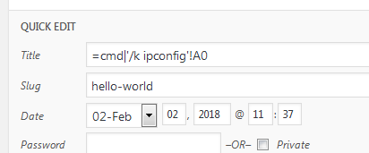
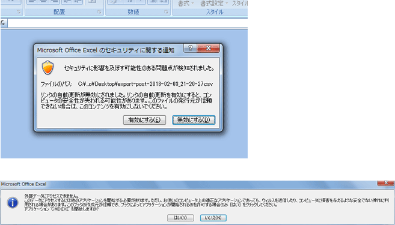
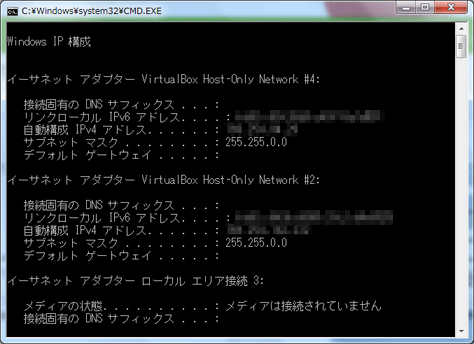
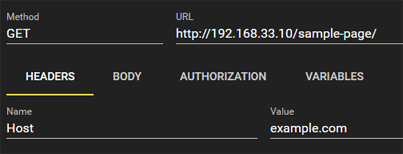
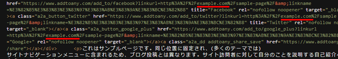
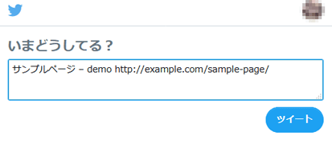

## :spy: Formula injection（CSV Injection）

[OWSAP](https://www.owasp.org/index.php/CSV_Injection)によると、Formula injection（CSV Injection）は以下のように記載されています。

>CSV Injection, also known as Formula Injection, occurs when websites embed untrusted input inside CSV files.When a spreadsheet program such as Microsoft Excel or LibreOffice Calc is used to open a CSV, any cells starting with '=' will be interpreted by the software as a formula. Maliciously crafted formulas can be used for three key attacks: 

要約すると、CSVファイルに数式と解釈されるようなデータの挿入を許可してしまい、ユーザがExcelなどでCSVファイルを開いた時に悪意のあるコードが実行されてしまう脆弱性になります。

以下のソースは、あるCSV出力プラグインのCSV出力の部分を抜粋したものです。

```php
$fp = fopen( $filepath, 'w' );

// 配列をカンマ区切りにしてファイルに書き込み
foreach ( $list as $fields ) {
  //文字コード変換
  if ( function_exists( "mb_convert_variables" ) ) {
    mb_convert_variables( $string_code, 'UTF-8', $fields );
  }
  fputcsv( $fp, $fields );
}
fclose( $fp );
```

DBから取得した投稿データを```fputcsv```にそのまま渡してCSVファイルに出力しています。一見するとよくある処理なのですが、仮に投稿データに不正なデータがあった場合、ここが脆弱性につながります。

では、実際に投稿のタイトルに不正なデータを入れてみます。

```
=cmd|'/k ipconfig'!A0
```



そして、このプラグインを使ってCSVファイルとしてエクスポートし、Excelで開いてみます。そうすると以下のようにセキュリティ警告が出ますので「有効にする」をクリックし、次に開いたメッセージボックスの「はい」をクリックします。



そうするとコマンドプロンプトが開きipconfigが実行されてしまいました。




これは先ほどタイトルに入力したDDE（Dynamic Data Exchange）コマンドがExcel上で実行されてしまったからです。今回はDDEの例をご紹介しましたが、例えばExcelのHYPERLINK関数を使って不正なリンクを仕込むといったこともできます。したがって、仕様的に文字の削除が可能なのであれば、先頭の文字から"="を削除した方が安全です。また、"="以外にも"+"、"-"、"@"も同様に数式として解釈されます。これらの文字も削除した方が良いでしょう。

## :spy: Cache Poisoning

[OWSAP](https://www.owasp.org/index.php/Cache_Poisoning)によると、Cache Poisoningは以下のように記載されています。

>The impact of a maliciously constructed response can be magnified if it is cached either by a web cache used by multiple users or even the browser cache of a single user. If a response is cached in a shared web cache, such as those commonly found in proxy servers, then all users of that cache will continue to receive the malicious content until the cache entry is purged. Similarly, if the response is cached in the browser of an individual user, then that user will continue to receive the malicious content until the cache entry is purged, although only the user of the local browser instance will be affected. 

要約すると、コンテンツをキャッシュして不特定多数のユーザーに配信している場合に、攻撃者によってキャッシュに不正なコードを仕込まれ、汚染されたコンテンツがユーザーに配信されてしまう脆弱性になります。

今回ご紹介するCache Poisoningは、「AddToAny Share Buttons」というソーシャルメディアへのシェアボタンを追加するプラグインで見つかったものです。このプラグインは投稿の末尾に自動的にシェアボタンを表示してくれるのですが、それと別に自分でテーマをカスタマイズして好きな場所にシェアボタンを追加できるように以下のようなヘルパー関数を用意しており、そこに脆弱性がありました。

```php
<?php if ( function_exists( 'ADDTOANY_SHARE_SAVE_KIT' ) ) { 
  ADDTOANY_SHARE_SAVE_KIT( array( 'use_current_page' => true ) );
} ?>
```

では、問題のあった箇所を見てみましょう。

```php
if ( ! $linkurl ) {
  if ( $use_current_page ) {
    $linkurl = esc_url_raw ( ( is_ssl() ? 'https://' : 'http://' ) . $_SERVER['HTTP_HOST'] . $_SERVER['REQUEST_URI'] );
  } elseif ( isset( $post ) ) {
    $linkurl = get_permalink( $post->ID );
  } else {
    $linkurl = '';
  }
}
```

上記はシェアリンクのURLを組み立てている処理なのですが、```$use_current_page```がtrueの場合、```HTTP_HOST```と```REQUEST_URI```を使って組み立てています。もし、攻撃者がHOSTヘッダーを改ざんしてリクエストを送った場合、linkurlは以下のようになってしまいます。

```
http://（悪意のあるサイト）.com/xxxxxxxxx/
```

では、実際にサンプルページに以下のようなリクエストを送ってみます。（ここでは、事前にWP Fastest Cacheを入れてページをキャッシュするようにしておきます。）



そうすると以下のようなレスポンスが返ってき、linkurlがHostヘッダに設定した値になっていることが分かります。



次にページにアクセスしTwitterのツイートボタンをクリックしてみます。



キャッシュプラグインによって先ほどのリクエストがキャッシュされてしまい、本来サンプルページのURLが表示されるべきところで、不正なURLが表示されてしまいました。今回はWordPressのプラグインによるアプリケーションレイヤーのキャッシュでしたが、ロードバランサーやリバースプロキシ、CDNなど様々なレイヤーでキャッシュを利用されている方も多いかと思います。**Web Cache Deception Attack**といった攻撃で個人情報を狙う事例も発生していますので、キャッシュの取り扱いには十分な注意が必要です。
