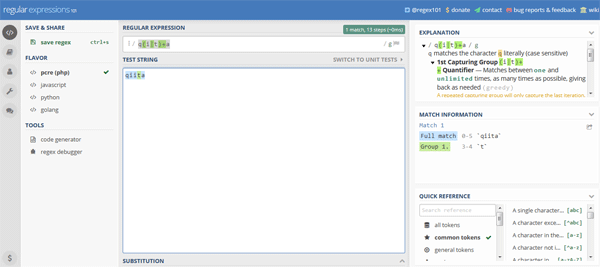
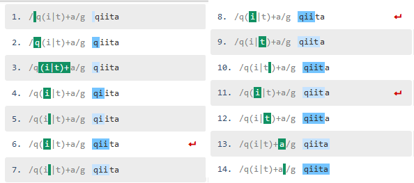
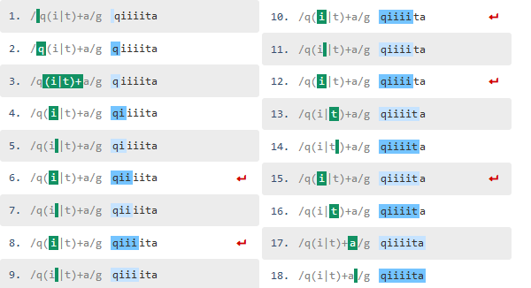
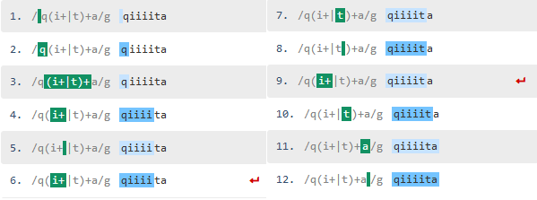
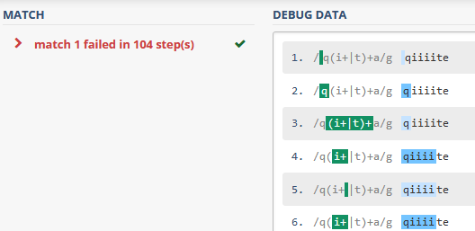
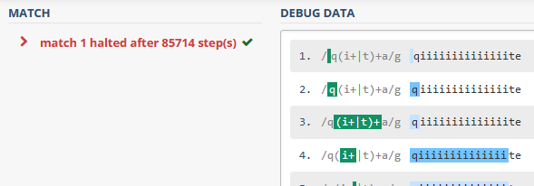
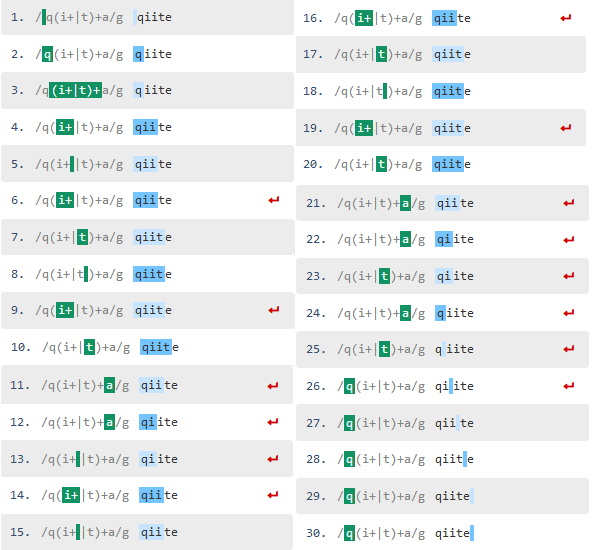

この記事はQiitaからの転載です。
https://qiita.com/prograti/items/9b54cf82a08302a5d2c7

過去にWordPressを題材にしていろいろな脆弱性のケーススタディを取り上げました。

- [Webアプリケーションの脆弱性ケーススタディ（WordPress編）](https://qiita.com/prograti/items/951949e407fe8a40043b)
- [Webアプリケーションの脆弱性ケーススタディ（WordPress編その２）](https://qiita.com/prograti/items/82409213bb875540a52e)

今回は、ReDoS（Regular Expressions DoS）について取り上げてみたいと思います。ReDoSとは[OWASP](https://www.owasp.org/index.php/Regular_expression_Denial_of_Service_-_ReDoS)によると以下のように記載されています。

>The Regular expression Denial of Service (ReDoS) is a Denial of Service attack, that exploits the fact that most Regular Expression implementations may reach extreme situations that cause them to work very slowly (exponentially related to input size). An attacker can then cause a program using a Regular Expression to enter these extreme situations and then hang for a very long time. 

名前からも想像がつくようにDoS（Denial of Service）の一種で、正規表現による照合処理のパフォーマンスがボトルネックとなって引き起こされる脆弱性になります。有名な例を挙げると2016年7月にStack OverflowがReDoSによって、サービスを約30分も停止する事態に陥りました（実際はユーザーのイレギュラーな投稿によってトップページの表示に時間が掛かってしまい、ヘルスチェックでエラーになってロードバランサーから切り離されてしまったとのことです。狙って攻撃したのか偶然なのかは不明です）。

http://stackstatus.net/post/147710624694/outage-postmortem-july-20-2016

Stack Overflowの事例ではスペースをトリムするというシンプルな正規表現がトリガーとなってしまったわけですが、なぜこのような事が起こってしまうのかを理解するために、正規表現エンジンがどのような動きをするのかを確認してみたいと思います。

## :mag_right: 正規表現エンジンの動きを見てみる

今回は正規表現エンジンの動きを確認するために[regular expressions 101](https://regex101.com)というサイトのregex debbugerを使います。このツールを使うとどのような順番で処理が行われているのかを視覚的に確認することができます（※デバッグできるのはPHPのPCREのみ）。




まず最初に以下のようなパターンを設定してデバッグしてみます。

```
q(i|t)+a
```

"qiita"という文字列でテストすると以下のようになりました。



赤い矢印はバックトラックが発生していることを表しています。簡単に流れを追ってみると以下のようになります。

1. 照合を始めるための前処理。
1. 最初の`q`で照合し1文字目の"q"に一致。
1. 次の`(i|t)+`に移る。
1. `(i|t)+`の1番目の`i`で照合し2文字目の"i"に一致。
1. グループ内で一致したのでキャプチャ。
1. 再び`i`に戻って照合し3文字目の"i"に一致。
1. グループ内で一致したのでキャプチャ。
1. 再び`i`に戻って照合するが4文字目が"t"のため一致せず。
1. `(i|t)+`の2番目の`t`で照合し4文字目の"t"に一致。
1. グループ内で一致したのでキャプチャ。
1. `(i|t)+`の1番目の`i`に戻って照合するが5文字目が"a"のため一致せず。
1. `(i|t)+`の2番目の`t`で照合するがこれも一致せず。
1. 次の`a`に移って照合し5文字目の"a"と一致。
1. "qiita"とパターンが一致したので結果を返すための後処理。

ちょっとややこしいですね:sweat:

次に"qiiiita"と"i"を2文字を増やしてテストしてみましょう。



最初の例と比較して文字数が増えた分、`i`の照合回数が増えるので処理数も増えました。では、今度はパターンを以下のように変更してみます。

```
q(i+|t)+a
```



さっきよりも処理の数が減りました。`i+`となったので最長一致で"iiii"まで一致したためです。では、今度は"qiiiite"と変更してパターンに一致しないように変更します。



さっきとは打って変わって急に処理数が増えました。さらに文字列を増やして"qiiiiiiiiiiiiiite"に変更してみます。



処理数が急激に増えて、制限をオーバーして停止してしまいました。なぜこのように処理が増えてしまったのか見てみましょう。



ちょっと分かりにくいのですが、最初はパターンの`i+`の部分が"ii"と評価されて一致していますが、"qiit"まで行って最後の"a"で一致しなかったので先程の"ii"のところまで戻って、今度は"i"と評価し直して照合を再開しています。これでも一致しないので今度は`t`で照合し、これも一致しないので`q`に戻って照合しています。

特に`i+`の部分は"qiiiii....te"と"i"の数が増えれば増えるほどバックトラックの数も大幅に増えるため、処理数もそれにあわせて指数関数的に増えることになります（Catastrophic Backtracking）。

つまり、**一致するデータの処理より一致しないデータの処理の方がはるかに処理の数が多くなる**ということです。これでReDoSの動作原理が何となくイメージできましたでしょうか？では、実際にあった脆弱性をいくつか見てみたいと思います。
