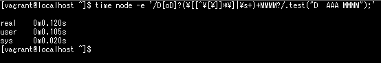
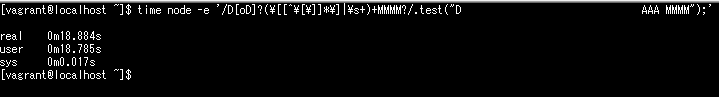
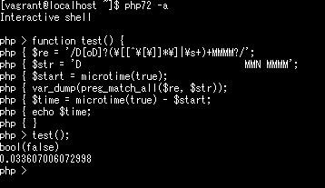
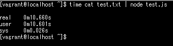
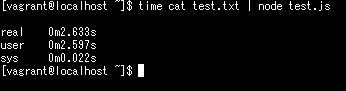
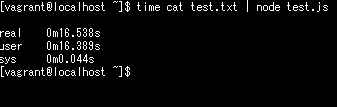
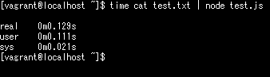

## :skull_crossbones: 事例１．moment

[moment](https://github.com/moment/moment)は日付関係の操作を行うためのnodeモジュールです。今回ご紹介するのは、2.15.2より前のバージョンで見つかったもので、月の書式に関する以下の正規表現です。

```lib/units/month.js
/D[oD]?(\[[^\[\]]*\]|\s+)+MMMM?/
```

"DD MMM"というような書式に一致するのですが、よく見ると最初に説明したサンプルと似ていて`\s+`の部分が怪しそうです。では、パターンと一致しない文字列を作って、空白文字の部分の数を増やしながら実行時間を計測してみたいと思います。

まず、スペース2個で実行してみます。すぐに処理が終わりました。



次にスペース30個で実行してみます。



わずか0.1秒足らずだったものが18秒以上掛かってしまいました。せっかくなのでPHPでも試してみたいと思います。



こちらは即座に0（一致しない）ではなくfalse（エラー）が返ってきました。PHPでは`pcre.backtrack_limit`という設定でバックトラック処理の制限値がデフォルトで100万に設定されています。そのために途中で処理を中断してエラーになります。 [^1]

参考）http://php.net/manual/ja/pcre.configuration.php

なお、脆弱性があった箇所は現在以下のように`\s+`が`\s`に修正されています。

```lib/units/month.js
/D[oD]?(\[[^\[\]]*\]|\s)+MMMM?/
```

## :skull_crossbones: 事例２．marked

[marked](https://github.com/chjj/marked)はマークダウンテキストをパース＆コンパイルするためのnodeモジュールです。今回ご紹介するのは0.3.9より前のバージョンで見つかったもので、コードブロックに関する以下の正規表現です。

``` lib/marked.js
/^(`+)\s*([\s\S]*?[^`])\s*\1(?!`)/
```

構文でいくつか簡単に説明しておきますと、`*?`は最短一致の量指定子です。`?`が無いと末尾のバッククォートの前の空白文字も一致してしまうため付けられています。`\1`は1番目のキャプチャグループと同じテキストつまり最初のバッククォートと同じテキストであることを表しています（先頭に3つバッククォートがあったら末尾も3つという感じ）。`?!`は否定先読みです。バッククォートでない文字が続く場合に一致とみなされます（これがないとバッククォートが先頭3つで末尾4つでも一致してしまうため）。

これはどのような文字列が入ると問題になるかお分かりになりますでしょうか？一見しただけでは気付きにくいかもしれませんが、先頭と末尾のバッククォートの数を異なるものにしてパターンに一致しないようにし、バッククォートの中に空白文字が入れれば入れるだけ処理数が大きく増加していきます。言葉で説明するよりもデモをデバッグしていただいた方がよく分かると思いますので興味のある方は以下をご利用ください。

デモ：https://regex101.com/r/4CBPCL/1

空白文字を2000文字入れて実行した時の結果は以下になります。



約10秒ほど掛かってしまいました。なお、脆弱性があった箇所は現在以下のように修正されています。後方にあった`\s*`を`\2`に変更してバックトラックが発生しないようにしています。

``` lib/marked.js
/^(`+)(\s*)([\s\S]*?[^`]?)\2\1(?!`)/
```

## :skull_crossbones: 事例３．mobile-detect

[mobile-detect](https://github.com/hgoebl/mobile-detect.js)はUser-Agentからデバイスを判別するためのnodeモジュールです（PHPのMobile Detectの移植版）。今回ご紹介するのは1.4.0より前のバージョンで見つかったもので、Dell製のデバイスを判別する以下の正規表現です。

``` mobile-detect.js
/Dell.*Streak|Dell.*Aero|Dell.*Venue|DELL.*Venue Pro|Dell Flash|Dell Smoke|Dell Mini 3iX|XCD28|XCD35|\b001DL\b|\b101DL\b|\bGS01\b/i
```

構文としては特に難しい内容はなく、デバイスの種類を12個並べているだけです（`\b`は単語の境界を表す）。これは比較的イメージしやすいかもしれませんが、"DellDellDellDell....."とつなげていくと処理数がどんどん増えて行きます。処理の流れとしては以下のような感じです。

1. 文字列の最初の"Dell"が`Dell.*Streak`の`Dell`と一致。残りの"Dell....."が`.*`と一致。
2. 終端まで到達したので`Streak`の`S`と一致するまで一文字ずつ前に戻っていくが"DellDellDell....."なので一致するものがなく、`Dell.*Aero`⇒`Dell.*Venue`とパターンを変えながら同じ処理を繰り返していく。
3. 結局どれにも一致しないので、"DellDellDellDell....."の最初の"Dell"から2番目の"Dell"に移って、また`Dell.*Streak`から同じ処理を繰り返す。そしてそれが3番目の"Dell"、4番目の"Dell"と続いていく。

デモ：https://regex101.com/r/dh0smy/2

"Dell"という文字を1万回繰り返したテキストデータを作って実行した結果が以下になります。



2秒以上かかっています。User-Agentは簡単に偽装できますので、大量のデータを送りつければWebサーバに高負荷をかけることが出来てしまいます。なお、修正後は以下のようにUser-Agentを500文字までに制限する処理が加えられました。

``` mobile-detect.js
function prepareUserAgent(userAgent) {
  return (userAgent || '').substr(0, 500); // mitigate vulnerable to ReDoS
}
```

## :skull_crossbones: 事例４．whatwg-mimetype

[whatwg-mimetype](https://github.com/jsdom/whatwg-mimetype)はMIMEタイプをパースするためのnodeモジュールです。今回ご紹介するのは2.1.0より前のバージョンで見つかったもので、Content-Typeをタイプとパラメータに分割するための以下の正規表現です。

``` lib/content-type-parser.js
/^(.*?)\/(.*?)([\t ]*;.*)?$/
```

"text/html"や"multipart/form-data; boundary=aaaaa"のような文字列をパースしているのですが、見た目はシンプルで特に問題のない正規表現のようにも見えます。しかし、ここにもちょっとした見落としがあります。

例えば以下のように大量にスラッシュを続けた後、最後に改行を入れた文字列をパースさせると問題になります。

```
///////////////////////////.....(N個)..../////\n
```

試しにスラッシュを5万個用意した文字列を改行ありと無しでパースさせてみます。

改行あり


改行なし


改行なしはパターンに一致するため0.1秒足らずで処理を終了していますが、改行ありだとパターンに一致しなくなるためバックトラックが大量に発生し16秒以上掛かってしまいました。Content-Typeは簡単に偽装できますので大量のデータを送りつければWebサーバに高負荷をかけることが出来てしまいます。なお、修正後は正規表現を使わずに処理を全て書き直したようです。

https://github.com/jsdom/whatwg-mimetype/commit/26c539a699778f8743b8319c298b5fb28a4328d0

## まとめ

今回、いろいろな事例を見た中で多かった対応をまとめると以下の通りです。

- `*`や`+`を削除する
- `{n}`を使いマッチする回数を制限する
- アンカー（`^`）を付ける
- 文字列の長さを制限し、長い文字列は正規表現で処理させない
- 正規表現を使わずに別の方法で処理する

正規表現に長けた人であれば先読みやアトミックグループなどを使って効率の良い正規表現を書けるかもしれませんが、そうでない人の方が多いかと思います（私も毎回ググるタイプです:sweat_smile:）。また、正規表現エンジンの違いにより動作が異なる場合もあるでしょう。今回のご紹介した事例は海外の優秀なプログラマーの方が作られたものでしたが、それでもやはりミスが出てしまいます。

できるだけ複雑なパターンは避け、場合によっては多少冗長でも正規表現以外の方法で処理させることも検討した方が良いかもしれません（これはReDoSに限らず、正規表現をバリデーションとして使う場合のチェック漏れという観点からも同様だと思います）。 [^2]

（記載内容に間違いがありましたらコメント・編集リクエストを頂けると幸いです:bow:）

## 余談

URLのリライトで正規表現は避けられないので、apacheのmod_rewriteがどうなっているのか念のため調べてみました。ソースを確認したところ`pcre_exec`を実行していて、[pcreapiマニュアル](https://www.pcre.org/original/doc/html/pcreapi.html)を確認したところ以下のように記載されていました。

>The default value for the limit can be set when PCRE is built; the default default is 10 million, which handles all but the most extreme cases. You can override the default by suppling pcre_exec() with a pcre_extra block in which match_limit is set, and PCRE_EXTRA_MATCH_LIMIT is set in the flags field. If the limit is exceeded, pcre_exec() returns PCRE_ERROR_MATCHLIMIT. 

1000万回ということでReDoSの心配はなさそうです。試してみましたがすぐに404が返ってきました。

[^1]: mb_ereg（鬼車）でも試しましたが、こちらも即座に結果が返ってきました。バックトラック処理の制限がされているかどうかは未調査です。
[^2]: Qiitaに投稿されているメールアドレスの正規表現のいくつかはReDoSの問題を抱えていました。サーバサイドでどこまでチェックを行うかということも検討した方が良いかもしれません。（危険なデータのチェックは必要ですが）
