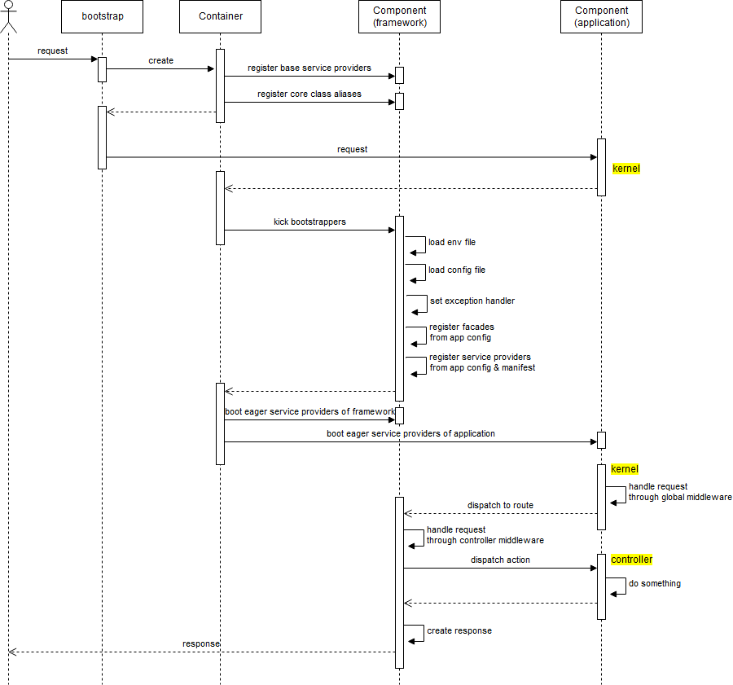
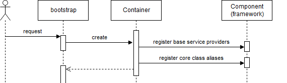

この記事はQiitaからの転載です。
https://qiita.com/prograti/items/750a1d17021498885b6d

## はじめに

本記事はLaravel（5.6）をより深く理解することを目的としており、アプリケーション開発のhow-toのような内容ではありませんので予めご了承ください。アプリケーション開発を行う上での情報は公式ドキュメントをご覧ください。

Laravel5.6公式ドキュメント
https://laravel.com/docs/5.6/

【追記 2018/03/25】
Eloquent編をアップしました。ご興味のある方はこちらもどうぞ。
[Deep Dive into Laravel Eloquent ORM](https://qiita.com/prograti/items/70aef5060eed98258a9b)

## Laravelのリクエスト ライフサイクル

まずは、リクエストを受けてレスポンスを返すまでの間にLaravel内でどのような処理が行われているのか見てみましょう。下図が全体の流れをシーケンス図風にまとめたものになります（スペースの関係上、細かい内容やメッセージ線を省略しているのでご了承ください）。



上図で登場するオブジェクトは以下の４つです。

- bootstrap　・・・起動スクリプト（bootstrap/app.php）
- Container　・・・サービス コンテナ（Illuminate\Foundation\Application）
- Component(framework)　・・・Laravelフレームワークの各種コンポーネント
- Component(application)　・・・アプリケーションのコンポーネント（コントローラ etc）

それでは順番に処理を見て行きましょう。

### :one: アプリケーションの作成
　


クライアントからリクエストが送られてくると始めにアプリケーションの作成が行われます。ここでいうアプリケーションとはサービス コンテナ（DIコンテナ）を表します。アプリケーションの作成で行われる主な処理は以下の2つです。

- サービス プロバイダの登録
- コアクラスのエイリアスの登録

サービス プロバイダの登録では、以下の3つのサービス プロバイダがサービス コンテナに登録されます。

- Illuminate\Log\LogServiceProvider
- Illuminate\Events\EventServiceProvider
- Illuminate\Routing\RoutingServiceProvider

そして、各サービス プロバイダからログやイベント、ルーティングに関する基本的なクラスがサービス コンテナに登録されます。

コアクラスのエイリアス登録では、以下のように一つのキーに対して複数のエイリアス名が登録される形になります。

```php
[
	'app'                  => [\Illuminate\Foundation\Application::class, \Illuminate\Contracts\Container\Container::class, \Illuminate\Contracts\Foundation\Application::class,  \Psr\Container\ContainerInterface::class],
	'auth'                 => [\Illuminate\Auth\AuthManager::class, \Illuminate\Contracts\Auth\Factory::class],
	'auth.driver'          => [\Illuminate\Contracts\Auth\Guard::class],
	'blade.compiler'       => [\Illuminate\View\Compilers\BladeCompiler::class],
	'cache'                => [\Illuminate\Cache\CacheManager::class, \Illuminate\Contracts\Cache\Factory::class],
	'cache.store'          => [\Illuminate\Cache\Repository::class, \Illuminate\Contracts\Cache\Repository::class],
	'config'               => [\Illuminate\Config\Repository::class, \Illuminate\Contracts\Config\Repository::class],
	'cookie'               => [\Illuminate\Cookie\CookieJar::class, \Illuminate\Contracts\Cookie\Factory::class, \Illuminate\Contracts\Cookie\QueueingFactory::class],
	'encrypter'            => [\Illuminate\Encryption\Encrypter::class, \Illuminate\Contracts\Encryption\Encrypter::class],
	'db'                   => [\Illuminate\Database\DatabaseManager::class],
	'db.connection'        => [\Illuminate\Database\Connection::class, \Illuminate\Database\ConnectionInterface::class],
	'events'               => [\Illuminate\Events\Dispatcher::class, \Illuminate\Contracts\Events\Dispatcher::class],
	'files'                => [\Illuminate\Filesystem\Filesystem::class],
	'filesystem'           => [\Illuminate\Filesystem\FilesystemManager::class, \Illuminate\Contracts\Filesystem\Factory::class],
	'filesystem.disk'      => [\Illuminate\Contracts\Filesystem\Filesystem::class],
	'filesystem.cloud'     => [\Illuminate\Contracts\Filesystem\Cloud::class],
	'hash'                 => [\Illuminate\Hashing\HashManager::class],
	'hash.driver'          => [\Illuminate\Contracts\Hashing\Hasher::class],
	'translator'           => [\Illuminate\Translation\Translator::class, \Illuminate\Contracts\Translation\Translator::class],
	'log'                  => [\Illuminate\Log\LogManager::class, \Psr\Log\LoggerInterface::class],
	'mailer'               => [\Illuminate\Mail\Mailer::class, \Illuminate\Contracts\Mail\Mailer::class, \Illuminate\Contracts\Mail\MailQueue::class],
	'auth.password'        => [\Illuminate\Auth\Passwords\PasswordBrokerManager::class, \Illuminate\Contracts\Auth\PasswordBrokerFactory::class],
	'auth.password.broker' => [\Illuminate\Auth\Passwords\PasswordBroker::class, \Illuminate\Contracts\Auth\PasswordBroker::class],
	'queue'                => [\Illuminate\Queue\QueueManager::class, \Illuminate\Contracts\Queue\Factory::class, \Illuminate\Contracts\Queue\Monitor::class],
	'queue.connection'     => [\Illuminate\Contracts\Queue\Queue::class],
	'queue.failer'         => [\Illuminate\Queue\Failed\FailedJobProviderInterface::class],
	'redirect'             => [\Illuminate\Routing\Redirector::class],
	'redis'                => [\Illuminate\Redis\RedisManager::class, \Illuminate\Contracts\Redis\Factory::class],
	'request'              => [\Illuminate\Http\Request::class, \Symfony\Component\HttpFoundation\Request::class],
	'router'               => [\Illuminate\Routing\Router::class, \Illuminate\Contracts\Routing\Registrar::class, \Illuminate\Contracts\Routing\BindingRegistrar::class],
	'session'              => [\Illuminate\Session\SessionManager::class],
	'session.store'        => [\Illuminate\Session\Store::class, \Illuminate\Contracts\Session\Session::class],
	'url'                  => [\Illuminate\Routing\UrlGenerator::class, \Illuminate\Contracts\Routing\UrlGenerator::class],
	'validator'            => [\Illuminate\Validation\Factory::class, \Illuminate\Contracts\Validation\Factory::class],
	'view'                 => [\Illuminate\View\Factory::class, \Illuminate\Contracts\View\Factory::class],
]
```

補足説明するとサービス コンテナの内部では抽象エイリアスとエイリアスという2種類のエイリアスを持っていて、上記でいうと配列のキーが抽象エイリアスで配列の値（クラス名、インターフェース名）がエイリアスになります。

例えば、`LogManager`はサービス プロバイダで以下のように抽象エイリアスを使ってサービス コンテナに登録されています。

```php
$this->app->singleton('log', function () {
  return new LogManager($this->app);
});
```

コンポーネントを取得する場合は、抽象エイリアス / エイリアスのどちらを指定してもサービス コンテナが名前解決してくれて同じインスタンス（singletonの場合）を返してくれます。

```php
var_dump(app('log') ===  app('Illuminate\Log\LogManager')); // boolean true
var_dump(app('log') === app('Psr\Log\LoggerInterface')); // boolean true
```

なお、混同しやすいのですが上記のエイリアスは`config\app.php`で定義するFacadeのエイリアスとは別のものです。

```php
'aliases' => [
  ...
  'Route' => Illuminate\Support\Facades\Route::class,
  ...
```

こちらのエイリアスは`Illuminate\Foundation\AliasLoader`を使ってFacadeのインスタンスを取得するために使用されます。こちらも簡単に説明しておきますと、AliasLoaderは[class_alias](http://php.net/manual/ja/function.class-alias.php)関数を使用してエイリアスから実体となるクラスをオートロードしています。

例えば、ルートの定義で`Route::get`と記述しますが、この`Route`がエイリアスです。

```php
Route::get('/', function () {
  return view('welcome');
});
```

`Route`はAliasLoaderによって`Illuminate\Support\Facades\Route::class`と紐づけられているため、初回呼び出し時に`Illuminate\Support\Facades\Route`がオートロードされます。Routeファサードクラスは、`getFacadeAccessor`で`router`を返しますが、前述した抽象エイリアスになります。

```php
protected static function getFacadeAccessor()
{
  return 'router';
}
```

Routingサービス プロバイダで`Illuminate\Routing\Router`を`router`としてバインドしているため、ルートの定義の`Route::get`は`Illuminate\Routing\Router`のgetメソッドを呼び出していることになります。

```php
$this->app->singleton('router', function ($app) {
  return new Router($app['events'], $app);
});
```
