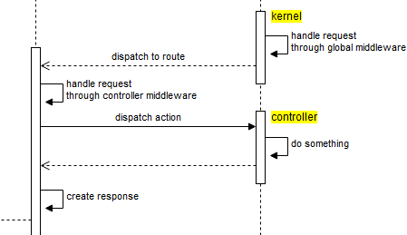

### :two: bootstrapperによる設定
　


アプリケーションの作成が終わるとbootstrapperが起動されます。ここでは、`Illuminate\Foundation\Bootstrap`直下にある以下のクラスのことを便宜的にbootstrapperと呼んでいます。

- \Illuminate\Foundation\Bootstrap\LoadEnvironmentVariables
- \Illuminate\Foundation\Bootstrap\LoadConfiguration
- \Illuminate\Foundation\Bootstrap\HandleExceptions
- \Illuminate\Foundation\Bootstrap\RegisterFacades
- \Illuminate\Foundation\Bootstrap\RegisterProviders
- \Illuminate\Foundation\Bootstrap\BootProviders

まず、最初に.envファイルが読み込まれます。環境変数を設定しておけば.env.localのように環境ごとにファイルを分けることができます。

例）Nginx（/etc/nginx/fastcgi_params）

```
fastcgi_param  APP_ENV  local;
```

なお、configのキャッシュを作成した場合、bootstrapperは.envファイルを読み込みません。

```
php artisan config:cache
```

.envファイルの読み込みが終わると次にconfigディレクトリ直下にあるapp.phpなどの各設定ファイルが読み込まれます（configのキャッシュがある場合はキャッシュを読み込む）。その次にbootstrapでサービス コンテナにバインドしている例外ハンドラが`set_exception_handler`に設定されます。

```php
$app->singleton(
  Illuminate\Contracts\Debug\ExceptionHandler::class,
  App\Exceptions\Handler::class
);
```

その次が前述したFacadeのエイリアスの登録になります。app.phpの”aliases”に設定した全エイリアスがここでAliasLoaderに登録されます。また、パッケージManifestファイル（後述）に設定されているエイリアスもここで登録されます。

そして、最後がサービス プロバイダの登録になります。app.phpに設定した”providers”に設定したプロバイダおよびパッケージManifestファイルに設定されているサービス プロバイダがサービス コンテナに登録されます。

パッケージManifestファイルとは`bootstrap\cache\packages.php`ファイルの事を指しています。このファイルは`php artisan package:discover`が実行された時に作成されるのですが、このコマンドが実行されるのが、composerの`post-autoload-dump`が実行されるタイミングになります。

```composer.json
"scripts": {
  "post-root-package-install": [
    "@php -r \"file_exists('.env') || copy('.env.example', '.env');\""
  ],
  "post-create-project-cmd": [
    "@php artisan key:generate"
  ],
  "post-autoload-dump": [
    "Illuminate\\Foundation\\ComposerScripts::postAutoloadDump",
    "@php artisan package:discover"
  ]
},
```

新しいパッケージが追加されるとartisanコマンドが起動されて`vendor\composer\installed.json`ファイルが読み込まれ、extraプロパティに"laravel"が定義されているパッケージから"providers"と"aliases"を抽出してパッケージManifestファイルに出力します。

```vendor\composer\installed.json
"extra": {
  "branch-alias": {
    "dev-master": "3.0-dev"
  },
  "laravel": {
    "providers": [
      "Laravel\\Socialite\\SocialiteServiceProvider"
    ],
    "aliases": {
      "Socialite": "Laravel\\Socialite\\Facades\\Socialite"
    }
  }
},
```

なお、app.phpとパッケージManifestファイルのプロバイダ情報は初回起動時に`bootstrap\cache\services.php`というサービスManifestファイルに出力され、そちらがプロバイダの設定情報として読み込まれるようになります（新しいパッケージが追加・削除された場合は自動的に再作成される）。 [^1]

サービスManifestファイルをもとにサービス プロバイダは"eager"と"deferred"に分類されてサービス コンテナに登録され、"deferred"で登録されたサービスプロバイダは必要になった時点でインスタンス化されサービス コンテナにバインドされます。

### :three: リクエストの処理
　


bootstrapperによる設定が終わるとリクエストがKernelに渡り、まず最初に以下の5つのグローバル ミドルウェアによってリクエストが処理されます。 [^2]

- \Illuminate\Foundation\Http\Middleware\CheckForMaintenanceMode
- \Illuminate\Foundation\Http\Middleware\ValidatePostSize
- \App\Http\Middleware\TrimStrings
- \Illuminate\Foundation\Http\Middleware\ConvertEmptyStringsToNull
- \App\Http\Middleware\TrustProxies

**CheckForMaintenanceMode**はアプリケーションがメンテナンスモードかどうかをチェックします（artisanコマンドを実行することで`storage\framework`直下にdownという名前のファイルが作成されメンテナンスモードにすることができる）。メンテナンスモードの場合は503 HTTPステータスコードが返されます。

```
php artisan down
```

**ValidatePostSize**はリクエストのCONTENT_LENGTHがphp.iniに設定されている`post_max_size`を超えていないかどうかをチェックします。超えている場合は413 HTTPステータスコードが返されます。

**TrimStrings**はGETパラメータおよびPOSTパラメータの値（JSONリクエストの場合は各プロパティの値）をトリムします。ただし、"password"と"password_confirmation"という名前のパラメータはトリムしません。

**ConvertEmptyStringsToNull**はGETパラメータおよびPOSTパラメータの値（JSONリクエストの場合は各プロパティの値）が空文字の場合NULL値に変更します。

**TrustProxies**はクライアントとWebサーバの間にロードバランサーやリバースプロキシを挟んでいる場合に、URLの生成やリダイレクトなどが正常に動作するようにリクエストにプロキシ情報を設定します。

```php
class TrustProxies extends Middleware
{
  // プロキシのアドレス
  protected $proxies = [
    '192.168.1.1',
    '192.168.1.2',
  ];

  // プロキシヘッダのマップ
  protected $headers = [
    Request::HEADER_FORWARDED => 'FORWARDED',
    Request::HEADER_X_FORWARDED_FOR => 'X_FORWARDED_FOR',
    Request::HEADER_X_FORWARDED_HOST => 'X_FORWARDED_HOST',
    Request::HEADER_X_FORWARDED_PORT => 'X_FORWARDED_PORT',
    Request::HEADER_X_FORWARDED_PROTO => 'X_FORWARDED_PROTO',
  ];
}
```
configにtrustedproxy.phpファイルを作成して設定することもできます。

```php
<?php

return [
  'proxies' => [
    '192.168.1.1',
    '192.168.1.2',
  ],
  
  'headers' => [
    \Illuminate\Http\Request::HEADER_FORWARDED => 'FORWARDED',
    \Illuminate\Http\Request::HEADER_X_FORWARDED_FOR => 'X_FORWARDED_FOR',
    \Illuminate\Http\Request::HEADER_X_FORWARDED_HOST => 'X_FORWARDED_HOST',
    \Illuminate\Http\Request::HEADER_X_FORWARDED_PORT => 'X_FORWARDED_PORT',
    \Illuminate\Http\Request::HEADER_X_FORWARDED_PROTO => 'X_FORWARDED_PROTO',
  ]
];
```

グローバル ミドルウェアの処理が終わるとリクエストにマッチするRoute情報を探し出し、設定されているコントローラ ミドルウェアにリクエストの処理をさせます。コントローラ ミドルウェアとは、コントローラのルートやコントローラのコンストラクタの中で指定したミドルウェアのことです。

```php
// ルートで設定する例
Route::get('profile', 'UserController@show')->middleware('auth');
```

```php
// コントローラのコンストラクタで設定する例
public function __construct()
{
  $this->middleware('auth');
}
```

ミドルウェアグループとミドルウェアは`app\Http\Kernel.php`に定義されています。

```php
protected $middlewareGroups = [
  'web' => [
    \App\Http\Middleware\EncryptCookies::class,
    \Illuminate\Cookie\Middleware\AddQueuedCookiesToResponse::class,
    \Illuminate\Session\Middleware\StartSession::class,
    // \Illuminate\Session\Middleware\AuthenticateSession::class,
    \Illuminate\View\Middleware\ShareErrorsFromSession::class,
    \App\Http\Middleware\VerifyCsrfToken::class,
    \Illuminate\Routing\Middleware\SubstituteBindings::class,
  ],

  'api' => [
    'throttle:60,1',
    'bindings',
   ],
];

protected $routeMiddleware = [
  'auth' => \Illuminate\Auth\Middleware\Authenticate::class,
  'auth.basic' => \Illuminate\Auth\Middleware\AuthenticateWithBasicAuth::class,
  'bindings' => \Illuminate\Routing\Middleware\SubstituteBindings::class,
  'cache.headers' => \Illuminate\Http\Middleware\SetCacheHeaders::class,
  'can' => \Illuminate\Auth\Middleware\Authorize::class,
  'guest' => \App\Http\Middleware\RedirectIfAuthenticated::class,
  'throttle' => \Illuminate\Routing\Middleware\ThrottleRequests::class,
];
```

※`app\Providers\RouteServiceProvider`によって`routes/web.php`にはwebミドルウェアグループ、`routes/api.php`にはapiミドルウェアグループが自動的に適用されます。

**EncryptCookies**はCookieデータを`openssl_encrypt`および`openssl_decrypt`を使って暗号化・復号化します。暗号化・復号化で使用するキーは.envファイルに設定しているAPP_KEYになります。暗号化したくないcookieがある場合はミドルウェアの`$except`に名前を設定することで生データのまま保存することができます。

**AddQueuedCookiesToResponse**はcookieキューに保存されたcookieをレスポンスに追加します。レスポンスが作成される前に先にcookieに値をセットしたい場合にcookieキューを使用することができ、Cookieファサードを使用することでキューにcookieを追加することができます。

```php
Cookie::queue('name', 'value', 60 * 24);
```

**StartSession**は`config/session.php`が定義されている場合にセッションをスタートします。また、session.phpに設定した`lottery`の値に基づきセッションのgcが行われます。

```php
'lottery' => [2, 100], // random_int(1, 100) <= 2 がtrueの場合にgcが行われる
```

**AuthenticateSession**（デフォルトでコメントアウト）はセッションにユーザーのパスワードのハッシュ値を保存し、セッションに保存されたハッシュ値と現在のユーザーのパスワードのハッシュ値が一致しない場合は強制的にログアウトさせます。例えばパスワードが第3者に漏れて不正にログインされた場合、ユーザーがパスワードを変更すると第3者は強制的にログアウトされます。

**ShareErrorsFromSession**はバリデーションエラーなどセッションに'errors'として保存されたデータをerrors変数としてビューにアサインします。

**VerifyCsrfToken**はセッションに保存しているトークンとリクエストされたトークンが一致するかどうかをチェックします。トークンに一致しない場合は419 HTTPステータスコードを返します。トークンチェックをしたくないURLがある場合はミドルウェアの`$except`にURLを設定することでトークンチェックを回避することができます。メソッドが"HEAD"、"GET"、"OPTIONS"であったりコンソールからユニットテストを実行している場合はトークンチェックは行われません。

**SubstituteBindings**はルートパラメータの値を別の値に付け替える処理を行います。具体的には`Route::bind`やモデル結合ルートがSubstituteBindingsの処理に該当します。

```php
public function boot()
{
  parent::boot();

  // userパラメータの値からユーザー情報を取得し、userパラメータにモデルインスタンスをセットし直す
  Route::bind('user', function ($value) {
    return App\User::where('name', $value)->first() ?? abort(404);
  });
}
```

```php
// userパラメータの値からユーザー情報を取得し、モデルインスタンスを自動的に注入
Route::get('api/users/{user}', function (App\User $user) {
  return $user->email;
});
```

**Authenticate**は指定されたガードでユーザー認証を行い、ユーザー認証に失敗したらログインページにリダイレクトします（JSONレスポンスの場合は401 HTTPステータスコード）。ガードを指定していない場合は`config\auth.php`に設定しているデフォルトガードを使用します。なお、ガードは複数指定でき、どれか一つのガードで認証できれば認証成功になります。

**AuthenticateWithBasicAuth**はBasic認証によるログインを行います。Basic認証のユーザー名にはメールアドレスを使用します。認証に失敗した場合は401 HTTPステータスコードを返します。なお、AuthenticateWithBasicAuthは`config\auth.php`に設定しているデフォルトガードを使用しますが、ドライバが"token"だとBasic認証は使用できません（TokenGuardにBasic認証処理が実装されていないため）。

**SetCacheHeaders**はレスポンスにキャッシュヘッダ（ETag、max-age、s-max-age）を設定します。

```php
Route::get('/', function () {
  return view('welcome');
})->middleware('cache.headers:etag;max_age=120;s_maxage=60');
```

**Authorize**は指定されたアビリティ（許可したい操作）およびルートパラメータ（もしくはモデルクラス名）を基に`App\Providers\AuthServiceProvider`でマッピングされたポリシーを呼び出し認可処理を行います。権限がない場合は403 HTTPステータスコードを返します。ルートパラメータを指定した場合、前述したSubstituteBindingsによって暗黙のモデル結合が行われます。

```php
// ルートパラメータにpostを指定
Route::put('/post/{post}', function (Post $post) {
  // do something
})->middleware('can:update,post');
```

**RedirectIfAuthenticated**は指定されたガードによるログインチェックを行い、ユーザーがログイン済みの場合はホーム画面へリダイレクトします。ログインしていない場合はそのまま後続へ処理を引き渡します。

**ThrottleRequests**はユーザーが同一ルートに対して一定の時間間隔（分）で何回までアクセス可能かを制限します。制限を超えた場合は429 HTTPステータスコードを返します。レスポンスヘッダーに`X-RateLimit-Limit`と`X-RateLimit-Remaining`が付加され、制限値と残回数を確認することができます。また、制限を超えると`Retry-After`（何秒後にリトライ可能）と`X-RateLimit-Reset`（制限がリセットされるUNIXタイムスタンプ）ヘッダーも付加されます。同一ユーザーの判別はログインユーザーの場合はユーザー情報のハッシュ値、ゲストユーザーの場合はサイトのドメインとIPアドレスを組み合わせたもののハッシュ値で行われます。なお、ユーザーの試行回数などのデータは`config\cache.php`に設定されたドライバに基づきキャッシュとして保存されます。

```php
// 1分間に5回まで
Route::get('/', function () {
  return view('welcome');
})->middleware('throttle:5,1');
```

上記、コントローラ ミドルウェアの処理が終わるとControllerDispatcherによりリクエストされたコントローラのアクションが実行され、その結果がレスポンスとしてクライアントに返されます。

以上がLaravelの大まかなリクエスト ライフサイクルになります。続いてLaravelのコアの部分であるサービス コンテナ、サービス プロバイダ、カーネル & ルーター、コントローラ、ビューを見て行きたいと思います（ここでは公式サイトの内容を補足していきます）。


[^1]: composer.jsonにextraプロパティに"providers"および"aliases"が設定されているパッケージをインストールした場合は、app.phpにサービス プロバイダの定義を記述しなくても自動的に読み込まれます（例えばLaravel Socialiteとか）。
[^2]: HTTPテストの場合、継承するTestCaseクラス内でミドルウェアが無効化されているためリクエストは処理されません（サービス コンテナに'middleware.disable'を設定することで無効化できます）。
