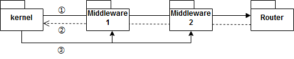

## カーネル & ルーター

[公式サイト]Routing
https://laravel.com/docs/5.6/routing

カーネルはリクエストを受け取りルーターに渡すフロント コントローラの役割を果たします。カーネルが実装しているインターフェースは以下のようなメソッドが定義されています。

```php
public function bootstrap();
public function handle($request);
public function terminate($request, $response);
public function getApplication();
```

まず最初に`bootstrap`メソッドを実行してbootstrapperを起動し、bootstrapperによる処理が終わるとミドルウェアを介してルーターにリクエストの処理を引き継ぎます。コントローラでの処理が終わりミドルウェアを介してレスポンスをクライアントに送信した後にアプリケーションの終了処理を行います。もし、ミドルウェアに`terminate`メソッドが実装されている場合は、このタイミングで`terminate`メソッドが実行されます。



次はルーターを見てみましょう。ルーター（`Illuminate\Routing\Router`）が実装しているインターフェースは以下のようなメソッドが定義されています。

```php
// ルートの登録・設定
public function get($uri, $action);
public function post($uri, $action);
public function put($uri, $action);
public function delete($uri, $action);
public function patch($uri, $action);
public function options($uri, $action);
public function match($methods, $uri, $action);
public function resource($name, $controller, array $options = []);
public function group(array $attributes, $routes);

// ルートパラメータのバインド
public function substituteBindings($route);
public function substituteImplicitBindings($route);
```

```php
// ルートパラメータのバインド
public function bind($key, $binder);
public function getBindingCallback($key);
```

インターフェースを見て分かるように、ルーターの基本的な役割はルートの登録・設定、ルートパラメータの作成になります。まず、アプリケーション側の`App\Providers\RouteServiceProvider`によって指定されたルート定義ファイル`routes/web.php`と`routes/api.php`がルーターによってrequireされます。

```php
Route::middleware('web')
  ->namespace($this->namespace)
  ->group(base_path('routes/web.php'));

Route::prefix('api')
  ->middleware('api')
  ->namespace($this->namespace)
  ->group(base_path('routes/api.php'));
```

ルート定義ファイルの中で以下のようにRouteファサードを使ってルート情報を登録していますので、ルート定義ファイルがrequireされたタイミングでルーターにルート情報が登録されます（ルート情報は`Illuminate\Routing\Route`のコレクションで、それぞれのRouteが自分が担当するコントローラの実行を受け持つ）。

```php
Route::get('foo', function () {
  return 'Hello World';
});
```

ルーターはリクエストを受け取るとリクエストメソッドとURIから該当するルートを見つけ、コントローラ ミドルウェアが定義されている場合はミドルウェアを介してルートに処理を引き継ぎます。

```php
return (new Pipeline($this->container))
  ->send($request)
  ->through($middleware)
  ->then(function ($request) use ($route) {
    return $this->prepareResponse(
      $request, $route->run()
    );
  });
```

そしてルートがコントローラを実行して結果をルーターに返すと、ルーターは受け取ったデータの型から適切なレスポンスを作成します。

```php
if ($response instanceof PsrResponseInterface) {
  $response = (new HttpFoundationFactory)->createResponse($response);
} elseif ($response instanceof Model && $response->wasRecentlyCreated) {
  $response = new JsonResponse($response, 201);
} elseif (! $response instanceof SymfonyResponse &&
  ($response instanceof Arrayable ||
  $response instanceof Jsonable ||
  $response instanceof ArrayObject ||
  $response instanceof JsonSerializable ||
  is_array($response))) {
  $response = new JsonResponse($response);
} elseif (! $response instanceof SymfonyResponse) {
  $response = new Response($response);
}
```

もし、該当するルートが見つからなかった場合は404 HTTPステータスコードを返します。なお、フォールバックルートを設定することでルートが見つからなかった場合の動作をカスタマイズすることができます。

```php
Route::fallback(function(){
  return response()->view('errors.notFound', [], 404);
});
```

以上がルーティングの一連の流れになります。

## コントローラ

[公式サイト]Controllers
https://laravel.com/docs/5.6/controllers

コントローラの実行はルートが担当します。ルートは`App\Providers\RouteServiceProvider`で指定した名前空間とルート定義ファイルで指定した`コントローラ名@アクション名`をもとに実行するコントローラとメソッドを決定します。

```php
Route::middleware('web')
  ->namespace($this->namespace) // App\Http\Controllers
  ->group(base_path('routes/web.php'));
```

```php
Route::get('/home/', 'HomeController@index')->name('home');
```

もし、アクション名が指定されていない場合、クラスに`__invoke`メソッドが定義されているかどうかをチェックし、メソッドが定義されている場合はそれを実行メソッドに決定します。そしてサービス コンテナを介してコントローラをインスタンス化し（サービス コンテナにコントローラも登録される）、メソッドを実行します。

アプリケーションの基底コントローラ（`App\Http\Controllers\Controller`）は以下の3つのトレイトを使っています。

- Illuminate\Foundation\Validation\ValidatesRequests
- Illuminate\Foundation\Auth\Access\AuthorizesRequests
- Illuminate\Foundation\Bus\DispatchesJobs


**ValidatesRequests**はコントローラに検証メソッドを提供します。

```php
public function store(Request $request)
{
    $this->validate($request, [
        'title' => 'required|max:255',
        'body' => 'required',
    ]);

}
```

これはリクエストオブジェクトのvalidateメソッドと同じ働きをします。

```php
$request->validate([
  'title' => 'required|unique:posts|max:255',
  'body' => 'required',
]);
```

なお、`Illuminate\Http\Request`自体にはvalidateメソッドは定義されていません。validateメソッドは`FoundationServiceProvider`の中でmacroを使って後付けされています。

```php
public function registerRequestValidate()
{
  Request::macro('validate', function (array $rules, ...$params) {
    validator()->validate($this->all(), $rules, ...$params);

    return $this->only(collect($rules)->keys()->map(function ($rule) {
      return str_contains($rule, '.') ? explode('.', $rule)[0] : $rule;
    })->unique()->toArray());
  });
}
```

**AuthorizesRequests**はコントローラに認可メソッドを提供します。認可について公式サイトに記載がありますのでそちらをご確認ください。

[公式サイト]Authorization
https://laravel.com/docs/5.6/authorization

ただ、`authorizeResource`メソッドの記載がないのでそこだけ簡単にご紹介します。これはリソースコントローラで認可処理を行う場合に利用できます。例えばコントローラのコンストラクタでメソッドを実行するとリソースコントローラのアクションに対して一括で認可処理を行うことができます。

```php
public function __construct()
{
  $this->authorizeResource(Photo::class);
}
```

リソースコントローラのアクションとポリシーメソッドの対応は以下の通りです。

|アクション|ポリシーメソッド|
|:--|:--|
|show|view|
|create|create|
|store|create|
|edit|update|
|update|update|
|destroy|delete|

**DispatchesJobs**はコントローラにジョブの実行メソッドを提供します。例えばartisanコマンドで同期ジョブを作成し、作成したジョブクラスのhandleメソッドに処理を実装します。

```php
php artisan make:job SampleJob --sync
```

```php
public function handle()
{
  // do something
}
```

そして、コントローラ側でdispatchメソッドを使ってジョブを実行します。

```php
$this->dispatch(app('App\Jobs\SampleJob'));
```

ビジネスロジックなどをジョブとして切り出すことで再利用性を高め、コントローラの肥大化も防ぐことができます。

### :bulb:ルートのキャッシュ

設定しているルートがコントローラベースのものだけであればルート設定をキャッシュすることにより、コントローラ実行までの時間を短縮することができます（クロージャベースのルートがある場合はキャッシュの作成不可）。

```
php artisan route:cache
```

キャッシュファイルはルート情報をシリアライズした形で`bootstrap\cache\routes.php`に作られます。

```php
app('router')->setRoutes(
    unserialize(base64_decode('TzozNDoiSWxsdW.....'))
);
```

キャッシュについて少しだけ補足説明すると、ルートはSymfonyの`RouteCompiler`によってコンパイルされてキャッシュされます。コンパイルを行うことで例えば以下のようなルートが正規表現に変換されます。

```
/password/reset -> #^/password/reset/(?P<token>[^/]++)$#su
```

Laravelではこの正規表現を使ってリクエストされたURLがマッチするかどうかを検証しています。ルート情報をキャッシュしていない場合は、ルート情報の登録に加えて、コンパイルしてルートが一致するかどうかの処理が毎回走るため、ルートの数が多ければ多いほどキャッシュの効果が大きくなります（ルートが100個あってリクエストURLが一番最後のルートに一致する場合、コンパイルが100回走ります）。
