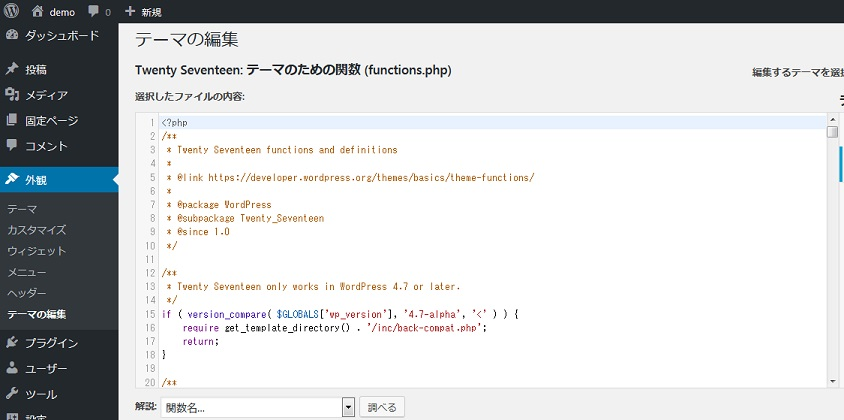

:three: **テーマエディタおよびプラグインエディタを無効にする**

WordPressの管理画面にはエディタ上でテーマを編集する機能とプラグインを編集する機能が標準で用意されています。



ちょっと修正したい時に便利な機能なのですが、この機能が有効になっていると不正アクセスされた場合に簡単にバックドアを仕込むことができてしまいます。基本的にこの機能は無効にしてローカルで編集したファイルをSFTPでアップロードするようにした方が安全です。無効にするにはwp-config.phpに以下の記述を追加すればOKです。

```php
define('DISALLOW_FILE_EDIT', true);
```

:warning: `current_user_can('edit_plugins')`を使用しているプラグインがあった場合、上記操作により動作しなくなる可能性があります。


なお、`DISALLOW_FILE_EDIT`とは別に`DISALLOW_FILE_MODS`というのもあります。こちらはファイルの編集に加えて画面からプラグインやテーマのインストールおよびアップデートも禁止にすることができます。不正なプラグインをインストールされないようにするなら、こちらの方がより強固かもしれません。

```php
define('DISALLOW_FILE_MODS', true);
```

ただし、これだとWordPress本体も含めて全ての自動アップデートが無効になってしまうため、もし自動アップデートを有効にしたいのであればfunctions.phpにフィルタを追加してください。

```php
add_filter('file_mod_allowed', function($allowed, $context) {
  return 'automatic_updater' === $context;
}, 10, 2);
```

:four: **wp-config.phpをプロテクトする**

本番公開後にwp-config.phpを編集する機会はほとんどありません。ファイルのパーミッションを**400**などの読み取り権限のみに変更して、編集する時だけ書き込み権限を付与した方が安全です。ファイルの編集はローカルPCで行うようにしましょう。なぜなら、オンラインで編集する場合、エディタによってはswp（スワップ）ファイルを作成するものがあり、そこにアクセスされる可能性があるからです。

また、サーバーで何らかの作業をしていて、ちょっとした設定ミスでphpファイルがテキストで表示されてしまうことも稀にあります。そのような場合も考慮して.htaccessに以下の記述を追加して、wp-config.phpへのアクセスを禁止すると良いでしょう。

```apache
# Apache 2.2
<Files wp-config.php>
  order allow,deny
  deny from all
</Files>

# Apache 2.4
<Files wp-config.php>
  Require all denied
</Files>
```

もしくは、wp-config.phpをルートの外に移動させてしまう方法もあります。例えば以下のようにルートのwp-config.phpは移動先のwp-config.phpを読み込むだけにする形です。

```php
<?php
require_once(dirname(__FILE__) . '/' . '../path/to/wp-config.php');
```

なお、WordPressはルートにwp-config.phpがない場合は一つ上の階層を探しに行き、そこにwp-config.phpがあればそれを読み込んでくれますので、その機能を利用することもできます。

:five: **プラグインディレクトリを移動する**

アクセスログを見るとプラグインのphpファイルに直接リクエストが来ていることがよくあります。

```http
GET /wp-content/plugins/wp-db-ajax-made/xml_rpc.class.php HTTP/1.1
```

これは脆弱性のあるプラグインやウィルスを含むプラグインを狙った攻撃なのですが、Remote Code ExecutionやArbitrary File Downloadのような脆弱性のあるプラグインは過去に数多く報告されています。

このような自動スクリプトによる攻撃を防ぐ方法の一つとしてプラグインディレクトリを移動する方法があります。プラグインディレクトリは`WP_PLUGIN_DIR`という定数で定義されていますので、wp-config.phpで以下のように任意の場所に変更することができます。

```php
define('WP_PLUGIN_DIR', dirname(__FILE__) . '/extensions/');
```

:warning: CSSやJavaScriptの読み込みに失敗して上手く動作しなくなるプラグインもありますのでご注意ください。

### :white_check_mark: .htaccessにルールを追加する

.htaccessはセキュリティを高める上で手軽に利用できる方法の一つです。いくつかポイントをご紹介したいと思います。

:one: **wp-adminへのアクセスを制限する**

管理画面はログイン認証があるとはいえ、ブルートフォース攻撃などで破られる可能性があります。また、最近だと`wp-admin/load-scripts.php`に直接リクエストを送ってサーバに負荷を掛けることができるといった報告も挙がっています。

https://www.cvedetails.com/cve/CVE-2018-6389/

したがってwp-adminは可能な限りアクセスを制限した方が安全です。

もし、特定のIPアドレスからしかアクセスしないのであれば.htaccessでIP制限をかけましょう。まずwp-login.phpにIP制限をかけるためにルートにある.htaccessに以下のような内容を記述します。

```apache
# Apache 2.2
<Files wp-login.php>
  order deny,allow
  deny from all
  allow from 192.168.33.10
</Files>

#Apache 2.4
<Files wp-login.php>
  Require all denied
  Require ip 192.168.33.10
</Files>
```

次にwp-adminディレクトリの直下に.htaccessを作成し、以下のような内容を記述します。なお、ここではAjaxリクエストを許可していますが、プラグインなどでAjaxを使用しないのであれば不要です。

```apache
# Apache 2.2
order deny,allow
deny from all
allow from 192.168.33.10

<Files admin-ajax.php>
  Order allow,deny
  Allow from all
  Satisfy any 
</Files>

# Apache 2.4
Require all denied
Require ip 192.168.33.10

<Files admin-ajax.php>
  Require all granted
</Files>
```

もしIPアドレスでの制限が難しいのであれば代わりにBasic認証を検討してください。

```apache
<Files wp-login.php>
  AuthType Basic
  AuthName "Restricted"
  AuthUserFile /path/to/.htpasswd
  Require valid-user
</Files>
```

```apache
AuthType Basic
AuthName "Restricted"
AuthUserFile /path/to/.htpasswd
Require valid-user

# Apache 2.2
<Files admin-ajax.php>
  Order allow,deny
  Allow from all
  Satisfy any 
</Files>

# Apache 2.4
<Files admin-ajax.php>
  Require all granted
</Files>
```

なお、apacheのhttpd.confには最初から.htaccessや.htpasswdへのアクセスをブロックするように設定されていると思いますが、もし設定されていないのであれば追加した方が良いでしょう。

```apache:httpd.conf
<Files ".ht*">
  Require all denied
</Files>
```
