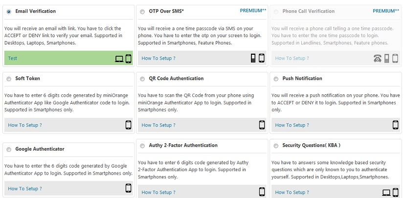
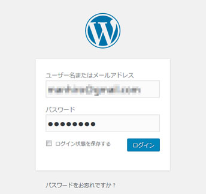
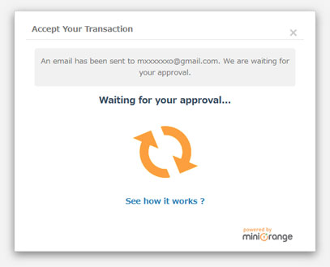
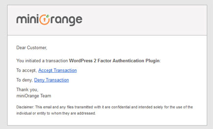
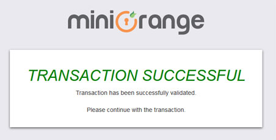
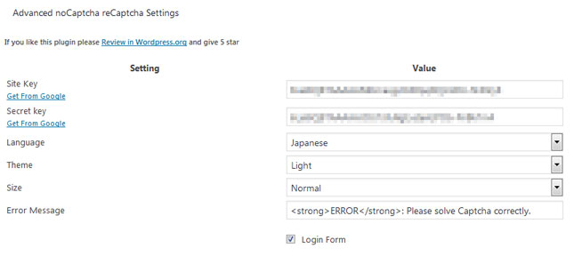
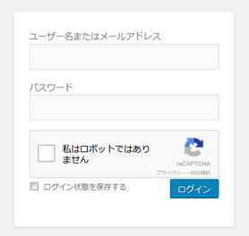
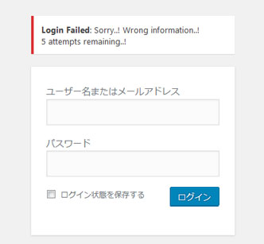
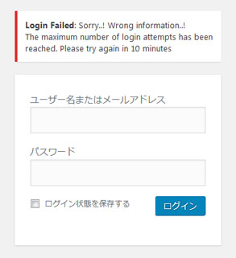

:two: **wp-includeへのアクセスを禁止する**

wp-includeフォルダ配下にあるphpスクリプトはWordPressのコアファイルであり、通常はincludeされて使われるもので直接アクセスされることはありません。直接アクセスされても何も出力されない場合がほとんどなのですが、一部のファイルは`display_errors`が有効になっているとエラー情報が出力されてしまいます。攻撃者に余計な情報を与えるのは望ましくありませんので、アクセス禁止にしてしまった方が安全です（マルチサイトの場合は`wp-includes/ms-files.php`はアクセス許可にする必要があります）。

```apache
<IfModule mod_rewrite.c>
  RewriteEngine On
  RewriteBase /
  RewriteRule ^wp-admin/includes/ - [F,L]
  RewriteRule !^wp-includes/ - [S=3]
  RewriteRule ^wp-includes/[^/]+\.php$ - [F,L]
  RewriteRule ^wp-includes/js/tinymce/langs/.+\.php - [F,L]
  RewriteRule ^wp-includes/theme-compat/ - [F,L]
</IfModule>
```

:three: **アップロードフォルダでPHPスクリプトが実行できないようにする**

プラグインの脆弱性などによりPHPスクリプトがアップロードされてしまうケースはたびたび起こります。アップロードフォルダ（`wp-content/uploads`）直下に.htaccessを作成して、仮にアップロードされたとしても実行できないようにした方が安全です。

```apache
# Apache 2.2
<FilesMatch "\.php$">
   deny from all
</FilesMatch>

# Apache 2.4
<FilesMatch "\.php$">
   Require all denied
</FilesMatch>

# .php5や.phtなどもブロックする場合
<FilesMatch "\.ph(?:p[345]?|t|tml)$">
   Require all denied
</FilesMatch>
```

もし、アップロードできるファイルの種類を限定できるのであればそれだけを許可した方がより安全かもしれません。

```apache
Require all denied

<FilesMatch "\.(jpg|jpeg|png|gif)$">
  Require all granted
</FilesMatch>
```

:four: **XML-RPCを無効にする**

XML-RPCはモバイルアプリから投稿する場合など外部連携のためのAPIとして使用されていますが、pingbackによるDDosやブルートフォース攻撃に悪用されやすい機能です。XML-RPCを使用していないのであれば無効にした方が安全です。

```apache
# Apache 2.2
<Files xmlrpc.php>
  Order Allow,Deny
  Deny from all
</Files>

# Apache 2.4
<Files xmlrpc.php>
  Require all denied
</Files>
```

もしくはフィルタを使って無効にすることもできます。

```php
add_filter('xmlrpc_enabled', '__return_false');
```

また、XML-RPCと同様の機能にWP REST APIがあります。こちらを無効にする場合はリライトルールを追加します。

```
RewriteRule ^wp-json(.+) - [F,L]
```

もしくはフィルタを使って無効にすることもできます。

```php
add_filter('rest_authentication_errors', function(){
  return new WP_Error('403', 'Forbidden');
});
```

:warning: Contact Form 7やJetpackといったプラグインはREST APIを使用しているため無効にすると不具合が発生します。ご注意ください。

### :white_check_mark: ユーザー認証を強固にする

IPアドレスでの制限やBasic認証などの方法は前述しましたが、ここではそれ以外の方法をいくつかご紹介します。（敢えて言う必要はないかと思いますが、パスワードは大文字、小文字、数字、記号を使って強度のあるものにしてください）

:one: **2段階認証を使う**

最近は2段階認証を提供するWebサービスも多くなりましたが、WordPressでもプラグインを使えば簡単に2段階認証を利用することができます。ここでは、[miniOrange 2 Factor Authentication](https://wordpress.org/plugins/miniorange-2-factor-authentication/)というプラグインを使ってみたいと思います。

プラグインをインストールしてminiOrangeにアカウントを作成するとすぐに2段階認証が利用できるようになります。



無料プランでも色々な方式を利用できますが、一番簡単なEメール認証を使ってみたいと思います。まずログイン画面で普通にログインします。



そうすると以下のような画面が表示され承認が終わるまで待機し続けます。



メールを確認すると以下のようなメールが届いていますので記載されているリンクをクリックします。



以下のような画面が表示され、先程の画面に戻るとログインして管理画面が表示されています。



このように非常に簡単に2段階認証を利用することができます。なお、このプラグインは無料で利用できますがユーザー数は1人までとなっています（有料プランもあり）。

:two: **CAPTCHAを使う**

2段階認証は非常に強固ですが、無料だと制限があったりして実運用に適さない場合があるかもしれません。ボットによる不正アクセスを防ぐという点においてはCAPTCHAが有効であると言われています。ここでは[Advanced noCaptcha reCaptcha](https://wordpress.org/plugins/advanced-nocaptcha-recaptcha/)というプラグインを使ってGoogleのreCaptchaを設置してみたいと思います。

プラグインをインストールして設定画面を開くとreCaptchaを利用するためのサイトキーとシークレットキーを入力する欄がありますので、Googleのサイトで発行したキーを入力し、設定を保存してください。



キーを発行して間もないとまだreCaptchaがサイトのドメインを認識していなくて表示されない場合がありますので、10分くらい待ってログイン画面にアクセスします。



そうするとログインフォームにreCaptchaが表示されます。これで設定は完了です。CAPTCHA自体が完璧な仕組みであるとは言えませんが、ユーザー数などの制限もなく容易に導入できますので検討してみてください。

:three: **ログイン試行回数を制限する**

ログインの試行回数を制限すれば手当たり次第にログインを試みるブルートフォース攻撃を防ぐことができサイトの安全性を高めることができます。ここでは[WP Limit Login Attempts](https://wordpress.org/plugins/wp-limit-login-attempts/)というプラグインを使ってみたいと思います。このプラグインは無料版だと初期設定は変更できませんでの、インストールするだけで完了です。

試しにわざとログインに失敗してみると以下のようなメッセージが表示されます。



5回連続で失敗すると以下のようなメッセージが表示され、10分間同一IPアドレスからログインできなくなります。



初期設定を変更できない不便さはありますが、他にも同様のプラグインはあると思いますので導入を検討してみてください。

:four: **ログイン画面、管理画面のURLを変更する**

ログイン画面や管理画面のURLが`wp-login.php`や`/wp-admin/`のままだとボットによる不正アクセスを受けやすくなります。.htaccessにRewriteRuleを追加して変更すればそのようなアクセスを軽減することができます。

```apache
<IfModule mod_rewrite.c> 
  RewriteEngine On 
  RewriteBase / 

  RewriteRule ^hello-login.php(.*) /wp-login.php$1 [L,QSA]
  RewriteCond %{ENV:REDIRECT_STATUS} ^$
  RewriteRule ^wp-login.php - [F,L]

  RewriteCond %{REQUEST_URI} /hello-admin$
  RewriteRule ^(.*)$ /hello-admin/ [R=301,L]
  RewriteRule ^hello-admin(.*) /wp-admin$1 [L,QSA]
  RewriteCond %{ENV:REDIRECT_STATUS} ^$
  RewriteRule ^wp-admin(.+) - [F,L]
</IfModule> 
```

もし、管理画面からしかユーザー追加を行わないのであればwp-signup.phpとwp-activate.phpもブロックしておくと良いでしょう。

```apache
RewriteRule ^wp-signup.php - [F,L]
RewriteRule ^wp-activate.php - [F,L]
```
