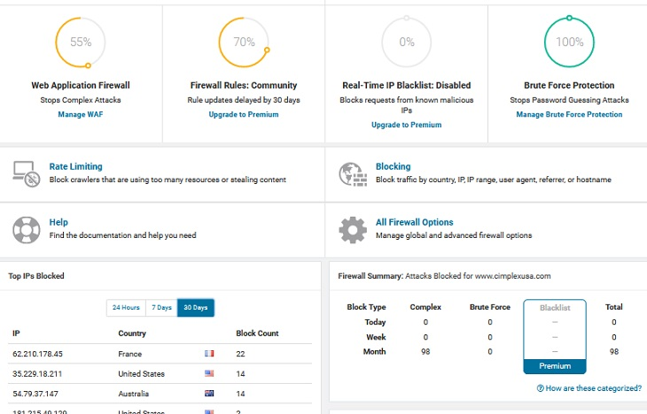

### :white_check_mark: セキュリティプラグイン、WAFを導入する

PCにウィルス対策ソフトを入れるのと同じようにWordPressにも外部からの脅威を防御するためのセキュリティプラグインやWAF（web application firewall）が存在します。もし、AWSを利用しているのであればマーケットプレイスで複数のセキュリティベンダがWAFを提供していますので、そちらを利用すると良いでしょう。

AWS WAF のマネージドルール
https://aws.amazon.com/jp/mp/security/WAFManagedRules/

AWS WAF の料金
https://aws.amazon.com/jp/waf/pricing/?p=ps

ここでは個人的によく利用しているWordPressプラグインの[Wordfence Security](https://wordpress.org/plugins/wordfence/)を簡単にご紹介したいと思います。



Wordfenceが提供してくれる機能は主に以下の4つです。

- 外部からの攻撃を防ぐFirewall機能
- 特定の条件に基づいてアクセスをブロックするBlocking機能
- 悪意のあるコードやバックドアを検知するScan機能
- その他Tools

:one: **Firewall機能**

外部からのリクエストに対してルールに基づきパターンマッチングを行い、攻撃とみなされるリクエストをブロックします。主に以下のような攻撃に対応しています。

- SQL Injection
- Cross Site Scripting (XSS)
- Malicious File Upload
- Directory Traversal
- Local File Inclusion
- External Entity Expansion (XXE)

Firewallのルールはネットワークを通じて自動的に更新されます。ただし、有料版だと逐一リアルタイムで更新されますが、無料版の場合は有料版の30日後になります。インストール後すぐにルールを適用するか、もしくは一定期間学習モードでサイトのアクセスパターンを覚えさせ、そこからルールを適用することもできます（誤検知を防ぐため）。

また、防御モードにベーシックと拡張の2種類を選択することができます。ベーシックモードはプラグインとして起動しリクエストを防御します。しかし、Wordfenceが起動する前に別のプラグインが起動するとそちらは防御対象外になります。また、PHPファイルにダイレクトにリクエストされるとプラグインは起動しませんので、そちらも防御対象外になります。

拡張モードはサーバの設定状況を見て、必要に応じて.htaccessや.user.ini、php.iniなどを変更し、全てのリクエストに対して可能な範囲で防御するモードになります。

:two: **Blocking機能**

以下のブロック機能を提供します。

- 指定したIPアドレスのブロック（ホワイトリストの作成も可能）
- 国レベルでのIPアドレスのブロック
- ユーザーエージェントを用いたブロック
- リファラーを用いたブロック
- 上記複数の条件を組み合わせたブロック

:three: **Scan機能**

WordPress内の全てのファイルをスキャンし悪意のあるコードやバックドア、シェルなどが攻撃者によってインストールされていないかどうかをチェックします。また、投稿、固定ページ、コメント内に不正なコードやURLが埋め込まれていないかどうかもチェックします。

スキャンする項目やスケジュールは自由にカスタマイズできます。ほとんどの項目は無償版でもスキャンできますが、一部の項目（Spamvertising Check、Spam Check、Blacklist Check）は有償版のみとなります。

スキャンが完了すると結果が管理画面に表示され、削除を行うか無視するかを選択することができます。

:four: **その他Tools**

- ユーザーのパスワードの強度をチェックする機能（有料版のみ）
- コメントスパムのフィルタリング機能
- サーバの設定内容をチェックする機能
- 直近のアクセスを確認できるライブトラフィック機能
- 2段階認証機能（有料版のみ）

以上が簡単なWordfenceの機能紹介になります。本プラグインに限らず他のセキュリティプラグインも同様の機能を提供してくれると思いますので、必要に応じてベンダーに問い合わせるなどして要件にあった製品をお探しください。**セキュリティプラグイン・WAFの導入を強くお勧めいたします**。

### :white_check_mark: その他Tips

:one: **ファイル・ディレクトリのパーミッションを適切に設定する**

共有サーバをご利用の場合は、サーバ運営会社が推奨する設定値がサポートページなどに記載されていると思いますので、そちらを参照して頂きたいのですが、一般的な共有サーバだと以下のように必要最小限の権限を与える形になります。

|ファイル|パーミッション||
|:--|:--|:--|
|ディレクトリ|705|rwx---r-x|
|wp-config.php|400|r--------|
|PHPファイル|600|rw-------|
|HTML、CSS、画像など|604|rw----r--|
|.htaccess|604|rw----r--|

お使いの共有サーバによってはディレクトリが755だったり、ファイルが644かもしれません。推奨値に従ってください。ディレクトリを777に設定したり、ファイルを666に設定したりすると共有サーバの別のユーザからファイルを改ざんされる可能性がありますので十分にご注意ください。

:two: **不要なプラグイン・テーマを削除する**

**プラグインやテーマで使用していないものは必ず削除してください**。仮に無効にしていたとしても、プラグインに脆弱性があるとファイルに直接アクセスされてコマンドを実行されたり、ファイルをアップロード・ダウンロードされる可能性があるからです。

:three: **WordPressのバージョン情報を削除する**

WordPressのバージョン情報は攻撃者が参考する情報の一つです。WordPressは初期状態ではメタタグなどにバージョン情報が出力されます。

```php
<meta name="generator" content="WordPress 4.9.4" />
```

削除したから攻撃されないというわけではありませんが、念のため削除しておいた方が無難です。functions.phpに以下の内容を記述してください。

```php
add_filter('the_generator', '__return_empty_string');
```

ネット上では下の方をよく見かけますが、これだとRSSとかにはバージョン情報が表示されてしまいますので上のフィルタの方が良いかと思います。

```php
remove_action('wp_head', 'wp_generator');
```

加えて、CSSやJavaScriptからもバージョン情報を削除したり、readme.htmlやlicense.txtをブロックしておくと良いでしょう。

```php
function remove_wp_version_str($src) {
  global $wp_version;
  parse_str(parse_url($src, PHP_URL_QUERY), $query);
  if (!empty($query['ver']) && $query['ver'] === $wp_version) {
    $src = remove_query_arg('ver', $src);
  }
  return $src;
}

add_filter('script_loader_src', 'remove_wp_version_str');
add_filter('style_loader_src', 'remove_wp_version_str');
```

```apache
<Files readme.html>
  Require all denied
</Files>
<Files license.txt>
  Require all denied
</Files>
```


:four: **しっかり検討した上でプラグインやテーマをインストールする**

プラグインやテーマにバックドアが仕込まれるサプライチェーンアタックがたびたび発生しています。

- [Three More WordPress Plugins Found Hiding a Backdoor](https://www.bleepingcomputer.com/news/security/three-more-wordpress-plugins-found-hiding-a-backdoor/)
- [Backdoor in Captcha Plugin Affects 300K WordPress Sites](https://www.wordfence.com/blog/2017/12/backdoor-captcha-plugin/)
- [WordPress Plugin Banned for Crypto Mining](https://www.wordfence.com/blog/2017/11/wordpress-plugin-banned-crypto-mining/)

プラグインやテーマはWordPress公式レポジトリや運営がしっかりしているサイトなど信頼できるところからダウンロードするようにしてください。

WordPress公式レポジトリ
https://wordpress.org/themes/
https://wordpress.org/plugins/

テーマやプラグインのマーケットプレイス
https://themeforest.net/
https://www.elegantthemes.com/
https://codecanyon.net/category/wordpress

プラグインやテーマを選定するときは見た目や機能だけでなく、以下のような点も考慮するようにしましょう。

- 法人でサポート窓口がちゃんとあるかどうか
- 個人の場合、サポートのスレッドを見てユーザーの質問に丁寧に対応しているかどうか
- バクフィックスやセキュリティアップデート、機能改善などがこまめに行われているかどうか

あと、個人的な主観ですが、プラグインやテーマで利用されるCSSやJavaScriptがプラグインのアセットの中に含まれずに外部リソースから読み込まれているものは極力避けた方が良いかと思います（作成者が自由に悪意のあるコードに変更できるため）。

:five: **脆弱性情報をこまめにチェックする**

公式サイトにセキュリティアップデートなどの情報が掲載されますのでこまめにチェックしましょう。また、脆弱性データベースでプラグインやテーマの脆弱性情報が確認できますので、こちらもあわせてチェックしましょう。

公式サイト
https://wordpress.org/news/

脆弱性データベース
https://wpvulndb.com/

## まとめ

基本的な内容ばかりでしたが意外と見落としもあるかなと思ったのでまとめてみました。今回はWordPressの設定が中心でしたが、当然ながらカスタマイズの際のプログラミングにおける注意点などセキュリティで考慮すべき点は数多く存在します。既にご覧になっている方も多いと思いますが、IPAの「安全なウェブサイトの作り方」をご一読ください。

安全なウェブサイトの作り方
https://www.ipa.go.jp/security/vuln/websecurity.html

仕事の関係で様々なWordPressのサイトを触る機会がありますが、残念ならが100%と言っても過言ではないくらいほとんどのサイトがアップデートもまともに行われていないのが実情です。保守契約を結んでいないなど事情はあると思いますが、きちんとクライアントにセキュリティリスクを理解してもらった上で、継続的なメンテナンスができる状態にすることが制作に関わるディレクターや開発者の果たすべき役割だと思います。本記事が少しでもお役に立てれば幸いです。

