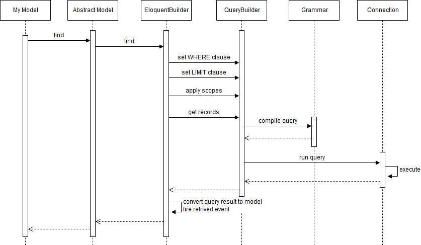

この記事はQiitaからの転載です。
https://qiita.com/prograti/items/70aef5060eed98258a9b

## はじめに
過去にLaravel（5.6）のリクエストライフサイクルを中心にご紹介しました。

[Deep Dive into Laravel](https://qiita.com/prograti/items/750a1d17021498885b6d)

今回はEloquentの基本動作とリレーションについてご紹介したいと思います。その他のコレクションやミューテタなどの機能はここでは触れませんので公式サイトをご覧ください。

[公式サイト]Eloquent
https://laravel.com/docs/5.6/eloquent

## 処理の流れ

Eloquentの仕組みを見るために、まずは簡単なCRUD操作を例に基本的な内部処理の流れを見てみたいと思います。

:one: **Read**

以下のようなモデルからデータを取得する処理の流れを順番に見てみます。

```php
public function show($id)
{
  $user = User::find($id);
}
```

処理の流れを簡略化したものが以下のようになります（実際はもう少し複雑ですが分かりやすくするために省略しています）。



まず、アプリケーションモデルが継承する基底ModelがEloquentBuilderにfindの処理を依頼します。EloquentBuilderはModelとQueryBuilderを仲介するAdapterのような存在で、ORMの処理を組み立てる中心的な役割を果たします。なお、EloquentBuilderはマクロを使って独自に拡張することもできます。

```App\Providers\AppServiceProvider.php
use Illuminate\Database\Eloquent\Builder;

public function register()
{
  // 拡張例（ロックしてeagerロードする）
  Builder::macro('loadWithLock', function($relations){
    $eagerLoad = $this->parseWithRelations(is_string($relations) ? func_get_args() : $relations);
    foreach ($eagerLoad as $name => $closure) {
      $eagerLoad[$name] = function($relation) use ($closure) {
        $closure($relation);
        $relation->lockForUpdate();
      };
    }
    $this->eagerLoad = array_merge($this->eagerLoad, $eagerLoad);
    return $this;
  });
}
```

```php
// 使用例
$posts = Post::loadWithLock('comments')->lockForUpdate()->find(1);
```

QueryBuilderはfrom句、join句、where句、group句、having句、order句、limit句、offset句、union句などの情報を保持する器を持っており、EloquentBuilderはその器にデータをセットします。このケースだとfrom句に'users'、where句に'users.id = 1'、limit句に'1'となります。

from句にセットされるテーブル名について補足すると、テーブル名はPluralizerというクラスを使ってモデル名から複数形の単語を生成しています（実際の生成はDoctrineのInflectorというクラスが行います）。ただし、data（datumの複数形）のような単語はそのままテーブル名として使用されます。特殊な単語の一覧はPluralizerとInflectorでそれぞれ以下のように定義されています。

```Illuminate\Support\Pluralizer.php
public static $uncountable = [
  'audio','bison','cattle','chassis','compensation','coreopsis',
  'data','deer','education','emoji','equipment','evidence',
  'feedback','firmware','fish','furniture','gold','hardware',
  'information','jedi','kin','knowledge','love','metadata',
  'money','moose','news','nutrition','offspring','plankton',
  'pokemon','police','rain','rice','series','sheep',
  'software','species','swine','traffic','wheat',
];
```

```Doctrine\Common\Inflector\Inflector.php
private static $uninflected = array(
  '.*?media', 'Amoyese', 'audio', 'bison', 'Borghese', 'bream', 'breeches',
  'britches', 'buffalo', 'cantus', 'carp', 'chassis', 'clippers', 'cod', 'coitus', 'compensation', 'Congoese',
  'contretemps', 'coreopsis', 'corps', 'data', 'debris', 'deer', 'diabetes', 'djinn', 'education', 'eland',
  'elk', 'emoji', 'equipment', 'evidence', 'Faroese', 'feedback', 'fish', 'flounder', 'Foochowese',
  'Furniture', 'furniture', 'gallows', 'Genevese', 'Genoese', 'Gilbertese', 'gold', 
  'headquarters', 'herpes', 'hijinks', 'Hottentotese', 'information', 'innings', 'jackanapes', 'jedi',
  'Kiplingese', 'knowledge', 'Kongoese', 'love', 'Lucchese', 'Luggage', 'mackerel', 'Maltese', 'metadata',
  'mews', 'moose', 'mumps', 'Nankingese', 'news', 'nexus', 'Niasese', 'nutrition', 'offspring',
  'Pekingese', 'Piedmontese', 'pincers', 'Pistoiese', 'plankton', 'pliers', 'pokemon', 'police', 'Portuguese',
  'proceedings', 'rabies', 'rain', 'rhinoceros', 'rice', 'salmon', 'Sarawakese', 'scissors', 'sea[- ]bass',
  'series', 'Shavese', 'shears', 'sheep', 'siemens', 'species', 'staff', 'swine', 'traffic',
  'trousers', 'trout', 'tuna', 'us', 'Vermontese', 'Wenchowese', 'wheat', 'whiting', 'wildebeest', 'Yengeese'
);
```

artisanコマンドを使ってモデルの作成およびマイグレーションを行っていればテーブル名を解決してくれますので特に意識する必要はありませんが、自分でテーブルを作る場合は上記単語は気を付ける必要があります。

話を元に戻して、QueryBuilderにwhere句やlimit句をセットした後、スコープが設定されていればスコープに定義されたwhere句などの情報を追加でセットします。

```php
class User extends Model
{
  protected static function boot()
  {
    parent::boot();

    static::addGlobalScope('prefecture', function (Builder $builder) {
      $builder->where('prefecture', '=', '13');
    });
  }
}
```

全ての情報がセットし終わるとQueryBuilderにクエリの実行を依頼します。QueryBuilderはGrammar（MySql、Postgres、SQLite、SQL Serverの4種類）を使ってwhere句やlimit句の情報をプリペアドステートメントにコンパイルします。そしてコンパイルされたプリペアドステートメントとバインドパラメータをConnectionに渡し、Connectionがクエリを実行します。実行結果はEloquentBuilderでモデルに変換され、`retrieved`イベントが発行されて処理が終了となります。

:bulb: **モデルイベント**

Eloquentではモデル操作の前後で様々なイベントを発行します。モデルの`dispatchesEvents`プロパティにアプリケーションで作成したイベントを登録し、イベントリスナーでキャッチすることで処理をフックすることができます（creating、updatingなどの～ing系はリスナーでfalseをリターンすれば処理を中断することができる）。

```php
namespace App;

class User extends Model
{
  protected $dispatchesEvents = ['retrieved' => \App\Events\UserRetrieved::class];
}
```

```php
namespace App\Events;

use App\User;

class UserRetrieved
{
  public $user;

  public function __construct(User $user)
  {
    $this->user = $user;
  }
}
```

```php
namespace App\Listeners;

use App\Events\UserRetrieved as UserRetrievedEvent;

class UserRetrieved
{
  public function handle(UserRetrievedEvent $event)
  {
    $user = $event->user;
    // do something
  }
}
```

```php
class EventServiceProvider extends ServiceProvider
{
  protected $listen = [
    \App\Events\UserRetrieved::class => [
      \App\Listeners\UserRetrieved::class,
    ],
  ];
}
```

また、モデルにはObserverを登録するための`observe`メソッドが用意されていますので、Observerを利用すれば複数のイベントの処理を管理することができます。

```php
namespace App\Observers;

use App\User;

class UserObserver
{
  public function creating(User $user)
  {
    // do something
  }
    
    
  public function updating(User $user)
  {
    // do something
  }
}
```

```php
class AppServiceProvider extends ServiceProvider
{
  public function boot()
  {
    User::observe(UserObserver::class);
  }
}
```
