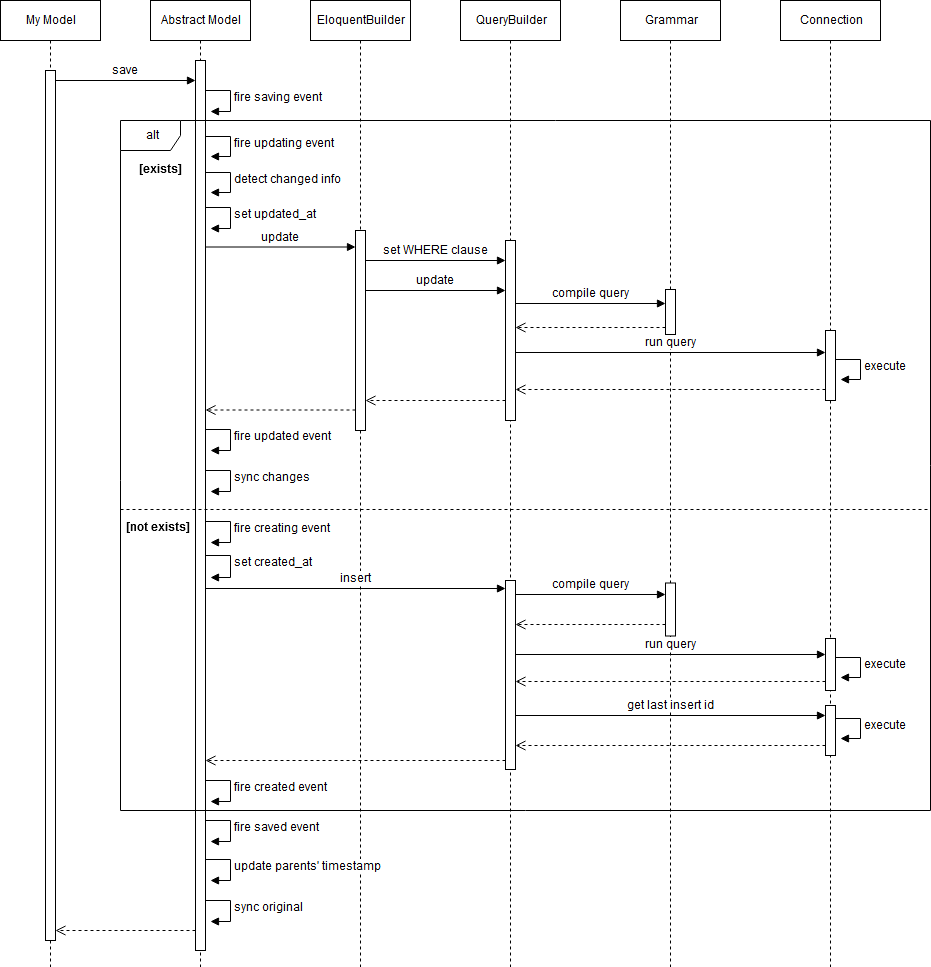

:two: **Create & Update**

以下のようなモデルの新規作成および更新する処理を流れを順番に見てみます。

```php
public function store(Request $request)
{
  $user= new User;
  $user->name = $request->name;
  $user->save();
}

public function update(Request $request, $id)
{
  $user = User::find($id);
  $user->name = $request->name;
  $user->save();
}
```

処理の流れを簡略化したものが以下のようになります。



まず、基底モデルでsavingイベントが発行されます。そして、モデルがnewしたものか、既存のモデルかで処理が分岐します。

既存のモデルの場合、最初にupdatingイベントが発行されます。次にモデルのデータに変更があったかどうかをチェックします。変更がなかった場合はupdate処理はスキップされます。データに変更があった場合はモデルに更新日付がセットされます。次にEloquentBuilderがWHERE句のセットを行い、QueryBuilderがクエリの実行を行います。実行が終わるとupdatedイベントが発行され、更新情報に今回の更新データを同期させます。

※モデルは内部でDBからデータを取得した時点でのオリジナル情報、現在の情報、DBに反映された更新情報の3種類を保持しています。

```php
public function update(Request $request, $id)
{
  $user = User::find($id);

  var_dump($user->getOriginal()); // オリジナル情報

  $user->name = 'qiita';

  var_dump($user->getAttributes()); // 現在の情報
  var_dump($user->getChanges());  // DBに反映された更新情報
  var_dump($user->getDirty());  // 変更された情報

  $user->save();

  var_dump($user->getOriginal());
  var_dump($user->getAttributes());
  var_dump($user->getChanges());
}
```

```php
// getOriginal
array
  'id' => int 1
  'name' => string 'no name'
  'created_at' => string '2018-03-18 08:32:43'
  'updated_at' => null

// getAttributes - nameを変更したので情報も上書きされる
array
  'id' => int 1
  'name' => string 'qiita'
  'created_at' => string '2018-03-18 08:32:43'
  'updated_at' => null

// getChanges - まだDBに反映してないので空
array
  empty

// getDirty - nameを変更したので情報が追加される
array
  'name' => string 'qiita'

// getOriginal - DBに反映したのでオリジナル情報のnameも上書きされる
array
  'id' => int 1
  'name' => string 'qiita'
  'created_at' => string '2018-03-18 08:32:43'
  'updated_at' => string '2018-03-18 08:38:38'

// getAttributes - オリジナル情報と同じ
array
  'id' => int 1
  'name' => string 'qiita'
  'created_at' => string '2018-03-18 08:32:43'
  'updated_at' => string '2018-03-18 08:38:38'

// getChanges - クエリを実行してnameとupdated_atが更新されたので情報が追加される
array
  'name' => string 'qiita'
  'updated_at' => string '2018-03-18 08:38:38'
```

モデルをnewした場合、最初にcreatingイベントが発行されます。モデルに作成日付がセットされた後にQueryBuilderがinsertのクエリを実行します。もし、モデルの主キーがオートインクリメントのIDの場合、先程insertしたデータのIDを取得し、モデルにIDをセットします。クエリの実行が終わるとcreatedイベントが発行されます。

そして、後処理としてsavedイベントが発行され、もしモデルにtouchesプロパティが設定されている場合は親モデルの更新日付を更新します。

```php
class Profile extends Model
{
  // Profileに更新があった場合、親のUserの更新日付も更新する
  protected $touches = ['user'];

  public function user()
  {
    return $this->belongsTo('App\User');
  }
}
```

最後にDBからデータを取得した時点でのオリジナル情報を現在の情報で上書きします。

:notebook_with_decorative_cover: **Create & Update系メソッド一覧**

Create & Update系メソッドでよく使うものをリストアップしてご紹介します。

:black_small_square: **save**
:fire: saving、saved、creating、created、updating、updated

DBにレコードを保存します。新規モデルの場合はinsert、既存モデルの場合はupdateになります。

```php
// insert
$user = new User;
$user->name = 'qiita';
$success = $user->save();

// update
$user = User::find(1);
$user->active = 0;
$success = $user->save();

$profile = Profile::find(1);
$profile->bio = 'hello world';
$success = $profile->save(['touch' => false]); // 親モデルの更新日付を更新しない
```

:black_small_square: **create**
:fire: saving、saved、creating、created

指定したattributeでレコードを作成します（インスタンスを返しますがattributeはセットした項目とキー、作成日付、更新日付しか持っていません。DBからセレクトしている訳ではないので当然ではありますが一応念のため）。

```php
$post = new Post;
$post = $post->create([
  'user_id' => 1, 
  'title' => 'sample', 
  'content' => 'this is a sample page.'
]);
```

なお、createでattributeを渡すためにはモデルの`fillable`プロパティに許可するattributeを設定するか、`guarded`プロパティで禁止するプロパティから除外する必要があります。それ以外のattributeを渡した場合は例外がスローされます。

```php
class Post extends Model
{
  // user_id、title、contentを許可
  protected $fillable = ['user_id', 'title', 'content'];
}

class Post extends Model
{
  // user_idを禁止（デフォルトは全て）
  protected $guarded= ['user_id'];
}
```

:black_small_square: **forceCreate**
:fire: saving、saved、creating、created

モデルのfillabl/guardedプロパティの有無に関係なく、指定したattributeでレコードを作成します。

```php
$post = new Post;
$post = $post->forceCreate([
  'user_id' => 1, 
  'title' => 'sample', 
  'content' => 'this is a sample page.'
]);
```

:black_small_square: **insert**
:fire: なし

指定したattributeでレコードを作成します。QueryBuilderを直接呼び出しているため作成日付は自動的にセットされません。また、fillableプロパティやguardedプロパティも無効となります。

```php
$success = Post::insert([
  'user_id' => 1, 
  'title' => 'sample', 
  'content' => 'this is a sample page.',
  'created_at' => new \DateTime
]);

// bulk insert
$success = Post::insert([
  ['user_id' => 1, 
  'title' => 'sample', 
  'content' => 'this is a sample page.',
  'created_at' => new \DateTime],
  ['user_id' => 2, 
  'title' => 'sample', 
  'content' => 'this is a sample page.',
  'created_at' => new \DateTime],
]);
```

:black_small_square: **update**
:fire: saving、saved、updating、updated

変更するカラムをattributeで渡してレコードを更新します。

```php
$post = Post::find(1);
$success = $post->update(['title' => 'Hello World', 'content' => 'hello world.']);
```

※createと同じようにモデルにfillabl/guardedプロパティを設定しておく必要があります。もしくは以下のような方法で代替することもできます。

```php
$success = $post
  ->fillable(['title', 'content'])
  ->update(['title' => 'Hello World', 'content' => 'hello world.']);

$success = $post
  ->guard(['user_id'])
  ->update(['title' => 'Hello World', 'content' => 'hello world.']);
```

```php
Post::unguard(); // ガードを外す
$post = Post::find(1);
$success = $post->update(['title' => 'Hello World', 'content' => 'hello world.']);
Post::reguard(); // ガードを元に戻す
```

:black_small_square: **push**
:fire: saving、saved、updating、updated

モデルおよびリレーションのあるモデルもまとめてDBに保存します。

```php
$user = User::find(1);
$user->name = 'qiita';
$profile = $user->profile;
$profile->bio = 'hello world';
$success = $user->push(); // userに加えてprofileも更新される
```

:black_small_square: **firstOrCreate**
:fire: retrieved、saving、saved、updating、updated

attributeにマッチしたレコードの1レコード目を返します。該当するレコードがない場合はinsertを行います。

```php
// レコードがない場合はuser_id、title、contentの値を使ってinsertを行う
$post = Post::firstOrCreate(
  ['user_id' => 1, 'title' => 'sample'],
  ['content' => 'this is a sample page.']
);
```

※createと同じようにモデルにfillabl/guardedプロパティを設定しておく必要があります。

:black_small_square: **updateOrCreate**
:fire: retrieved、saving、saved、creating、created、updating、updated

attributeにマッチしたレコードを更新します。該当するレコードがない場合はinsertを行います。

```php
// レコードがない場合はuser_id、title、contentの値を使ってinsertを行う
$post = Post::updateOrCreate(
  ['user_id' => 1, 'title' => 'sample'],
  ['content' => 'hello world.']
);
```

※createと同じようにモデルにfillabl/guardedプロパティを設定しておく必要があります。

:black_small_square: **increment**
:fire: なし

指定したカラムの値を増やしてレコードを更新します。

```php
$post = Post::find(1);
$post->increment('page_views'); // +1
$post->increment('page_views', 10); // +10
```

:black_small_square: **decrement**
:fire: なし

指定したカラムの値を減らしてレコードを更新します。

```php
$post = Post::find(1);
$post->decrement('days_left'); // -1
$post->decrement('days_left', 10); // -10
```

:black_small_square: **replicate**
:fire: なし

モデルを複製して新しいインスタンスを作成します。複製されたモデルのattributeは元のモデルからキー、作成日付、更新日付を取り除いたものになります。

```php
$post = Post::find(1);
$clone = $post->replicate();

var_dump($post->exists); // 既存モデルのため true
var_dump($clone->exists); // 新規モデルのため false
var_dump($post->is($clone)); // 複製したモデルにはキーがないため false

$clone->save(); // 複製元と同じ情報で新しいレコードを作成

$clone = $post->replicate(['pageviews']); // 複製したくないattributeを指定することも可
```
