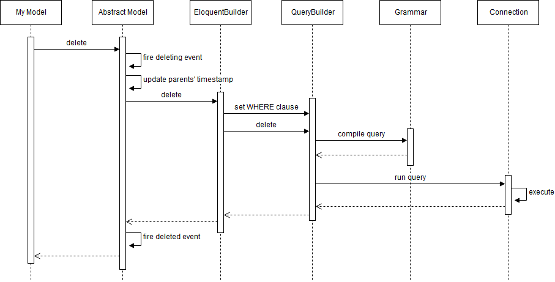
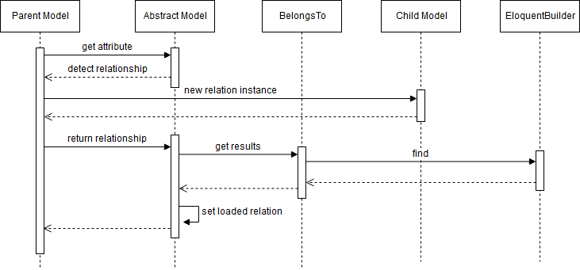

:three: **Delete**

以下のようなモデルを削除する処理を流れを順番に見てみます。

```php
public function destroy($id)
{
  $user = User::find($id);
  $user->delete();
}
```

処理の流れを簡略化したものが以下のようになります。



まず、基底モデルでdeletingイベントが発行されます。次にモデルにtouchesプロパティが設定されている場合は親モデルの更新日付を更新します。EloquentBuilderがWHERE句のセットを行いQueryBuilderがクエリの実行を行います。実行が終わるとdeletedイベントが発行されます。

:notebook_with_decorative_cover:  **Delete系メソッド一覧**

Delete系メソッドでよく使うものをリストアップしてご紹介します。

:black_small_square: **delete**
:fire: deleting、deleted

レコードを削除します（モデルのソフトデリートが有効な場合は論理削除）。

```php
$user = User::find(1);
$success = $user->delete();
```

:black_small_square: **forceDelete**
:fire: deleting、deleted、forceDeleted

レコードを物理削除します。

```php
$user = User::find(1);
$success= $user->forceDelete();
```

:black_small_square: **destroy**
:fire: deleting、deleted

キーを指定してレコードを削除します。

```php
$count = User::destroy(1);
$count = User::destroy([1, 2, 3]);
```

:black_small_square: **truncate**
:fire: なし

テーブルをtruncateします。

```php
User::truncate();
```

:black_small_square: **restore**
:fire: restoring、restored、saving、saved、updating、updated

論理削除されたレコードを元に戻します。

```php
$users = User::onlyTrashed()->get();
foreach ($users as $user) {
  $user->restore();
}
```

## リレーション

基本的な処理の流れを見ましたので、次はリレーションの仕組みを見てみたいと思います。

:one: **1対1（hasOne、belongsTo）**

親モデルが子モデルと1対1のリレーションを持っている場合、親モデルでは`hasOne`メソッドを使って子モデルとのリレーションを定義します。

```php
class User extends Model
{
  public function profile()
  {
    return $this->hasOne('App\Profile');
  }
}
```

子モデルを取得する場合には以下のように親モデルのattributeとしてアクセスします。

```php
public function show($id)
{
  $user = User::find($id);
  $profile = $user->profile;
}
```

この時の処理の流れを簡略化したものが以下のようになります。


まず、モデルのattributeにアクセスすると基底クラスはモデル自身が持つattributeなのか、そうでないのかを判断し、そうでない場合はモデルに定義されたメソッドを実行します。

モデルはメソッドのリターンとしてhasOneメソッドを使ってHasOneオブジェクトを基底クラスに返します。hasOneメソッドは引数として子モデルのクラス名、外部キー、ローカルキーを指定します。

```php
return $this->hasOne('App\Profile', '外部キー', 'ローカルキー');
```

外部キーを指定しない場合、親モデルのクラス名のスネークケースとキーをアンダースコアでつなげた形になります（例：user_id）。

```Illuminate\Database\Eloquent\Model.php
public function getForeignKey()
{
  return Str::snake(class_basename($this)).'_'.$this->getKeyName();
}
```

ローカルキーとは子モデルの外部キーが参照する親モデルのキーを表します。指定しない場合は親モデルのキー（id）になります。実行されるクエリのイメージは以下のようになります。

```sql
SELECT * FROM 子モデル WHERE 子モデルの外部キー = 親モデルのキー（ローカルキー）の値
```

基底クラスは実行したクエリの結果をEloquentBuilderから受け取りモデルに返します。なお、取得した結果はロード済みリレーションとして保持され、同一リクエスト内であればattributeに何回アクセスしてもクエリが実行されるのは最初の1回だけになります。

```php
public function show($id)
{
  $user = User::find($id);
  $profile = $user->profile;  // クエリが実行される
  $profile = $user->profile;  // 保持している結果を返すのでクエリは実行されない

  $user = User::find($id);
  $profile = $user->profile;  // 最初の$userとはインスタンスが異なるのでクエリが実行される
}
```

なお、hasOneは`withDefault`メソッドを使ってデフォルトモデルを設定することができます。親モデルに紐づく子モデルがない場合、子モデルのインスタンスを生成して返します。子モデルのattributeの外部キーには親モデルのキー（ローカルキー）の値がセットされます。

```php
// データがない場合は new Profile(['user_id' => xxx]) が返される
return $this->hasOne('App\Profile')->withDefault();

// attributeを指定することも可能。fillableプロパティかguardedプロパティの設定が必要
return $this->hasOne('App\Profile')->withDefault(['bio' => 'hello world']);
```

次は子モデルを見てみましょう。子モデルでは`belongsTo`メソッドを使って親モデルとのリレーションを定義します。

```php
class Profile extends Model
{
  public function user()
  {
    return $this->belongsTo('App\User');
  }
}
```

親モデルを取得する場合には以下のように子モデルのattributeとしてアクセスします。

```php
public function show($id)
{
  $profile= Profile::find($id);
  $user= $profile->user;
}
```

この時の処理の流れを簡略化したものが以下のようになります。



基本的に前述したhasOneと流れは同じです。モデルはメソッドのリターンとしてbelongsToメソッドを使ってBelongsToオブジェクトを基底クラスに返します。belongsToメソッドは引数として子モデルのクラス名、外部キー、オーナーキー、リレーション名を指定します。


```php
return $this->belongsTo('App\User', '外部キー', 'オーナーキー', 'リレーション名');
```

外部キーを指定しない場合、リレーション名のスネークケースと親モデルのキーをアンダースコアでつなげた形になります。リレーション名はデフォルトでbelongsToメソッドを呼び出したfunctionの名前が設定されます（userというメソッドで呼び出していたらuserになる）。

```Illuminate\Database\Eloquent\Concerns\HasRelationships.php
protected function guessBelongsToRelation()
{
  list($one, $two, $caller) = debug_backtrace(DEBUG_BACKTRACE_IGNORE_ARGS, 3);

  return $caller['function'];
}
```

オーナーキーとは親モデルのキーを表します。指定しない場合は親モデルのキー（id）になります。実行されるクエリのイメージは以下のようになります。

```sql
SELECT * FROM 親モデル WHERE オーナーキー（親モデルのキー） = 子モデルの外部キーの値
```

なお、belongsToは`withDefault`メソッドを使ってデフォルトモデルを設定することができます。子モデルに紐づく親モデルがない場合、親モデルの空のインスタンスを生成して返します。

```php
// データがない場合は new User() が返される
return $this->belongsTo('App\User')->withDefault();

// attributeを指定することも可能。fillableプロパティかguardedプロパティの設定が必要
return $this->belongsTo('App\User')->withDefault(['name' => 'anonymous']);
```

:bulb: **リレーションモデルのinsert、updateおよびリレーションの更新**

子モデルのレコードを新規追加する場合、saveメソッドを使うとちょっと便利です（外部キーにも値が自動的に設定される）。

```php
$user = User::find(1);
$profile = new Profile(['nick_name' => 'qiita']);

// 外部キー（user_id）に親モデルのキーが自動的に入る
$profile = $user->profile()->save($profile);
```

saveメソッド以外にも以下のようなメソッドが利用できます。

```php
// insert
$profile = $user->profile()->create(['nick_name' => 'qiita']);

// selectしてレコードがなければinsert
$profile = $user->profile()->firstOrCreate([], ['nick_name' => 'qiita']); 

// selectしてレコードがあればupdate、なければinsert
$profile = $user->profile()->updateOrCreate([], ['nick_name' => 'qiita']);
```

なお、上記メソッドで子モデルを追加しても親モデルのリレーションに追加される訳ではありません。

```php
$profile = $user->profile()->save($profile);

var_dump($user->getRelations()); // empty

$profile = $user->profile;

var_dump($user->getRelations()); // ['profile' => object(App\Profile)]
```

`associate`メソッドおよび`dissociate`メソッドを使ってbelongsToリレーションを更新することができます。

```php
class User extends Model
{
  public function organization()
  {
    return $this->belongsTo('App\Organization');
  }
}
```

```php
$organization = Organization::find(1);
$user = User::find(1);

// ユーザーのorganization_idに値がセットされ、リレーションが追加される
$user->organization()->associate($organization);
$user->save();

var_dump($user->getRelations()); // ['organization' => object(App\Organization)]

// ユーザーのorganization_idにnullがセットされ、リレーションが解除される
$user->organization()->dissociate();

var_dump($user->getRelations()); // empty
```
