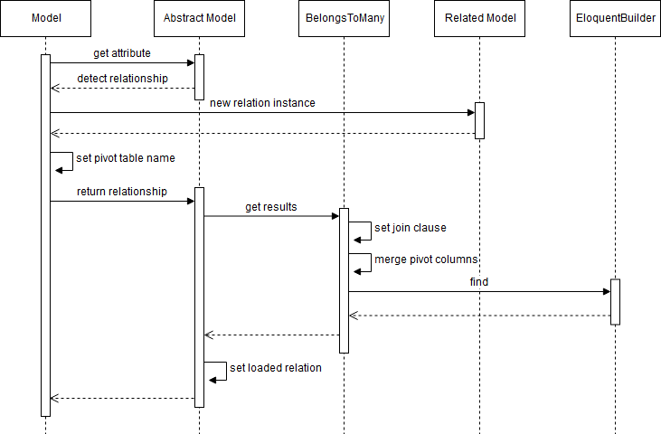

:two: **1対多（hasMany、belongsTo）**

1対多は基本的に1対1と同じでほとんど違いはありません。hasOneの場合は返ってくる結果が1件ですが、hasManyの場合はコレクションが返ってきます。hasManyにはデフォルトモデルを設定することはできません。

リレーションはQueryBuilderとして動作しますので、条件を追加して絞り込むことができます（1対多に限らず他のリレーションも同様です）。

```php
$post = Post::find(1);
$comments = $post->comments()->where('user_id', 2)->get();
```

以下のようにリレーションモデルのレコードに基づいてモデルのレコードを絞り込むこともできます。

```php
// コメントのある投稿を取得
$post = Post::has('comments')->get();

// コメントか いいね がある投稿を取得
$post = Post::has('comments')->orHas('likes')->get();

// コメントがない投稿を取得
$post = Post::doesntHave('comments')->get();

// コメントがないか いいね がない投稿を取得
$post = Post::doesntHave('comments')->orDoesntHave('likes')->get();

// 直近10日間でコメントがあった投稿を取得
$post = Post::whereHas('comments', function($query) {
  $query->where('created_at', '>=', Carbon::now()->subDay(10));
})->get();

// 直近10日間でコメントか いいね　があった投稿を取得
$post = Post::whereHas('comments', function($query) {
  $query->where('created_at', '>=', Carbon::now()->subDay(10));
})->orWhereHas('likes', function($query) {
  $query->where('created_at', '>=', Carbon::now()->subDay(10));
})->get();

// 直近10日間でコメントがなかった投稿を取得
$post = Post::whereDoesntHave('comments', function($query) {
  $query->where('created_at', '>=', Carbon::now()->subDay(10));
})->get();

// 直近10日間でコメントか いいね　がなかった投稿を取得
$post = Post::whereDoesntHave('comments', function($query) {
  $query->where('created_at', '>=', Carbon::now()->subDay(10));
})->orWhereDoesntHave('likes', function($query) {
  $query->where('created_at', '>=', Carbon::now()->subDay(10));
})->get();
```

また、前述した1対1のsaveメソッドやcreateメソッド以外に、複数モデルのinsertに対応した`saveMany`メソッドや`createMany`メソッドが利用できます。

```php
$post = Post::find(1);
$posts = $post->comments()->saveMany([
  new Comment(['user_id' => 1, 'comment' => 'hoge']),
  new Comment(['user_id' => 2, 'comment' => 'hoge']),
]);

$posts = $post->comments()->createMany([
  ['user_id' => 1, 'comment' => 'hoge'],
  ['user_id' => 2, 'comment' => 'hoge'],
]);
```

firstOrCreateやupdateOrCreateを使って条件を指定したinsert、updateを行うこともできます。

```php
// user_idが2のコメントがなければuser_idが2のコメントをinsert
$post = $post->comments()->firstOrCreate(
  ['user_id' => 2], ['comment' => 'hoge']
);

// user_idが2のコメントがあればupdate、なければinsert
// ※ただし、user_idが2のコメントが複数あっても最初の1レコード目しか更新されない
$post = $post->comments()->updateOrCreate(
  ['user_id' => 2], ['comment' => 'hoge']
);
```

:three: **多対多（belongsToMany）**

モデルが多対多のリレーションを持っている場合、お互いのモデルは`belongsToMany`メソッドを使ってリレーションを定義します。

```php
class Post extends Model
{   
  public function tags()
  {
    return $this->belongsToMany('App\Tag');
  }
}
```

```php
class Tag extends Model
{   
  public function posts()
  {
    return $this->belongsToMany('App\Post');
  }
}
```

モデルを取得する場合には以下のようにモデルのattributeとしてアクセスします。

```php
public function show($id)
{
  $post = Post::find($id);
  foreach ($post->tags as $tag) {
    // do something
  }
}
```

この時の処理の流れを簡略化したものが以下のようになります。



前述したhasOneと流れは大体同じです。モデルはメソッドのリターンとしてbelongsToManyメソッドを使ってBelongsToManyオブジェクトを基底クラスに返します。belongsToManyメソッドは引数としてリレーションモデルのクラス名、中間テーブル名、外部pivotキー、関連pivotキー、親キー、関連キー、リレーション名を指定します。

```php
return $this->belongsToMany('App\Tag', '中間テーブル名', '外部pivotキー', '関連pivotキー', '親キー', '関連キー', 'リレーション名');
```

中間テーブルとはリレーション元テーブルとリレーション先テーブルを紐づけるためのテーブルになります。例えば投稿に複数のタグが付けられるようなデータモデルの場合、投稿に付けられたタグを取得したり、タグが付いた投稿を取得するには、投稿とタグを紐づけるための中間テーブル（投稿IDとタグIDをもつようなテーブル）が必要になります。

中間テーブル名はデフォルトで互いのモデル名のスネークケースをアンダースコアで繋いだものになります（モデル名はsort関数でソート）。つまり、PostとTagというモデルがあった場合、'post_tag'が中間テーブル名になります。

```Illuminate\Database\Eloquent\Concerns\HasRelationships.php
public function joiningTable($related)
{
  $models = [
    Str::snake(class_basename($related)),
    Str::snake(class_basename($this)),
  ];
  sort($models);
  
  return strtolower(implode('_', $models));
}
```

中間テーブルとの結合条件には関連キーと関連pivotキーが使用されます。関連キーを指定しない場合はリレーション先テーブルのキー（id）になります。関連pivotキーを指定しない場合はリレーション先テーブルの外部キーとなり、モデル名のスネークケースとキーをアンダースコアでつなげた形になります。

```sql
INNER JOIN 中間テーブル ON リレーション先テーブル.関連キー = 中間テーブル.関連pivotキー
```

WHERE句には外部pivotキーと親キーが使用されます。外部pivotキーを指定しない場合はリレーション元テーブルの外部キーとなり、モデル名のスネークケースとキーをアンダースコアでつなげた形になります。親キーを指定しない場合はリレーション元テーブルのキー（id）が使用されます。

```sql
WHERE 中間テーブル.外部pivotキー = 親キーの値
```

また、SELECTするカラムにはリレーション先のカラムの他に中間テーブルのpivotキーが追加されます。

```sql
SELECT リレーション先テーブル.*, 中間テーブル.外部pivotキー, 中間テーブル.関連pivotキー
```

従って実際に実行されるクエリのイメージは以下のようになります。

```sql
SELECT tags.*, post_tag.post_id, post_tag.tag_id
FROM posts 
INNER JOIN post_tag -- 中間テーブル名
ON tags.id = post_tag.tag_id -- 関連キー、関連pivotキー
WHERE post_tag.post_id = ? -- 外部pivotキー、親キーの値
```

取得した中間テーブルのデータはPivotモデルに格納され`pivot`というキー名でロード済みリレーションに保持されますので、`pivot`という名前のattributeにアクセスすればデータを取得することができます。

```php
public function show($id)
{
  $post = Post::find($id);
  foreach ($post->tags as $tag) {
    $post_id = $tag->pivot->post_id;
  }
}
```

リレーションの定義で`as`メソッドを使えばpivotという名前を変更することができます。

```php
class Post extends Model
{   
  public function tags()
  {
    return $this->belongsToMany('App\Tag')->as('taginfo');
  }
}
```

また、リレーションの定義で`using`メソッドを使えば中間テーブルデータのモデルをPivotから独自のモデルへ変更することができます。

```php
class Post extends Model
{   
  public function tags()
  {
    return $this->belongsToMany('App\Tag')->using('App\TagInfo');
  }
}
```

```php
use Illuminate\Database\Eloquent\Relations\Pivot;

// Pivotモデルを継承する必要がある
class TagInfo extends Pivot
{
    
}
```

前述したようにデフォルトでは中間テーブルの外部キー2つしかデータを取得しないためそれ以外のカラムにはアクセスできません。しかし、リレーション定義時に`withPivot`や`withTimestamps`を使うことでカラムを追加することができます。

```php
class Post extends Model
{   
  public function tags()
  {
    return $this->belongsToMany('App\Tag', 'tag_infos') // 中間テーブル名をtag_infosに変更
      ->using('App\TagInfo') // モデルをPivotからTagInfoに変更
      ->as('taginfo') // taginfoというattributeでアクセスできるように変更
      ->wherePivot('genre', 1) // genreが1のデータに絞り込む
      ->withPivot('tag_order', 'tag_color') // 取得するカラムを追加
      ->withTimestamps(); // created_atとupdated_atを追加
  }
}
```

:bulb: **中間テーブルのデータ操作**

Eloquentには中間テーブルにデータを追加、削除するための便利なメソッドが用意されています。

```php
$post = Post::find(1);

// 中間テーブルに投稿IDが1、タグIDが1のデータを追加する
$post->tags()->attach(1);

// 中間テーブルにタグIDが1のデータを指定したattributeで追加する
$post->tags()->attach(1, ['tag_order' => 1, 'tag_color' => 'red']);

// 中間テーブルにタグIDが1および2のデータを指定したattributeで追加する
$post->tags()->attach([
  1 => ['tag_order' => 1, 'tag_color' => 'red'],
  2 => ['tag_order' => 2, 'tag_color' => 'blue']
]);

// 中間テーブルからタグIDが1のデータを削除する
$count = $post->tags()->detach(1);

// 中間テーブルからタグIDが1および2のデータを削除する
$count = $post->tags()->detach([1, 2]);

// 中間テーブルから投稿IDが1のデータを全て削除する
$count = $post->tags()->detach();

// 中間テーブルにタグIDが1および2のデータが無ければ追加し、それ以外のものがあれば削除する
$changes = $post->tags()->sync([1, 2]);

// 中間テーブルにタグIDが1および2のデータが無ければ追加・更新し、それ以外のものがあれば削除する
$changes = $post->tags()->sync([
  1 => ['tag_order' => 1, 'tag_color' => 'red'],
  2 => ['tag_order' => 2, 'tag_color' => 'blue']
]);

// 中間テーブルにタグIDが1および2のデータが無ければ追加・更新し、それ以外のものは残したまま
$changes = $post->tags()->syncWithoutDetaching([
  1 => ['tag_order' => 1, 'tag_color' => 'red'],
  2 => ['tag_order' => 2, 'tag_color' => 'blue']
]);

// 中間テーブルに指定されたタグIDのものがあれば削除、なければ追加する
$changes = $post->tags()->toggle([1, 2]);

// 中間テーブルに指定されたタグIDのものがあれば削除、なければ指定したattributeで追加する
$changes = $post->tags()->toggle([
  1 => ['tag_order' => 1, 'tag_color' => 'red'],
  2 => ['tag_order' => 2, 'tag_color' => 'blue']
]);

// 中間テーブルにタグIDが1のデータを追加
$tag = Tag::find(1);
$tag = $post->tags()->save($tag, ['tag_order' => 1, 'tag_color' => 'red']);

// 中間テーブルのタグIDが1のデータを更新
$count = $post->tags()->updateExistingPivot(1, ['tag_order' => 1, 'tag_color' => 'red']);
```
