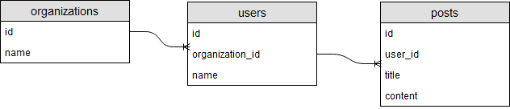
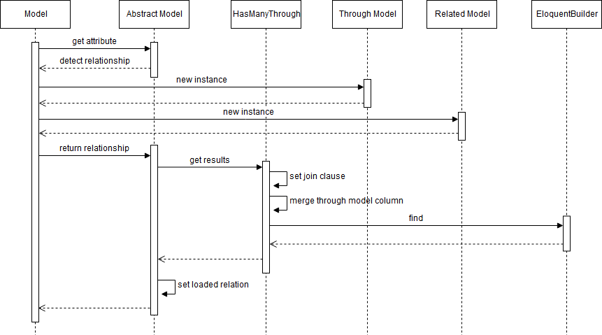
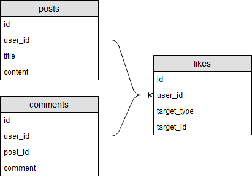
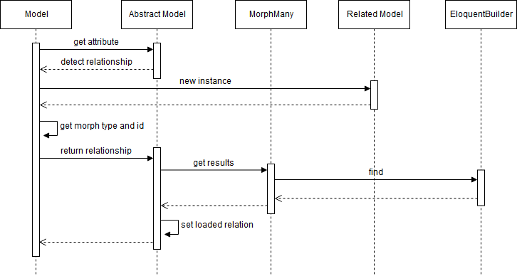
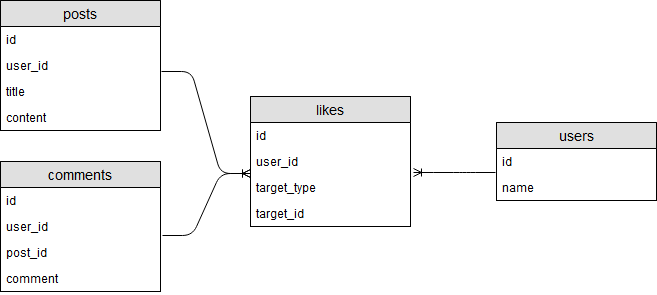
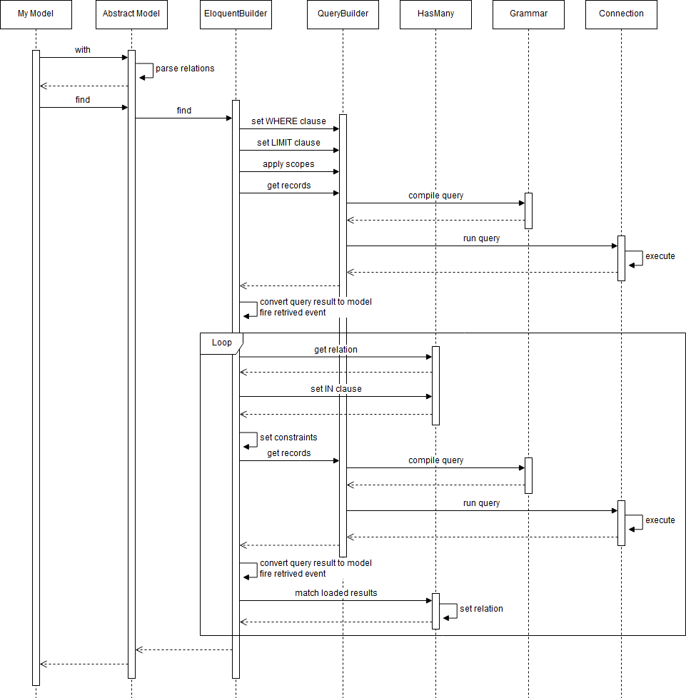

:four: **経由テーブル越しの多対多（hasManyThrough）**

例えば以下のようなデータモデルで、組織の投稿を取得するためには組織に所属するユーザーを経由して投稿を取得する必要があります。



このようなデータモデルに対応する場合、`hasManyThrough`メソッドを使ってリレーションを定義します。

```php
class Organization extends Model
{   
  public function posts()
  {
    return $this->hasManyThrough('App\Post', 'App\User');
  }
}
```

モデルを取得する場合には以下のようにモデルのattributeとしてアクセスします。

```php
public function show($id)
{
  $organization = Organization::find($id);
  foreach ($organization->posts as $post) {
    $title = $post->title;
  }
}
```

この時の処理の流れを簡略化したものが以下のようになります。



前述したbelongsToManyと流れは大体同じです。モデルはメソッドのリターンとしてhasManyThroughメソッドを使ってHasManyThroughオブジェクトを基底クラスに返します。hasManyThroughメソッドは引数としてリレーションモデルのクラス名、経由モデルのクラス名、ファーストキー、セカンドキー、ローカルキー、セカンドローカルキーを指定します。

```php
return $this->hasManyThrough('App\Post', 'App\User', 'ファーストキー', 'セカンドキー', 'ローカルキー', 'セカンドローカルキー');
```

第2引数で指定した経由テーブルが前述した多対多の中間テーブルと同等の役割を果たします。経由テーブルとの結合条件にはセカンドローカルキーとセカンドキーが使用されます。セカンドローカルキーを指定しない場合は経由テーブルのキー（id）になります。セカンドキーを指定しない場合は経由テーブルの外部キーとなり、モデル名のスネークケースとキーをアンダースコアでつなげた形になります。

```sql
INNER JOIN 経由テーブル ON 経由テーブル.セカンドローカルキー = 経由先テーブル.セカンドキー
```

WHERE句にはファーストキーとローカルキーが使用されます。ファーストキーを指定しない場合は経由元テーブルの外部キーとなり、モデル名のスネークケースとキーをアンダースコアでつなげた形になります。ローカルキーを指定しない場合は経由元テーブルのキー（id）になります。

```sql
WHERE 経由テーブル.ファーストキー = ローカルキーの値
```

また、SELECTするカラムには経由先テーブルのカラムの他にファーストキーが追加されます。

```sql
SELECT 経由先テーブル.*, 経由元テーブル.ファーストキー
```

従って実際に実行されるクエリのイメージは以下のようになります。

```sql
SELECT posts.*, users.organization_id 
FROM posts 
INNER JOIN users -- 経由元テーブル
ON users.id = posts.user_id -- セカンドローカルキー、セカンドキー
WHERE users.organization_id = ? -- ファーストキー、ローカルキーの値
```

:five: **ポリモーフィック リレーション（morphTo、morphMany）**

ポリモーフィック リレーションとは、1つのキーが持つリレーションが複数のモデルにまたがるようなものを表します。例えば以下のように投稿やコメントに対する「いいね」を一つのテーブルで管理する場合が該当します（target_typeとtarget_idで投稿に対するものかコメントに対するものかを管理する）。



このようなデータモデルに対応する場合、`morphTo`メソッドと`morphMany`メソッドを使ってリレーションを定義します。

```php
class Post extends Model
{
  public function comments()
  {
    return $this->hasMany('App\Comment');
  }
 
  public function likes()
  {
    return $this->morphMany('App\Like', 'target');
  }
}
```

```php
class Comment extends Model
{
  public function likes()
  {
    return $this->morphMany('App\Like', 'target');
  }
}
```

```php
class Like extends Model
{   
  public function target()
  {
    return $this->morphTo();
  }
}
```

モデルを取得する場合には以下のようにモデルのattributeとしてアクセスします。

```php
public function show($id)
{
  $post = Post::find($id);
  foreach ($post->likes as $like) {
    $user_id = $like->user_id;
  }

  foreach ($post->comments as $comment) {
    foreach ($comment->likes as $like) {
      $user_id = $like->user_id;
    }
  }
}
```

この時の処理の流れを簡略化したものが以下のようになります。



基本的には1対1や1対多の流れと同じです。モデルはメソッドのリターンとしてmorphManyメソッドを使ってMorphManyオブジェクトを基底クラスに返します。morphManyメソッドは引数としてリレーションモデルのクラス名、morph名、morphタイプ、morph ID、ローカルキーを指定します。

```php
return $this->morphMany('App\Like', 'morph名', 'morphタイプ', 'morph ID', 'ローカルキー');
```

morphタイプを指定しない場合はmorph名と'type'をアンダースコアで繋げた文字列（xxxx_type）となり、morph IDを指定しない場合はmorph IDと'id'をアンダースコアで繋げた文字列（xxxx_id）となります。ローカルキーを指定しない場合はリレーション元テーブルのキー（id）になります。

```php
public function show($id)
{
  $post = Post::find($id);
  foreach ($post->likes as $like) {
    $user_id = $like->user_id;
  }
}
```

上記のように投稿の「いいね」を取得する場合に実行されるクエリのイメージは以下のようになります。

```sql
SELECT * FROM likes WHERE target_type = 'App\Post' AND target_id = （投稿idの値）
```

morphタイプの値にはモデルのクラス名が入ります。ただし、サービスプロバイダなどでmorphMapを設定することでクラス名から代替文字列に変更することができます。

```php
use Illuminate\Database\Eloquent\Relations\Relation;

public function boot()
{
  Relation::morphMap([
    'post' => 'App\Post',
    'comment' => 'App\Comment',
  ]);
}
```

ポリモーフィック リレーションを利用してさらに複雑なケースに対応することができます。例えば以下のデータモデルのように、中間テーブルを介して投稿やコメントに「いいね」したユーザーを取得したり、ユーザーが「いいね」した投稿やコメントを取得する多対多の場合です。



この場合のリレーションの定義は`morphedByMany`メソッドと`morphToMany`メソッドを使用します。

```php
class User extends Model
{
  public function myLikedPosts()
  {
    return $this->morphedByMany('App\Post', 'target', 'likes');
  }

  public function myLikedComments()
  {
    return $this->morphedByMany('App\Comment', 'target', 'likes');
  }
}
```

```php
class Post extends Model
{
  public function likedUsers()
  {
    return $this->morphToMany('App\User', 'target', 'likes');
  }
}
```

```php
class Comment extends Model
{
  public function likedUsers()
  {
    return $this->morphToMany('App\User', 'target', 'likes');
  }
}
```

上記の例では第3引数にテーブル名を指定していますが、省略した場合は第2引数の文字列からテーブル名が決定されます（この場合はtargets）。

モデルを取得する場合には以下のようにモデルのattributeとしてアクセスします。

```php
public function show($id)
{
  $user= User::find($id);
  foreach ($user->myLikedPosts as $post) {
    $title = $post->title;
  }
}
```

また、前述した多対多の時と同様に中間テーブルのデータにもアクセスすることができます。

```php
class User extends Model
{
  public function myLikedPosts()
  {
    return $this->morphedByMany('App\Post', 'target', 'likes')
      ->as('like')
      ->withTimestamps();
  }
}
```

```php
public function show($id)
{
  $user= User::find($id);
  foreach ($user->myLikedPosts as $post) {
    $likedAt = $post->like->created_at;
  }
}
```

:six: **Eagerロード**

Eloquentではリレーションにアクセスする時、標準では遅延ロードになります。

```php
$posts = Post::all();
foreach ($posts as $post) {
  // このタイミングで投稿に紐づくコメントを取得するためのクエリが実行される
  $comments = $post->comments;
}
```

上記のような場合だとループの回数分クエリが実行され無駄にリソースを使ってしまう可能性があります。これを回避する方法としてEagerロードという仕組みがあり、Eagerロードを使うと先程のループのクエリが1回で済むようになります。Eagerロードを使うには以下のように`with`メソッドでリレーションを指定します。

```php
$posts = Post::with('comments')->get();
foreach ($posts as $post) {
  $comments = $post->comments;
}
```

この時の処理の流れを簡略化したものが以下のようになります（例として1対多のリレーションがあった場合を取り上げています）。



まず、最初にwithメソッドで指定されたリレーションをパースします。withメソッドでは単一でリレーションを指定するだけでなく、様々な指定方法があります。

```php
// 単一のリレーションを指定
$posts = Post::with('comments')->get();

// 複数のリレーションを指定
$posts = Post::with(['comments', 'likes'])->get();

// コメントとそれに紐づくユーザーを指定
$posts = Post::with('comments.user')->get();

// コメントの特定のカラムだけ取得（PostとCommentはpost_idで紐づいているためpost_idは必須）
$posts = Post::with('comments:post_id,comment')->get();
```

パースしてリレーション情報を取り出すと、まずは大元のモデル（この場合Post）のfindを行います。この処理の流れは前述したものと同じなので説明は割愛します。findした結果を受け取るとリレーション情報からリレーションオブジェクト（この場合HasMany）を取得し、IN句に大元のモデルのキー（id）をセットします。もし、withメソッドで制約を定義していたら、そちらも追加されます。

```php
$posts = Post::with(['comments' => function($relation) {
  $relation->where('created_at', '>', Carbon::now()->subDay(3));
}])->get();
```

そしてクエリを実行して結果を取得するとロードされたリレーションとして大元のモデルにセットされます。この操作がループかつネストしていれば再帰的に行われモデルのツリーが作成されます。これにより、モデルのattributeにアクセスしてもクエリが実行されることなく、既に作成されたモデルが返されることになります。

もし、動的にリレーションを定義したい場合は`load`メソッドを使用してください。

```php
// コレクションとモデルのどちらでもloadメソッドは使用可
$posts = Post::all();
if (Auth::check()) {
  $posts->load('comments');
}

$post = Post::find(1);
if (Auth::check()) {
  $post->load('comments');
}
```

常にEagerロードを適用したい場合があるかもしれません。その場合は、モデルに`with`プロパティを設定することができます。

```php
class Post extends Model
{
  protected $with = ['comments'];
}
```

もし、withプロパティを設定していてEagerロードを適用したくないケースがあった場合は`without`メソッドを使用することでEagerロードを解除することができます。

```php
$posts = Post::without('comments')->get();
```

## 最後に

一通りEloquentの基本的な操作を処理の流れを追いながら紹介してみました。insertの部分で少し触れましたがEloquentを使っているつもりが実はQueryBuilderの方を使っていて意図した動作にならないということも起こりえますので十分にご注意ください。

また、Eloquentに限ったことではありませんがORMは非常に便利な反面、その特性や制限を理解していないとシステムが大きく複雑になるにつれてそのアドバンテージを消失してしまいます。EloquentはActiveRecordパターンを実装したORMですが、そのシンプルな設計思想が故に複雑なDB設計とはあまり相性が良くありません。そのような事も理解した上で設計が必要になるということも念頭に置いておいた方が良いかもしれません（システムは生き物なのでどんなに頑張って設計してもインピーダンスミスマッチが起こることは避けられませんが:sweat_smile:）。

